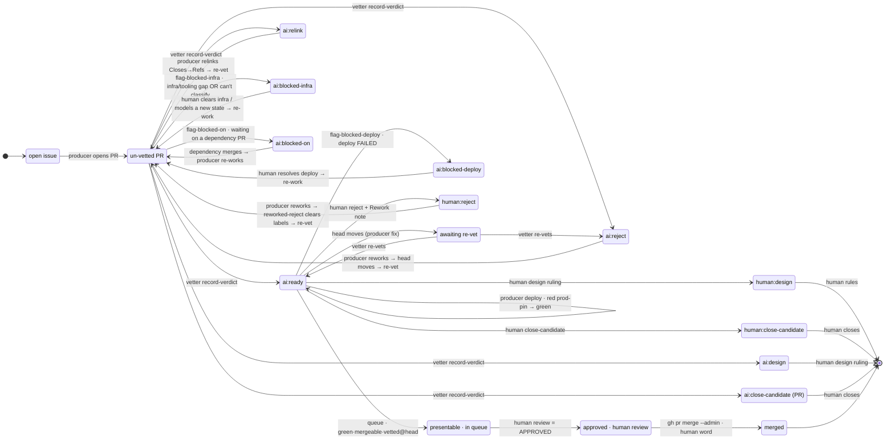

# rainlanguage org issue→PR pipeline

Local, autonomous cron jobs that drive issues to merge-ready PRs across the
rainlanguage **and cyclofinance** GitHub orgs. The pipeline is a **finite state
machine**: a PR's state _is_ its GitHub state — `ai:*` / `human:*` labels,
trusted `🤖 ai:vetter` comments, and its native review — and the
`pr-review-report` tool is the **only** transition function between states. A
**producer** cron and a **vetter** cron drive the automated transitions; landing
is interactive (a human merges on their explicit per-PR word). See
[CLAUDE.md](CLAUDE.md) for the framing.

## Pipeline state machine



Every transition above is a `pr-review-report` subcommand. A raw `gh` / `git`
state change from a prompt is a _loose_ transition — unenforced and untested —
so the prompts route **all** GitHub I/O through the tool. That is what makes
this an actual finite state machine rather than a picture of one.

### The vetter's transitions as an MCP surface (opt-in)

Routing through the tool is still enforced by the **prompt**, and a Bash
deny-list is prefix-matched and bypassable. `pr-review-report mcp` closes that
gap by serving the vetter's transitions over MCP (stdio):

| Tool             | The move it makes                                                                                            |
| ---------------- | ------------------------------------------------------------------------------------------------------------ |
| `unvetted`       | state-load: the open PRs to vet this run, vet-first, each with head/labels/review/sacred/vetted/ci/mergeable |
| `pr_context`     | read one PR: body, files, diff, every linked issue, and the trusted `🤖 ai:*` comments — one call            |
| `pr_checkout`    | local read-only clone of the PR head, so the `audit` skill has source                                        |
| `record_verdict` | the only write: `ai:<verdict>` label + sha-bound `🤖 ai:vetter` comment + cost                               |
| `clone_release`  | dispose of a checkout it is finished with (guarded — see below)                                              |

Run with `--mcp-config review-mcp.json --strict-mcp-config` and
`review-settings-mcp.json`, the vetter's entire tool surface is
`mcp__fsm__{unvetted,pr_context,pr_checkout,record_verdict,clone_release}` plus
`Read`/`Grep`/`Glob`/`Skill`/`ToolSearch` — **no Bash**, so there is no raw `gh`
or `git` to reach for. The guards (verdict vocabulary, a mandatory 0-1000 cost,
a well-formed `owner/repo#n`, the human-sacred refusal) are enforced in the
server and unit-tested rather than restated in the prompt.

**Opt-in, off by default:** set `VETTER_MCP=1` in `cron.env` and the runner uses
`review-prompt-mcp.txt` + `review-settings-mcp.json`; unset, the vetter runs
exactly as it does today.

### Work-clone lifecycle as an MCP surface (always on)

`pr-review-report mcp --profile producer` serves the **producer's** clone
lifecycle: `clone_create`, `clone_release`, `clone_list`, `clone_gc`. Unlike the
vetter's surface this one is **additive** — the producer keeps its Bash, and is
wired unconditionally (`--mcp-config campaign-mcp.json`, no
`--strict-mcp-config`), because what it gains is an operation it could not
previously perform at all:

`campaign-settings.json` denies `Bash(rm -rf /:*)`. Deny rules are
**prefix-matched**, so that also denied `rm -rf /home/gildlab/code/<clone>` —
every work-clone path — while `campaign-prompt.txt` mandated exactly that
deletion the moment a PR was pushed. The two contradicted each other for months;
the clone directory grew to **195 GB** and disk-full is the documented cause of
the producer's silent-death failure mode (#56).

The fix is not a wider deny rule (that fixes the instance and keeps the shape).
It is that **the model no longer supplies a path to delete** — it names a clone,
and the name is resolved in Rust before any syscall:

- exactly one path component directly under a configured root (`WORK_DIR`, plus
  `INSTALL_DIR`, where the vetter's `vet-*` clones were stranded); roots come
  from the environment, never from a tool argument;
- no `..` anywhere, no absolute path outside the root (including the
  sibling-prefix trick that fooled the deny rule), never the root itself or an
  ancestor, never a `.`-prefixed entry, never a symlink;
- the target must contain `.git` — **only a git work clone is ever deletable**,
  so no malformed argument can reach ordinary data.

Release refuses **unconditionally** on commits that exist only in the clone (or
an unknown push state); uncommitted changes refuse too, overridable with
`discard_uncommitted` once the caller has confirmed the dirt is build output.
`clone_gc` remains the unattended backstop with the old, deliberately
conservative rule — it deletes only what it can prove is finished.

The machine has **no dead-ends**: every state has an exit back into the
lifecycle or to a terminal (`merged` / a human ruling). The vet lifecycle
(`un-vetted → vetting → awaiting re-vet`) re-runs the vetter whenever a PR's
head moves, so a reworked PR is always re-judged against its current code. The
**human reject is TRANSIENT**, not terminal: when a human applies `human:reject`
and a trusted "Rework note", the producer executes the rework, pushes a fix
commit, and then calls **`pr-review-report reworked-reject <owner/repo> <n>`**
as its final step. That subcommand REMOVES `human:reject` **and any stale `ai:*`
verdict** (the code changed → re-vet from scratch), returning the PR to
ready-to-vet so it re-enters the normal vet → queue → human loop. It is guarded:
it clears `human:reject` **only** when the PR head commit provably
**post-dates** the `human:reject` label event (the one sanctioned carve-out from
"never remove a `human:*` label"); a head that does not post-date the reject is
refused, so a still-standing human reject is never silently undone.

`human-queue --json` emits the **full** inventory — every modeled state's PRs,
grouped into four lanes so the dashboard can show where PRs pile up:

- **vet-lifecycle** — `un-vetted` (open PRs awaiting a first verdict) and
  `awaiting-re-vet` (an `ai:ready` PR whose head moved past its last vetter
  verdict).
- **vetter-verdicts** — `ai:ready`, `ai:reject`, `ai:relink`, `ai:design`,
  `ai:close-candidate`.
- **producer-blocked** — `ai:blocked-deploy`, `ai:blocked-infra`,
  `ai:blocked-on`.
- **human-decisions** — `human:reject`, `human:design`, `human:close-candidate`.

Each PR is bucketed **once**, by FSM precedence (a human decision dominates a
stale `ai:*` label). The legacy `states` / `leaks` / `counts` keys are preserved
unchanged; `lanes` and the additive `counts` keys (`reject`, `relink`,
`closeCandidatePrs`, `humanReject`, `humanDesign`, `humanCloseCandidate`,
`unvetted`, `awaitingReVet`) are the full-machine view the dashboard renders.

The producer never narrates a hand-off in prose. Anything it cannot land is a
labeled transition into exactly one modeled state: `design`, `close-candidate`,
`blocked-deploy`, `blocked-infra`, or `blocked-on`. Those five plus `ready` (the
merge queue) are the **human-gated states** — the daily review queue, a plain
label search, no prose scraping. `blocked-infra` is the **total-function
fallback**: any situation the producer cannot classify into a state lands there
with a free-text reason, so it can never act _outside_ the machine. Reviewing
the `blocked-infra` queue is exactly where a human decides what needs to change
to move each item back into a well-defined state — fix the infra, model a new
state, or forbid the behavior; a recurring `blocked-infra` reason is the
evidence to promote it to a first-class state.

The three crons are **staggered by 2 h** so work flows downstream within each
4-hour cycle (all times UTC):

```
   :00  ✅ MERGE     lands the PRs you approved last cycle
   :01  🤖 PRODUCER  greens its own red PRs FIRST, then opens new fix PRs
   :03  🔍 VETTER    AI-reviews the fresh PRs → records verdicts
        👤  ……  you approve anytime  ·  pr-review-report.sh --ready
   :04  ✅ MERGE     (next cycle) lands what you just approved … ⟳

   6 cycles/day. A PR opened at :01 is vetted by :03; once you approve,
   the next :00/:04/:08… merge run lands it — hours end-to-end, hands-off.
```

- **Producer** (`campaign-run.sh`, every 4h at :00 of 1,5,9,13,17,21 UTC) —
  opens drives its OWN red PRs green FIRST (existing in-flight work, non-force
  commits), THEN opens one fix PR per tractable, uncovered issue (audit-backlog
  first). Org-mutating actions: `gh pr create`, `gh pr comment` (screenshots),
  and non-force `git push` to its own PR branches. Never
  merges/closes/deploys/force-pushes. Skips issues with a `reject` verdict
  (parked for a human, so a rejected fix isn't re-attempted into dead PRs).
- **Vetter** (`review-run.sh`, every 4h at :00 of 3,7,11,15,19,23 UTC) —
  AI-reviews open PRs and records a verdict (`ready`/`relink`/`reject`/`close`,
  `source: ai-campaign`) in `review-verdicts.jsonl`. **Read-only on GitHub** —
  approval is the human's gate.
- **You approve** — review with `pr-review-report.sh`; approving records a
  `source: human`, `verdict: ready` line (only these are mergeable).
- **Merge cron** (`merge-run.sh`, every 4h at :00 of 0,4,8,12,16,20 UTC) —
  merges ONLY human-approved PRs (effective `source: human`/`ready`), reading
  every failing check before any admin-merge-over-env-reds. **Defaults to
  dry-run** (`MERGE_DRY_RUN=1` — reports what it would merge); set
  `MERGE_DRY_RUN=0` in `cron.env` to go live.

## Scope — read this first

**The org-mutating actions this routine takes are `gh pr create`,
`gh pr comment` (UI screenshots), and a non-force `git push` of fix commits to
its OWN open red PR branches (to drive them green).** It **never** merges,
deploys, force-pushes, or closes/edits/comments-on issues. If it believes an
issue should be closed (already fixed, invalid, duplicate) it records a
_close-candidate_ — it never acts on it. A human reviews and disposes. This is
enforced two ways: the permission deny-list in `campaign-settings.json` and the
rules in `campaign-prompt.txt` (step 7 / 7a).

## Files (tracked here)

| File                       | Purpose                                                                                                                                                                                                                                         |
| -------------------------- | ----------------------------------------------------------------------------------------------------------------------------------------------------------------------------------------------------------------------------------------------- |
| `campaign-run.sh`          | Durable runner: `flock` single-run lock, `DISABLED` kill-switch, `timeout`, bakes PATH+nix, invokes `claude --print` with the prompt + settings, logs to `campaign.log` (+ per-run JSONL traces in `runs/`).                                    |
| `campaign-prompt.txt`      | The campaign instructions fed to the model.                                                                                                                                                                                                     |
| `campaign-settings.json`   | Tool allow/deny list passed via `--settings` (the permission guardrails).                                                                                                                                                                       |
| `review-run.sh`            | Vetting runner (same hardened pattern as `campaign-run.sh`): reviews open PRs, appends verdicts to `review-verdicts.jsonl`, logs to `review.log`. Read-only on GitHub. Kill-switch `review-DISABLED`.                                           |
| `review-prompt.txt`        | The AI-vetting instructions fed to the model.                                                                                                                                                                                                   |
| `review-settings.json`     | Tool allow/deny for the vetter — every GitHub write (incl. `gh pr review`/approve, `gh api`) is denied; the only write is `pr-review-report record-verdict`.                                                                                    |
| `review-mcp.json`          | MCP config for the opt-in MCP surface: one stdio server, `pr-review-report mcp`, named `fsm` (so its tools are `mcp__fsm__*`).                                                                                                                  |
| `review-settings-mcp.json` | Tool allow/deny for `VETTER_MCP=1`: the five `mcp__fsm__*` tools + `Read`/`Glob`/`Grep`/`Skill`/`ToolSearch`, **Bash denied outright**.                                                                                                         |
| `campaign-mcp.json`        | MCP config for the producer's clone-lifecycle surface: one stdio server, `pr-review-report mcp --profile producer`, named `fsm`. Additive — the producer keeps its Bash.                                                                        |
| `review-prompt-mcp.txt`    | The vetter prompt for the MCP surface — the same judgement gates with the `gh` command recipes removed (they are tool schemas now).                                                                                                             |
| `merge-run.sh`             | Merge runner — drives human-approved PRs to merge. Dry-run by default (`MERGE_DRY_RUN`). Logs to `merge.log`. Kill-switch `merge-DISABLED`.                                                                                                     |
| `merge-prompt.txt`         | The merge instructions: only human-approved PRs, read every failing check before admin-merge-over-env-reds, never deploy/force-push/touch-issues.                                                                                               |
| `merge-settings.json`      | Tool allow/deny for the merge cron — allows `gh pr merge`/`comment`, denies deploy/force-push/issue-ops/other mutations.                                                                                                                        |
| `cron.env.example`         | Template for deployment-specific values (PR assignee, work dir, models, run caps). Copy to `cron.env` (gitignored) and edit.                                                                                                                    |
| `pr-review-report.sh`      | Reports every open PR by its pipeline stage (approved / AI-vetted / needs-producer-fix (red) / conflicting / relink / reject / close / unreviewed / pending / draft), respecting `review-verdicts.jsonl` + GitHub approvals, as clickable URLs. |

## Configuration

Deployment-specific values are **not** committed. Copy `cron.env.example` to
`cron.env` (gitignored) and set at least `PR_ASSIGNEE` (the GitHub handle every
opened PR is assigned to). `WORK_DIR`, `MODEL`, `MAXTIME`, `KEEP_RUNS` have
defaults and may be overridden there. The runner self-locates its install dir
and rebuilds `PATH`/nix from `$HOME`, so there are no machine paths in the repo;
`campaign-prompt.txt` uses `{{WORK_DIR}}` / `{{CLOSE_CANDIDATES}}` /
`{{ASSIGNEE}}` placeholders that the runner substitutes at run time.

## Reviewing the output — the merge pipeline

A PR moves through two distinct gates before it merges:

```
🟦 unreviewed  →  🤖 AI-vetted  →  ✅ you approve  →  merge
```

- **AI review** is the automated pass (the review campaign): it records a
  verdict in `review-verdicts.jsonl` with `source: ai-campaign`. An AI `ready`
  verdict means "passed automated review" — it is **NOT** a human sign-off.
- **Human approval** is _your_ gate: a GitHub `APPROVED` review, or a verdict
  you set with `source: human`. **Only an approved PR is "ready to merge"**, and
  the merge is only ever performed on your explicit go-ahead.

`./pr-review-report.sh` prints every open PR bucketed by where it sits in that
pipeline, all as clickable URLs: **✅ approved by you** (ready to merge) · **🤖
AI-vetted — awaiting your approval** · **🔴 needs a producer fix** (CI red — the
producer drives it green) · **🔧 AI-flagged: relink** · **❌ reject /
changes-requested** · **🗑️ close (dup/superseded)** · **🟦 not yet reviewed** ·
**⚠️ conflicting** (needs rebase) · **🟡 pending** · **📝 drafts** · plus the
issue **close-candidates** the cron logged. `--ready` prints only the
approved-by-you set.

`review-verdicts.jsonl` (gitignored, local — like `close-candidates.jsonl`) is
the review ledger; one JSON object per line:
`{"repo":"rain.flare","pr":129,"verdict":"reject","source":"ai-campaign","note":"..."}`
— `verdict` ∈ `ready`|`relink`|`reject`|`close`, `source` ∈
`ai-campaign`|`human`. To approve a PR, either approve it on GitHub or add a
`source: human`, `verdict: ready` line. It self-provisions `gh`+`jq` via nix,
and reads `cron.env` for `ORG` / `PR_ASSIGNEE` / `CLOSE_CANDIDATES` /
`REVIEW_VERDICTS`.

## Runtime state (NOT tracked — see `.gitignore`)

- `campaign.log` — distilled human-readable log (`tail -f` to watch).
- `runs/<ts>.jsonl` — full per-run stream-json traces (`KEEP_RUNS` most recent).
- `close-candidates.jsonl` — append-only queue of issues the cron thinks should
  be closed but won't touch. A human reviews it like a PR queue and closes
  deliberately. One JSON line per candidate:
  `{repo, issue, url, title, reason, evidence, found_at}`.
- `DISABLED` — presence pauses the cron (kill-switch).
- `campaign.lock` — flock file (prevents overlapping runs).

## Schedule & controls

- **crontab:** `0 1,5,9,13,17,21 * * * <install-dir>/campaign-run.sh` (every
  4h).
- **Pause:** `touch DISABLED` · **Resume:** `rm DISABLED`
- **Watch:** `tail -f campaign.log` · **Run now:** run `campaign-run.sh`
  directly.

## What a run does

1. Auth + toolchain check (`gh auth status`, nix `forge --version`); stop loudly
   if broken.
2. Enumerate open issues org-wide.
3. Cheaply dedup against open PRs (single `jq` pass; byte-grepping the PR JSON
   is forbidden).
4. For each tractable, genuinely-uncovered issue: clone, branch, implement a
   minimal fix with mutation-validated tests, build + test, open ONE PR per
   issue (`gh pr create --assignee $PR_ASSIGNEE`, body `Closes #N` / `Refs #N`).
   If already fixed on main → no PR, log a close-candidate.
5. UI PRs require a screenshot (headless chromium harness → `pr-screenshots`
   branch).
6. End with a summary: PRs opened, issues skipped, close-candidates logged.
