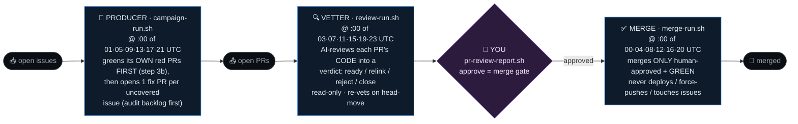

# rainlanguage org issue→PR pipeline

Local, autonomous cron jobs that drive issues to merge-ready PRs across the
rainlanguage GitHub org. State lives entirely in GitHub + small local ledgers.
The pipeline has two automated stages and one human gate:



The three crons are **staggered by 2 h** so work flows downstream within each
4-hour cycle (all times UTC):

```
   :00  ✅ MERGE     lands the PRs you approved last cycle
   :01  🤖 PRODUCER  greens its own red PRs FIRST, then opens new fix PRs
   :03  🔍 VETTER    AI-reviews the fresh PRs → records verdicts
        👤  ……  you approve anytime  ·  pr-review-report.sh --ready
   :04  ✅ MERGE     (next cycle) lands what you just approved … ⟳

   6 cycles/day. A PR opened at :01 is vetted by :03; once you approve,
   the next :00/:04/:08… merge run lands it — hours end-to-end, hands-off.
```

- **Producer** (`campaign-run.sh`, every 4h at :00 of 1,5,9,13,17,21 UTC) — opens
  drives its OWN red PRs green FIRST (existing in-flight work, non-force commits),
  THEN opens one fix PR per tractable, uncovered issue (audit-backlog first). Org-mutating actions: `gh pr create`,
  `gh pr comment` (screenshots), and non-force `git push` to its own PR branches.
  Never merges/closes/deploys/force-pushes. Skips issues with a `reject`
  verdict (parked for a human, so a rejected fix isn't re-attempted into dead PRs).
- **Vetter** (`review-run.sh`, every 4h at :00 of 3,7,11,15,19,23 UTC) — AI-reviews
  open PRs and records a verdict (`ready`/`relink`/`reject`/`close`, `source: ai-campaign`)
  in `review-verdicts.jsonl`. **Read-only on GitHub** — approval is the human's gate.
- **You approve** — review with `pr-review-report.sh`; approving records a
  `source: human`, `verdict: ready` line (only these are mergeable).
- **Merge cron** (`merge-run.sh`, every 4h at :00 of 0,4,8,12,16,20 UTC) — merges
  ONLY human-approved PRs (effective `source: human`/`ready`), reading every failing
  check before any admin-merge-over-env-reds. **Defaults to dry-run** (`MERGE_DRY_RUN=1`
  — reports what it would merge); set `MERGE_DRY_RUN=0` in `cron.env` to go live.

## Scope — read this first

**The org-mutating actions this routine takes are `gh pr create`, `gh pr comment`
(UI screenshots), and a non-force `git push` of fix commits to its OWN open red
PR branches (to drive them green).** It **never** merges, deploys, force-pushes, or
closes/edits/comments-on issues. If it believes an issue should be closed
(already fixed, invalid, duplicate) it records a *close-candidate* — it never
acts on it. A human reviews and disposes. This is enforced two ways: the
permission deny-list in `campaign-settings.json` and the rules in
`campaign-prompt.txt` (step 7 / 7a).

## Files (tracked here)

| File | Purpose |
|------|---------|
| `campaign-run.sh` | Durable runner: `flock` single-run lock, `DISABLED` kill-switch, `timeout`, bakes PATH+nix, invokes `claude --print` with the prompt + settings, logs to `campaign.log` (+ per-run JSONL traces in `runs/`). |
| `campaign-prompt.txt` | The campaign instructions fed to the model. |
| `campaign-settings.json` | Tool allow/deny list passed via `--settings` (the permission guardrails). |
| `review-run.sh` | Vetting runner (same hardened pattern as `campaign-run.sh`): reviews open PRs, appends verdicts to `review-verdicts.jsonl`, logs to `review.log`. Read-only on GitHub. Kill-switch `review-DISABLED`. |
| `review-prompt.txt` | The AI-vetting instructions fed to the model. |
| `review-settings.json` | Tool allow/deny for the vetter — every GitHub write (incl. `gh pr review`/approve, `gh api`) is denied; the only write is the local verdict ledger. |
| `merge-run.sh` | Merge runner — drives human-approved PRs to merge. Dry-run by default (`MERGE_DRY_RUN`). Logs to `merge.log`. Kill-switch `merge-DISABLED`. |
| `merge-prompt.txt` | The merge instructions: only human-approved PRs, read every failing check before admin-merge-over-env-reds, never deploy/force-push/touch-issues. |
| `merge-settings.json` | Tool allow/deny for the merge cron — allows `gh pr merge`/`comment`, denies deploy/force-push/issue-ops/other mutations. |
| `cron.env.example` | Template for deployment-specific values (PR assignee, work dir, models, run caps). Copy to `cron.env` (gitignored) and edit. |
| `pr-review-report.sh` | Reports every open PR by its pipeline stage (approved / AI-vetted / needs-producer-fix (red) / conflicting / relink / reject / close / unreviewed / pending / draft), respecting `review-verdicts.jsonl` + GitHub approvals, as clickable URLs. |

## Configuration

Deployment-specific values are **not** committed. Copy `cron.env.example` to
`cron.env` (gitignored) and set at least `PR_ASSIGNEE` (the GitHub handle every
opened PR is assigned to). `WORK_DIR`, `MODEL`, `MAXTIME`, `KEEP_RUNS` have
defaults and may be overridden there. The runner self-locates its install dir
and rebuilds `PATH`/nix from `$HOME`, so there are no machine paths in the repo;
`campaign-prompt.txt` uses `{{WORK_DIR}}` / `{{CLOSE_CANDIDATES}}` / `{{ASSIGNEE}}`
placeholders that the runner substitutes at run time.

## Reviewing the output — the merge pipeline

A PR moves through two distinct gates before it merges:

```
🟦 unreviewed  →  🤖 AI-vetted  →  ✅ you approve  →  merge
```

- **AI review** is the automated pass (the review campaign): it records a verdict
  in `review-verdicts.jsonl` with `source: ai-campaign`. An AI `ready` verdict
  means "passed automated review" — it is **NOT** a human sign-off.
- **Human approval** is *your* gate: a GitHub `APPROVED` review, or a verdict you
  set with `source: human`. **Only an approved PR is "ready to merge"**, and the
  merge is only ever performed on your explicit go-ahead.

`./pr-review-report.sh` prints every open PR bucketed by where it sits in that
pipeline, all as clickable URLs:
**✅ approved by you** (ready to merge) · **🤖 AI-vetted — awaiting your approval** ·
**🔴 needs a producer fix** (CI red — the producer drives it green) · **🔧 AI-flagged:
relink** · **❌ reject / changes-requested** · **🗑️ close (dup/superseded)** ·
**🟦 not yet reviewed** · **⚠️ conflicting** (needs rebase) · **🟡 pending** ·
**📝 drafts** · plus the issue **close-candidates** the cron logged. `--ready`
prints only the approved-by-you set.

`review-verdicts.jsonl` (gitignored, local — like `close-candidates.jsonl`) is the
review ledger; one JSON object per line:
`{"repo":"rain.flare","pr":129,"verdict":"reject","source":"ai-campaign","note":"..."}`
— `verdict` ∈ `ready`|`relink`|`reject`|`close`, `source` ∈ `ai-campaign`|`human`.
To approve a PR, either approve it on GitHub or add a `source: human`, `verdict:
ready` line. It self-provisions `gh`+`jq` via nix, and reads `cron.env` for
`ORG` / `PR_ASSIGNEE` / `CLOSE_CANDIDATES` / `REVIEW_VERDICTS`.

## Runtime state (NOT tracked — see `.gitignore`)

- `campaign.log` — distilled human-readable log (`tail -f` to watch).
- `runs/<ts>.jsonl` — full per-run stream-json traces (`KEEP_RUNS` most recent).
- `close-candidates.jsonl` — append-only queue of issues the cron thinks should
  be closed but won't touch. A human reviews it like a PR queue and closes
  deliberately. One JSON line per candidate:
  `{repo, issue, url, title, reason, evidence, found_at}`.
- `DISABLED` — presence pauses the cron (kill-switch).
- `campaign.lock` — flock file (prevents overlapping runs).

## Schedule & controls

- **crontab:** `0 1,5,9,13,17,21 * * * <install-dir>/campaign-run.sh`
  (every 4h).
- **Pause:** `touch DISABLED`  ·  **Resume:** `rm DISABLED`
- **Watch:** `tail -f campaign.log`  ·  **Run now:** run `campaign-run.sh` directly.

## What a run does

1. Auth + toolchain check (`gh auth status`, nix `forge --version`); stop loudly if broken.
2. Enumerate open issues org-wide.
3. Cheaply dedup against open PRs (single `jq` pass; byte-grepping the PR JSON is forbidden).
4. For each tractable, genuinely-uncovered issue: clone, branch, implement a
   minimal fix with mutation-validated tests, build + test, open ONE PR per issue
   (`gh pr create --assignee $PR_ASSIGNEE`, body `Closes #N` / `Refs #N`).
   If already fixed on main → no PR, log a close-candidate.
5. UI PRs require a screenshot (headless chromium harness → `pr-screenshots` branch).
6. End with a summary: PRs opened, issues skipped, close-candidates logged.
