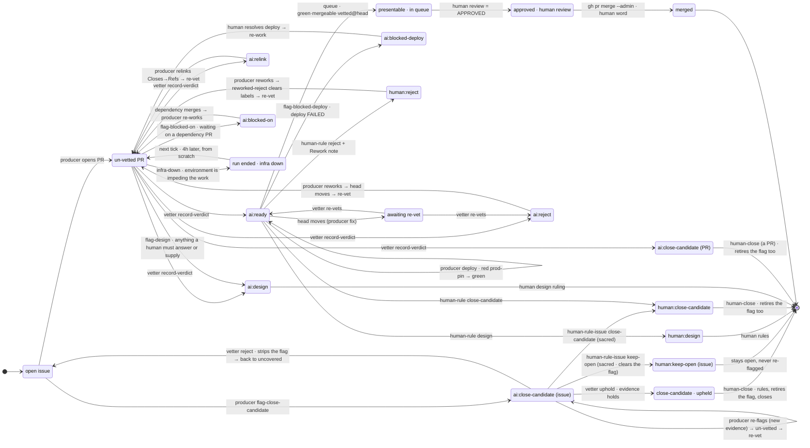

# rainlanguage org issue→PR pipeline

Local, autonomous cron jobs that drive issues to merge-ready PRs across the
rainlanguage **and cyclofinance** GitHub orgs. The pipeline is a **finite state
machine**: a PR's state _is_ its GitHub state — `ai:*` / `human:*` labels,
trusted `🤖 ai:vetter` comments, and its native review — and the
`pr-review-report` tool is the **only** transition function between states. A
**producer** cron and a **vetter** cron drive the automated transitions; landing
is interactive (a human merges on their explicit per-PR word). See
[CLAUDE.md](CLAUDE.md) for the framing.

## Pipeline state machine


```mermaid
stateDiagram-v2
    direction LR
    state "open issue" as issue
    state "ai:close-candidate (issue)" as icand
    state "close-candidate · upheld" as iupheld
    state "un-vetted PR" as unvetted
    state "awaiting re-vet" as revet
    state "ai:ready" as ready
    state "ai:reject" as reject
    state "ai:relink" as relink
    state "ai:design" as design
    state "ai:close-candidate (PR)" as close
    state "ai:blocked-deploy" as bdeploy
    state "ai:blocked-on" as bon
    state "run ended · infra down" as infradown
    state "human:reject" as hreject
    state "human:design" as hdesign
    state "human:close-candidate" as hclose
    state "human:keep-open (issue)" as ikeep
    state "presentable · in queue" as queue
    state "approved · human review" as approved
    state "merged" as merged

    [*] --> issue
    issue --> unvetted : producer opens PR

    %% issue close-candidate lifecycle — the vetter's SECOND subject. A flag is a CLAIM, and it is
    %% vetted before a human is asked to act on it (a bad flag asks a human to destroy work).
    issue --> icand : producer flag-close-candidate
    icand --> iupheld : vetter uphold · evidence holds
    icand --> issue : vetter reject · strips the flag → back to uncovered
    icand --> icand : producer re-flags (new evidence) → un-vetted → re-vet
    iupheld --> [*] : human-close · rules, retires the flag, closes
    icand --> hclose : human-rule-issue close-candidate (sacred)
    icand --> ikeep : human-rule-issue keep-open (sacred · clears the flag)
    ikeep --> [*] : stays open, never re-flagged

    %% vet lifecycle — the vetter is the sole verdict transition fn
    unvetted --> ready : vetter record-verdict
    unvetted --> reject : vetter record-verdict
    unvetted --> relink : vetter record-verdict
    unvetted --> design : vetter record-verdict
    unvetted --> close : vetter record-verdict
    ready --> revet : head moves (producer fix)
    revet --> ready : vetter re-vets
    revet --> reject : vetter re-vets

    %% ready → the human merge queue
    ready --> queue : queue · green·mergeable·vetted@head
    queue --> approved : human review = APPROVED
    approved --> merged : gh pr merge --admin · human word

    %% vetter verdicts route back to the producer, then re-vet
    reject --> unvetted : producer reworks → head moves → re-vet
    relink --> unvetted : producer relinks Closes→Refs → re-vet

    %% producer deploy + blocked hand-offs → human resolves → re-work
    ready --> ready : producer deploy · red prod-pin → green
    ready --> bdeploy : flag-blocked-deploy · deploy FAILED
    unvetted --> bon : flag-blocked-on · waiting on a dependency PR
    unvetted --> design : flag-design · anything a human must answer or supply
    bdeploy --> unvetted : human resolves deploy → re-work
    bon --> unvetted : dependency merges → producer re-works

    %% infra down is NOT a PR state — the RUN ends and no PR is touched (#108)
    unvetted --> infradown : infra-down · environment is impeding the work
    infradown --> unvetted : next tick · 4h later, from scratch

    %% human decisions are sacred — the vetter never re-verdicts these
    ready --> hreject : human-rule reject + Rework note
    ready --> hdesign : human-rule design
    ready --> hclose : human-rule close-candidate
    hreject --> unvetted : producer reworks → reworked-reject clears labels → re-vet
    hdesign --> [*] : human rules
    hclose --> [*] : human-close · retires the flag too

    design --> [*] : human design ruling
    close --> [*] : human-close (a PR) · retires the flag too
    merged --> [*]
```

Every transition above is a `pr-review-report` subcommand. A raw `gh` / `git`
state change from a prompt is a _loose_ transition — unenforced and untested —
so the prompts route **all** GitHub I/O through the tool. That is what makes
this an actual finite state machine rather than a picture of one.

### The human's transitions

Every actor's hand-off is a labelled transition — including the human's. That
was not true until #86: `human:reject`, `human:design`, `human:close-candidate`
and `human:keep-open` appeared in the binary only as strings it **read and
refused on**, so the one actor whose decisions everything else treats as sacred
was also the only one improvising raw `gh issue edit --add-label`.

| Transition                                             | The move it makes                                                                                     |
| ------------------------------------------------------ | ----------------------------------------------------------------------------------------------------- |
| `human-rule <owner/repo> <pr> <ruling> "<note>"`       | PR ruling — `reject` / `design` / `close-candidate`, pinned to the **head sha**                       |
| `human-rule-issue <owner/repo> <issue> <ruling> "<…>"` | issue ruling — those three plus `keep-open`, pinned to the **live flag** or to the **issue as filed** |
| `human-close <owner/repo> <n> "<note>"`                | the **terminal** edge, on either subject: rule, retire the pending flag, close — one transition       |
| `record-close-candidate-verdict <owner/repo> <issue>`  | the vetter's flag verdict, now reachable from a terminal too (the refusal above names it)             |

The vocabularies are not a second list: they **are** `HUMAN_DECISION_LABELS`
(PRs) and `HUMAN_RULING_LABELS` (issues), the same constants every AI transition
already refuses to override. A state added there gains its transition rather
than needing one, so the transition surface and the lane classifier cannot name
different states.

**A ruling is not a label; it is a label plus what it was ruling on.** The
comment a ruling posts pins to whatever the AI's ruling on the _same subject_
pins to, so the two records go stale together:

- a PR → its head sha: `👤 human` / `Ruled <sha>: reject — <note>`, the twin of
  `Reviewed <sha>: …`. A rework moves the head and the ruling visibly stops
  describing the code that is there.
- an issue carrying a **live** producer flag → the flag's timestamp:
  `Ruled close-candidate @<at>: keep-open — <note>`, the twin of
  `Reviewed close-candidate @<at>: …`. A re-flag invalidates it exactly as it
  invalidates the vetter's verdict.
- an issue with no live flag → the issue as filed: `Ruled issue @<createdAt>:`.
  Deliberately not a moving anchor — with no producer claim there is nothing
  that _can_ go stale — and saying `issue @…` rather than `close-candidate @…`
  is precisely the namespace distinction that was lost.

The guards are the same shape as the vetter's, and each exists for a failure
that has already happened:

- **the vocabulary**, from the constants above (a ruling outside them writes a
  label `classify_lane` buckets nowhere — a leak);
- **a note is required** (an unexplained ruling is indistinguishable from a
  mis-click, which is the whole complaint);
- **an anchor must exist** — no head sha, no ruling (`Ruled : reject` is the
  bound-to-nothing label this replaces);
- **a terminal subject is moot**, not refused: a merged PR or a closed issue has
  no state left to move out of, so nothing is written and the exit is 0;
- **re-ruling supersedes** rather than refuses. The human owns this namespace
  and may correct a mis-click, so the old `human:*` is removed and the new one
  added — the second sanctioned removal of a `human:*` label after
  `reworked-reject`, and sanctioned because the actor removing it wrote it;
- **a ruling that would strand a live flag is refused** (exit 4). This is the
  one from #86. On `rainlanguage/rain.erc4626.words#93` a hand-applied
  `human:reject` sat on an issue whose producer close-candidate flag had not
  been judged — and because **every** AI transition refuses once a human has
  ruled, `record_close_candidate_verdict` could never judge it again. The flag
  was stranded and undoing it took more raw `gh`. So on an issue carrying a live
  flag only the two rulings that **answer** the flag are legal, and the refusal
  names all three ways out, each a single command.

That last point is the rule the whole surface is built to respect: the human is
the top of the hierarchy, and **a tool that makes the sacred decision harder
than raw `gh` will simply be bypassed**. Every refusal here either has no legal
write to make or names the one-command move that is legal.

A ruling moves exactly **one** label. It never strips an `ai:*` label, with one
exception: `keep-open` clears `ai:close-candidate`, the only pair that
contradicts outright ("keep this open" against "close this"). Everything else is
merely stale, not contradictory — a `human:reject` PR deliberately keeps its old
`ai:ready` until `reworked-reject` clears it — and erasing the `ai:*` label
would erase the very claim the ruling was ruling on.

The writes happen in a fail-safe **order**, which is the reverse of the AI
verdict write's and is asserted as a property rather than left to statement
order: the comment lands before anything sacred is written (a sacred label with
no recorded reason is the failure being fixed), and the new ruling is added
before the old one is removed (the reverse has a window in which the subject
carries no human decision at all and every AI actor is free to move it).

#### The terminal edge — `human-close`

`iupheld --> [*]` and `hclose --> [*]` are edges of the diagram above, and until
#94 they had no transition function, so the only way to take them was raw
`gh issue close` — which knows nothing about the machine. The cost was measured:
when #94 was filed, **74** terminal subjects across the org (55 issues, 19 PRs)
were CLOSED and still carrying `ai:close-candidate`, a state no modeled
transition produces. In the same sitting the one ruling that did go through a
tool — a flag `reject` on `rain.dia#42` — came out clean. That asymmetry is the
argument: the transition with a tool was consistent, the one without it was
wrong every time.

`human-close <owner/repo> <n> "<note>"` is that edge as **one** transition: the
`👤 human` comment, `human:close-candidate`, the retirement of the pending flag,
then the close.

- **It is one transition, not a command that chains two.** A slash command that
  called `human-rule-issue` and then `gh issue close` would put the ORDER and
  the flag clear in a prompt — unenforced, untested, free to drift. Here the
  order is a tested property, and the close is **last** because a closed subject
  reads as moot to every ruling plan: closing first would make the labels
  permanently unreachable and a retry would report "nothing to do" over a
  half-written transition.
- **It retires `ai:close-candidate` and no other `ai:*` label.** That one label
  means "a human still has to ACT on this subject" — on an issue the producer's
  pending claim, on a PR the vetter's pending `close` verdict — and closing IS
  that act. Every other `ai:*` label is a judgement about the code and survives,
  exactly as the rulings leave it.
- **The ruling alone still leaves the flag standing.** While the subject is open
  the flag is the live pending claim and `closeCandidateUpheld` still counts it;
  only the terminal act retires it. The two are deliberately different, and that
  difference is the edge.
- **It resolves PR-or-issue by lookup**, from the subject's own `url`, so one
  `owner/repo#n` reference cannot act on the wrong one of the two populations
  that share the label name.
- **On an already-closed subject it clears a stale flag and writes no ruling.**
  The state had no exit and now has one — the machine has no dead ends — but the
  human's close is already on the record as GitHub's own close event, and a
  `👤 human` reason written today would date the decision to today. Manufactured
  provenance is worse than none.

#### One label, two populations

`ai:close-candidate` names two separately-sized sets: `closeCandidateIssues`
counts **issues** (a producer CLAIM awaiting judgement) and
`lanes.vetter-verdicts.ai:close-candidate` counts **PRs** (the vetter's own
`close` verdict). Every human transition therefore takes a full `owner/repo#n`,
and where it can act on either subject it READS which one it has rather than
trusting which command was typed. Where it cannot, it refuses by naming what was
actually referenced and handing over the command that fits — in **both**
directions, because a refusal a caller cannot act on sends them straight back to
raw `gh`:

- `record-close-candidate-verdict` pointed at a PR used to answer "no trusted
  producer close-candidate flag — nothing to judge", which reads as _this PR has
  no human path at all_ and was recorded as exactly that misreading. It now says
  the subject is a pull request, why a flag verdict cannot apply to one, and
  names the three moves that do.
- `human-rule` pointed at an issue used to answer "`gh pr view` failed — not
  writing on incomplete data", which reads as an API outage. It now names the
  subject and prints the `human-rule-issue` line, carrying the same ruling
  through.

### The human's slash commands

The transitions above are the layer a tool call reaches. The layer a **human**
types is a Claude Code plugin, published from this repo's own marketplace:

```
/plugin marketplace add rainlanguage/issue-pr-cron
/plugin install human-fsm@issue-pr-cron
```

| Command                                      | The transition it invokes                                                       |
| -------------------------------------------- | ------------------------------------------------------------------------------- |
| `/close-candidate <owner/repo#n> uphold "…"` | `human-close` — rule, retire the flag, close. Issue **or** PR, by lookup        |
| `/close-candidate <owner/repo#n> reject "…"` | `record-close-candidate-verdict … reject` — drop the flag, back to the producer |
| `/reject <owner/repo#n> "…"`                 | `human-rule` / `human-rule-issue` — `human:reject`                              |
| `/design <owner/repo#n> "…"`                 | `human-rule` / `human-rule-issue` — `human:design`                              |
| `/keep-open <owner/repo#n> "…"`              | `human-rule-issue … keep-open` — the sacred "never re-flag this"                |

Ruling on one close-candidate previously took four steps: a hand-written
JSON-RPC frame, `pr-review-report mcp` fed from a file, a Python filter to read
`isError` back out, then `gh issue comment` and `gh issue close`. It was done
seventeen times in one sitting. These collapse that to one invocation.

**Nothing in the plugin writes GitHub state.** Every guard — the ruling
vocabulary, the mandatory note, the provenance anchor, the stranded-flag
refusal, the subject-type check, terminal-is-moot, idempotence,
re-ruling-supersedes — is in the binary, where it is unit- and
mutation-validated. A command that re-derived a transition, or reached for raw
`gh` to do what a subcommand already does, would be the loose transition this
whole line of work exists to remove; the shipped commands are asserted against
that, by a test that reads their fenced blocks and requires every runnable line
to be a `pr-review-report` transition.

**Why a plugin rather than files with an install step.** The org already
distributes Claude Code assets this way — `claude-audit-skills`,
`adversarial-mutation-test` and `rain-org-health` each publish a
`.claude-plugin/marketplace.json`, and two of them are installed on the pipeline
box. `rain-org-health` is the shape followed here: a repo that is primarily
something else and publishes a plugin from a **subdirectory**
(`"source": "./plugins/human-fsm"`), so this repo does not have to pretend to be
a skills repo. And a slash command is the right form rather than a skill: these
are human-typed, deterministic, argument-taking transitions — "I have decided,
execute this" — not something a model should match by description and invoke on
its own.

**The version is stored twice, so agreement is a gate.** A plugin's version
lives in the marketplace listing installers read AND in the plugin manifest it
points at, and `/plugin` detects an update by comparing version strings — so a
listing naming the old version silently serves stale content.
`pr-review-report plugin-version-lockstep` asserts they agree for every plugin
the marketplace lists (and that each entry resolves to a manifest of the same
name), and `.github/workflows/version-hygiene.yaml` runs it plus the
change-must-bump check. It is a subcommand rather than a CI shell script for the
reason `require-qa-block` is: everything it does is parsing.

### The vetter's transitions as an MCP surface

For the producer, routing through the tool is enforced by the **prompt**, and a
Bash deny-list is prefix-matched and bypassable. For the vetter that gap is
closed: `pr-review-report mcp` serves its transitions over MCP (stdio), and that
server is the vetter's **only** tool surface.

| Tool                             | The move it makes                                                                                                                                                                           |
| -------------------------------- | ------------------------------------------------------------------------------------------------------------------------------------------------------------------------------------------- |
| `unvetted`                       | state-load: ONE PAGE of the open PRs to vet, vet-first, each with head/labels/review/sacred/vetted/ci/mergeable, plus the whole-queue `counts`, `more`, and the `openThreads` withhold list |
| `pr_context`                     | read one PR: body, files, diff, every linked issue, and the trusted `🤖 ai:*` comments — one call                                                                                           |
| `pr_checkout`                    | local read-only clone of the PR head, so the `audit` skill has source — returns the `dir` AND the `head` sha it produced, or errors having left nothing behind                              |
| `record_verdict`                 | the PR write: `ai:<verdict>` label + sha-bound `🤖 ai:vetter` comment + cost                                                                                                                |
| `clone_release`                  | dispose of a checkout it is finished with (guarded — see below)                                                                                                                             |
| `unvetted_close_candidates`      | state-load: ONE PAGE of the producer close-candidate flags to judge, each with its `flagAt` + stated evidence                                                                               |
| `close_candidate_context`        | read one flag: the issue's title/body/`createdAt`/labels plus the full flag body and any prior verdicts                                                                                     |
| `record_close_candidate_verdict` | the issue write: `uphold` (flag stands, queued for the human) or `reject` (strips `ai:close-candidate`)                                                                                     |

There is a **third profile**, and it is the answer to "CLI subcommand or MCP
tool?" for the human: `pr-review-report mcp --profile human` (wired by
`human-mcp.json`) serves `pr_context`, `close_candidate_context`, `human_rule`,
`human_rule_issue` and `human_close` — read the subject, rule on it, close it.
`human_close` is a tool rather than something the caller composes for the reason
above: the alternative is a transition half in a tool and half in a prompt, and
that half was wrong on all 74 closed-and-still-flagged subjects. The subcommands
above are for the human at a terminal; the profile is for **an agent acting on
the human's behalf**, which is the case that actually went wrong in #86. A
prompt rule cannot take a bypassable Bash away, and a `gh issue edit` that no
tool offers is exactly what gets improvised; a profile makes the non-FSM
operation _unavailable_. The vetter's inbox tools are deliberately absent — the
human's inbox is `human-queue`, which renders whole org-wide sets and does not
fit one tool result — and so is `record_close_candidate_verdict`, which is the
vetter's authority and the very move `human_rule_issue` refuses on the human's
behalf.

The last three vetter tools are its **second subject**. A PR asks a human to
merge code; a close-candidate flag asks a human to **destroy work**, so the flag
is judged before it reaches the triage queue. The shape is identical to the PR
side — state-load, read one, record one verdict — including the
vetted-at-the-thing-judged rule: a PR re-vets when its head moves, a flag
re-vets when the producer posts a new one.

`review-run.sh` always launches the model with `--mcp-config review-mcp.json`,
`--strict-mcp-config` and `--settings review-settings.json`, so the vetter's
entire tool surface is
`mcp__fsm__{unvetted,pr_context,pr_checkout,record_verdict,clone_release,unvetted_close_candidates,close_candidate_context,record_close_candidate_verdict}`
plus `Read`/`Grep`/`Glob`/`Skill`/`ToolSearch` — **no Bash**, so there is no raw
`gh` or `git` to reach for. There is no second vetter configuration and no flag
that selects one. The guards (verdict vocabulary, a mandatory 0-1000 cost, a
well-formed `owner/repo#n`, the human-sacred refusal) are enforced in the server
and unit-tested rather than restated in the prompt.

Those thirteen schemas are **presented, not deferred**: `review-run.sh` exports
`ENABLE_TOOL_SEARCH=false`, so the surface rides in the preamble instead of
costing the vetter a first-turn `ToolSearch` to rediscover a fixed allowlist by
name. `ToolSearch` nonetheless stays in the allow-list as the fail-safe — if a
harness defers anyway, a vetter that cannot call it sees its own tools as
nonexistent and records nothing at all (#63). The producer keeps deferral: it
has Bash and a far larger surface, where the round trip pays for itself.

### Every tool result is bounded, and going over is the tool's error

A state-load is a **page**, not a dump. `unvetted` and
`unvetted_close_candidates` return at most `limit` rows (default 10, max 25)
with the whole-queue `counts` alongside and `more` naming what the page left
behind; the vetter re-calls for the next page, and because each `record_verdict`
removes its subject from the queue, paging converges without an offset argument.
The page size is what makes the bound structural — the payload no longer grows
with the number of open PRs.

Every result is then checked against **one byte budget, the same for every
tool** (36,000 bytes), and a result over budget is returned as a **tool error
naming the argument to narrow** — never truncated, never spilled. On 2026-07-27
`unvetted {"include_skipped": true}` returned 63,742 characters on one line, the
harness refused it, and the vetter improvised a fallback that silently dropped
the whole open-threads accounting; the run log looked normal. A partial
state-load cannot say what it is missing, so the tool refuses to produce one.

**The budget must be lower than what the harness accepts, and that is the
mechanism, not a preference.** If the harness is the thing that speaks, what
comes back is untyped and arrives with `is_error` **unset** — so every rule
downstream about "a tool error is an instruction" stops applying at the moment
it is needed. `pr_context` used to be budgeted at `max_diff_bytes + 32,000`, up
to **332,000 bytes**, roughly six times what the harness accepts; its guard
could not fire, and the harness's message arrived instead. The value is now
measured rather than derived from halving a payload that had already been
refused — see [the ceiling, measured](#the-ceiling-measured).

Two consequences follow from one budget for every tool. `max_diff_bytes` can no
longer be raised past it, so a `pr_context` cannot buy itself more room than any
other tool gets. And **narrowing converges**: while the budget scaled with
`max_diff_bytes` and the diff was truncated to `max_diff_bytes`, lowering the
argument lowered allowance and payload equally, so "re-call NARROWER" was a loop
with no exit. Against a fixed allowance a smaller argument is a strictly smaller
result.

`pr_context` does not wait to be refused: it **fits itself** to the budget,
shrinking the diff until the document lands under it, and reports `diffBytes`
(the whole diff), `diffIncluded` (what actually made it in) and `diffTruncated`
so the gap between what exists and what was handed over is visible rather than
inferred. The shrink terminates — each round removes at least the overflow from
the cap, and one raw byte of diff is at least one byte of document — and the one
case no argument can fix, metadata alone over the budget, is a typed error that
says exactly that.

#### The ceiling, measured

Against Claude Code 2.1.220, by calling `pr_context` through the real harness at
increasing `max_diff_bytes` and reading the `tool_result` the model actually
received. There are **two** independent gates and **both** arrive with
`is_error` unset:

| gate  | what the model gets                                             | boundary                                                      |
| ----- | --------------------------------------------------------------- | ------------------------------------------------------------- |
| byte  | `<persisted-output> Output too large (NN KB)` + a 2 KB preview  | delivered at 50,011 bytes, replaced at 50,176                 |
| token | `Error: result (N characters …) exceeds maximum allowed tokens` | the gate the live traces hit, at 63,742 and 56,789 characters |

The byte gate is **not** governed by `MAX_MCP_OUTPUT_TOKENS` — forcing that to
200,000 still replaced a 50,486-byte result — and it is the more dangerous of
the two, because the 2 KB preview it substitutes looks like the head of a real
answer. The token gate is: forcing the variable to 100 replaced a 4.5 KB result.
Isolating it at `MAX_MCP_OUTPUT_TOKENS=10000` puts its boundary between 27,152
and 30,163 bytes, so this JSON measures **2.7–3.0 chars/token**; nothing on the
box sets that variable, and 56,789 characters tripped it live, which puts the
default near 19–21k tokens. Both gates therefore land around 50 kB for this
content.

36,000 sits ~28% under both. The margin is not timidity: the token gate scales
with the **content**, and a diff of generated hex — which this org has, in every
`src/generated/*.pointers.sol` — tokenises far worse than prose. At 36,000 bytes
even a payload tokenising at 1.5 chars/token stays inside a 19k-token cap.

The `openThreads` list is unconditional for the same reason: the PRs withheld
for unresolved threads (and their `unresolvedThreads` counts) are the only
skipped rows carrying information the vetter can act on, and making that
accounting depend on an optional argument is exactly how it went missing.

### The audit lens's working tree: the PR head, or nothing

`pr_checkout` shallow-clones the repo and fetches **`refs/pull/<n>/head`** into
`refs/remotes/origin/pr/<n>`, then checks that out as `pr-<n>`. Three properties
follow, and each fixes a distinct failure:

- **It works on a shallow clone.** `gh pr checkout` does not: a `--depth 1`
  clone's fetch refspec is
  `+refs/heads/<default>:refs/remotes/origin/<default>`, so a same-repo PR's
  head arrives as a bare fetched ref and `git checkout --track` refuses it —
  _"cannot set up tracking information; starting point 'origin/<head>' is not a
  branch"_ — for **every** same-repo PR, i.e. every PR that needed the audit
  lens (#81).
- **It stays shallow.** The obvious repair — widen the refspec and keep
  `gh pr checkout` — makes the follow-up fetch deepen the clone to nearly full
  history. Measured on raindex: **156 MiB** of pack against **3.9 MiB** for the
  pull-ref fetch, with `--depth 1 --no-single-branch` at 78 MiB and a full clone
  at 180 MiB. Disk-full silently killed both crons for ~17h (#56), so the fix
  that costs nothing over the shallow clone already intended is the only one
  that is not a trade.
- **The head is on a remote-tracking ref**, which is what makes the commit count
  as pushed. `gh pr checkout` puts a **fork** PR's head on a plain local branch,
  so `rev-list HEAD --not --remotes` reports the whole branch as unpushed and
  both `clone_release` and the sweep refuse the clone forever.

**Its postcondition is binary: the PR head at `dir`, or no `dir` at all.** The
old code returned an error while leaving the directory behind, because
`gh repo clone` had succeeded and only the checkout failed — so a directory
named after the PR sat at exactly the path the audit lens looks for, holding the
**default branch**. On 2026-07-27 the vetter met that failure, went looking for
a tree, found the leftover `vet-rain.factory-dep` from an unrelated run, and
began enumerating its Solidity sources as `rain.factory#47`'s. The chain is
broken in four places: the checkout works; a failed one deletes what it made;
the failure is an `isError` that names the wrong answer a filesystem search
returns and forbids it; and the sweep reclaims the leftovers a search would
otherwise find. The success value carries the `dir` **and** the `head` sha, so
locating (or recognising) the tool's own output is not a step that exists.

**What the vetter therefore does not verify.** With no Bash it cannot build, and
cannot execute anything in the clone `pr_checkout` gives it — it reads source,
it does not run it. Two checks live elsewhere as a result, and the vetter prompt
does not ask for either:

- **A clean working tree after a build.** Keeping a work clone clean by
  construction is the **producer's** obligation (`campaign-prompt.txt` step 6b:
  `git status --porcelain` must be empty before the work counts as submitted,
  and build/tooling dirt is gitignored as part of the PR). For rainix Solidity
  repos the committed-artifact half is additionally enforced on every push by
  the shared `rainix-copy-artifacts` workflow, which regenerates, builds, and
  fails on `git diff --exit-code`.
- **Re-running a PR's tests.** The QA gate checks that the QA-GUIDE.md section-8
  evidence block **exists** and that its claims are consistent with the diff it
  reads. It does not re-run the named tests against base; CI runs them, and a
  red CI is the producer's to green, never a vetter `reject` ground.

### Work-clone lifecycle as an MCP surface (always on)

`pr-review-report mcp --profile producer` serves the **producer's** clone
lifecycle: `clone_create`, `clone_release`, `clone_list`, `clone_gc`. Unlike the
vetter's surface this one is **additive** — the producer keeps its Bash, and is
wired unconditionally (`--mcp-config campaign-mcp.json`, no
`--strict-mcp-config`), because what it gains is an operation it could not
previously perform at all:

`campaign-settings.json` denies `Bash(rm -rf /:*)`. Deny rules are
**prefix-matched**, so that also denied `rm -rf /home/gildlab/code/<clone>` —
every work-clone path — while `campaign-prompt.txt` mandated exactly that
deletion the moment a PR was pushed. The two contradicted each other for months;
the clone directory grew to **195 GB** and disk-full is the documented cause of
the producer's silent-death failure mode (#56).

The fix is not a wider deny rule (that fixes the instance and keeps the shape).
It is that **the model no longer supplies a path to delete** — it names a clone,
and the name is resolved in Rust before any syscall:

- exactly one path component directly under a configured root (`WORK_DIR`, plus
  `INSTALL_DIR`, where the vetter's `vet-*` clones were stranded); roots come
  from the environment, never from a tool argument;
- no `..` anywhere, no absolute path outside the root (including the
  sibling-prefix trick that fooled the deny rule), never the root itself or an
  ancestor, never a `.`-prefixed entry, never a symlink;
- the target must contain `.git` — **only a git work clone is ever deletable**,
  so no malformed argument can reach ordinary data.

Release refuses **unconditionally** on commits that exist only in the clone (or
an unknown push state); uncommitted changes refuse too, overridable with
`discard_uncommitted` once the caller has confirmed the dirt is build output.
`clone_gc` remains the unattended backstop with the old, deliberately
conservative rule — it deletes only what it can prove is finished.

**Audit-lens checkouts are the one exception, and they had to be.** A `vet-*`
clone is the PR the vetter is **judging**, so its PR is always OPEN, and "open
PR → active work" made every leaked checkout immortal: 83 of them, 349 MB, under
a sweep that had been running nightly the whole time (#81). They are now
disposable on **age alone** — one day, ~12× the vetter's own 2h `REVIEW_MAXTIME`
ceiling, independent of `--max-age-days`. The dirt/unpushed guards still run
first, and "idle" is read as the newer of the clone directory's mtime and
`.git/HEAD`'s — a checkout rewrites files below the top level, so the
directory's own mtime does not move, and a clone the vetter checked out minutes
ago would otherwise read as days idle and be deleted underneath a run still
using it. So "never delete something that holds work" is unchanged; what changed
is that a read-only copy of a commit already on GitHub stopped being treated as
work. This sweep is the **only** thing that reclaims a leaked checkout, and it
has to be: a run that dies is exactly the run that leaks, so a `clone_release`
on the way out can never be the mechanism.

The machine has **no dead-ends**: every state has an exit back into the
lifecycle or to a terminal (`merged` / a human ruling). The vet lifecycle
(`un-vetted → vetting → awaiting re-vet`) re-runs the vetter whenever a PR's
head moves, so a reworked PR is always re-judged against its current code. The
**human reject is TRANSIENT**, not terminal: when a human applies `human:reject`
and a trusted "Rework note", the producer executes the rework, pushes a fix
commit, and then calls **`pr-review-report reworked-reject <owner/repo> <n>`**
as its final step. That subcommand REMOVES `human:reject` **and any stale `ai:*`
verdict** (the code changed → re-vet from scratch), returning the PR to
ready-to-vet so it re-enters the normal vet → queue → human loop. It is guarded:
it clears `human:reject` **only** when the PR head commit provably
**post-dates** the `human:reject` label event (the one sanctioned carve-out from
"never remove a `human:*` label"); a head that does not post-date the reject is
refused, so a still-standing human reject is never silently undone.

`human-queue --json` emits the **full** inventory — every modeled state's PRs,
grouped into four lanes so the dashboard can show where PRs pile up:

- **vet-lifecycle** — `un-vetted` (open PRs awaiting a first verdict) and
  `awaiting-re-vet` (an `ai:ready` PR whose head moved past its last vetter
  verdict).
- **vetter-verdicts** — `ai:ready`, `ai:reject`, `ai:relink`, `ai:design`,
  `ai:close-candidate`.
- **producer-blocked** — `ai:blocked-deploy`, `ai:blocked-on`, plus the RETIRED
  `ai:blocked-infra` for as long as any PR still carries it (#108).
- **human-decisions** — `human:reject`, `human:design`, `human:close-candidate`.

Each PR is bucketed **once**, by FSM precedence (a human decision dominates a
stale `ai:*` label). The legacy `states` / `leaks` / `counts` keys are preserved
unchanged; `lanes` and the additive `counts` keys (`reject`, `relink`,
`closeCandidatePrs`, `humanReject`, `humanDesign`, `humanCloseCandidate`,
`unvetted`, `awaitingReVet`) are the full-machine view the dashboard renders.

The ISSUE close-candidate lifecycle carries two further additive counts, which
split the existing `closeCandidateIssues` (unchanged: every issue carrying the
label) by vet state:

- **`closeCandidateUnvetted`** — flagged, no `human:*` ruling, and no vetter
  verdict against the CURRENT flag. This is the vetter's inbox, and it is the
  same set `unvetted-close-candidates` returns, so the dashboard and the vetter
  cannot disagree about its size.
- **`closeCandidateUpheld`** — the vetter judged the evidence sound, so the flag
  genuinely awaits human triage.

A **rejected** flag needs no count: the vetter strips `ai:close-candidate`, so
the issue leaves this set entirely and reappears under `uncoveredIssues` — the
producer's queue — which is exactly the behaviour a rejection should have.

Both are emitted exactly as `closeCandidateIssues` and `uncoveredIssues` are:
the key appears **twice** — at the top level as the ITEM ARRAY and under
`counts` as its length. The dashboard's state boxes are click-through, so a
count without its array renders a number that then lists nothing. Arrays and
counts are derived from a single document, so `counts.X == X.len()` holds by
construction. These are ISSUE states, so — like `closeCandidateIssues` — they
are **not** in `lanes`, which groups PRs.

### The subject-reference shape

Every reference to a GitHub subject in `human-queue --json` — a lane item, a
`states` member, `closeCandidateIssues`, `closeCandidateUnvetted`,
`closeCandidateUpheld`, `uncoveredIssues`, `leaks` — is **one** shape:

```json
{
  "repo": "owner/repo",
  "number": 512,
  "url": "https://github.com/owner/repo/issues/512",
  "title": "…"
}
```

`leaks` adds `reason`; nothing subtracts. The `url` is the one **GitHub
reported**, never rebuilt from `repo` + `number`: `{repo, number}` alone does
not say whether a number is an issue or a PR, and `closeCandidateUnvetted`
genuinely holds both (the producer can flag either). It costs nothing to carry —
every one of those arrays is built from a `gh search` / `gh issue view` payload
that already returns the url, so no extra call is made for it.

That is enforced by a single type (`SubjectRef`) with a single serialiser, not
by several structs agreeing: adding or removing a field is a compile error at
every construction site and every reader. The arrays drifted apart once already
(#114 — lane items carried `url`, the top-level arrays did not), and nothing
failed; a consumer just could not render a link.

The producer never narrates a hand-off in prose. Anything it cannot land is a
labeled transition into exactly one modeled state: `design`, `close-candidate`,
`blocked-deploy`, or `blocked-on`. Those four plus `ready` (the merge queue) are
the **human-gated states** — the daily review queue, a plain label search, no
prose scraping. `design` is the **total-function fallback**: a situation the
producer cannot classify is by definition one a human has to look at, and
`design` already means exactly that.

### Infrastructure down ends the run (#108)

`ai:blocked-infra` used to be the fourth blocked state and the total-function
fallback. It is **retired**. The prompt made the label a cross-run marker —
_"skip a PR already in that state"_ — so a PR that met a ten-minute outage was
parked until a human removed the label by hand. Thirteen ordinary PRs sat there
(a `pi` constant word, a staleness-overflow fix, a README setup fix); none of
them were infra problems. **Infrastructure being down is a property of the
moment, not of a PR.**

The response is one exit, and nothing else:

| Piece                                                              | What it does                                                                                                                                                                                                                                |
| ------------------------------------------------------------------ | ------------------------------------------------------------------------------------------------------------------------------------------------------------------------------------------------------------------------------------------- |
| `infra-down "<what is unavailable>" [--root-cause <owner/repo#n>]` | The model's mid-run exit. Records the finding once, exits **12**, touches no PR — no label, no comment, no GitHub call at all.                                                                                                              |
| `run-infra [<record>]`                                             | The runner's read-back. Exit **12** when the run recorded an outage, which is how `campaign-run.sh` ends a run on something discovered **mid-flight** — every other exit in that script (82, 90, 96, and the preflight abort) is pre-model. |
| `run-metrics --infra <record>`                                     | Folds `infraDown` / `infraReason` / `infraRootCause` onto the `runs.jsonl` line, beside #91's `unreadableFiles` / `commandsNotFound` / `missingTools`, and makes the run's `outcome` **`infra-down`** rather than `ok`.                     |
| `retire-blocked-infra [--dry-run]`                                 | One-shot: strips the retired label from every open PR still carrying it.                                                                                                                                                                    |

**There is deliberately no detector.** No threshold, no failure-signature
classifier, no "is this a real outage or just a flake". The model declares what
it saw and the run ends. That follows from the cost asymmetry: a **false exit**
costs one skipped run and the cron runs again in four hours, while a **false
negative** costs a whole run producing PRs nothing can verify — which is exactly
what `20260728T111645Z` did, with labelling churn on seven PRs as the visible
half. Every line of detection logic is machinery that can be wrong in the
expensive direction to avoid an outcome that costs nothing, so there is none.
Exiting on a flake is fine.

This is #91's rule one step later. `preflight` ends the run **before a token is
spent** when a harness tool is missing, because _"no verdict at all beats a
verdict from a lens that was blind without saying so"_. Here: no PRs at all
beats PRs against a fleet whose CI cannot pass.

The record is the entire output, and that is the argument for the swap: **errors
accumulate, labels do not.** One exit is noise; `outcome == "infra-down"` across
twenty runs is a signal a human can act on, and nobody has to audit labels to
find it —

```
jq -r 'select(.infraDown) | "\(.runId)  \(.infraRootCause)  \(.infraReason)"' metrics/runs.jsonl
```

Two things are unchanged. A red that **one PR can green** is still that PR's
work (the 3b rules are untouched). And anything genuinely permanent that needs a
**person** — a secret that exists nowhere, a harness that cannot render a stack
— is a question for the human, so it goes to `flag-design`, not to an exit that
would end every run forever.

The three crons are **staggered by 2 h** so work flows downstream within each
4-hour cycle (all times UTC):

```
   :00  ✅ MERGE     lands the PRs you approved last cycle
   :01  🤖 PRODUCER  greens its own red PRs FIRST, then opens new fix PRs
   :03  🔍 VETTER    AI-reviews the fresh PRs → records verdicts
        👤  ……  you approve anytime  ·  pr-review-report.sh --ready
   :04  ✅ MERGE     (next cycle) lands what you just approved … ⟳

   6 cycles/day. A PR opened at :01 is vetted by :03; once you approve,
   the next :00/:04/:08… merge run lands it — hours end-to-end, hands-off.
```

- **Producer** (`campaign-run.sh`, every 4h at :00 of 1,5,9,13,17,21 UTC) —
  opens drives its OWN red PRs green FIRST (existing in-flight work, non-force
  commits), THEN opens one fix PR per tractable, uncovered issue (audit-backlog
  first). Org-mutating actions: `gh pr create`, `gh pr comment` (screenshots),
  and non-force `git push` to its own PR branches. Never
  merges/closes/deploys/force-pushes. Skips issues with a `reject` verdict
  (parked for a human, so a rejected fix isn't re-attempted into dead PRs).
- **Vetter** (`review-run.sh`, every 4h at :00 of 3,7,11,15,19,23 UTC) —
  AI-reviews open PRs and records a verdict as an `ai:*` label plus a sha-bound
  comment. Approval is the human's gate.
- **You approve** — review with `pr-review-report.sh`; approval is a GitHub
  `APPROVED` review, and only approved PRs are mergeable.
- **Merge cron** — RETIRED. Landing is interactive-only: the human merges, or
  the interactive assistant merges on an explicit per-PR go-ahead. Noted here
  only so a reader of older docs is not left looking for it.

## Scope — read this first

**The org-mutating actions this routine takes are `gh pr create`,
`gh pr comment` (UI screenshots), and a non-force `git push` of fix commits to
its OWN open red PR branches (to drive them green).** It **never** merges,
deploys, force-pushes, or closes/edits/comments-on issues. If it believes an
issue should be closed (already fixed, invalid, duplicate) it records a
_close-candidate_ — it never acts on it. This is enforced two ways: the
permission deny-list in `campaign-settings.json` and the rules in
`campaign-prompt.txt` (step 7 / 7a).

That flag is then **vetted before a human sees it**. The producer is the party
with an incentive to believe its own evidence, so the vetter judges the claim
the same way it judges a PR: `uphold` leaves the flag queued for the human, and
`reject` strips `ai:close-candidate` and returns the issue to the producer's
uncovered queue. Only the human ever CLOSES an issue — but the queue they triage
has had its wrong flags filtered out first. Hand-triage of ~29 flags found
roughly one in three unsupported (#72), in three classes the vetter now checks
explicitly: evidence that predates the issue, evidence that is unreachable code,
and evidence that answers a narrower question than the issue asked.

## Files (tracked here)

| File                     | Purpose                                                                                                                                                                                                                                                                                                          |
| ------------------------ | ---------------------------------------------------------------------------------------------------------------------------------------------------------------------------------------------------------------------------------------------------------------------------------------------------------------- |
| `campaign-run.sh`        | Durable runner (built as the `campaign-run` flake package): `flock` single-run lock, `DISABLED` kill-switch, `timeout`, invokes `claude --print` with the prompt + settings, logs to `campaign.log` (+ per-run JSONL traces in `runs/`). Nix builds its PATH; it sets none itself.                               |
| `campaign-prompt.txt`    | The campaign instructions fed to the model.                                                                                                                                                                                                                                                                      |
| `campaign-settings.json` | Tool allow/deny list passed via `--settings` (the permission guardrails).                                                                                                                                                                                                                                        |
| `review-run.sh`          | Vetting runner (same hardened pattern as `campaign-run.sh`): vets open PRs on the MCP surface, logs to `review.log`. Its one GitHub write is `record_verdict`. Kill-switch `review-DISABLED`.                                                                                                                    |
| `review-prompt.txt`      | The AI-vetting instructions fed to the model: the judgement gates only — every `gh` recipe is a tool schema instead.                                                                                                                                                                                             |
| `review-settings.json`   | Tool allow/deny for the vetter: the five `mcp__fsm__*` tools + `Read`/`Glob`/`Grep`/`Skill`/`ToolSearch`, **Bash denied outright**.                                                                                                                                                                              |
| `review-mcp.json`        | The vetter's MCP config: one stdio server, `pr-review-report mcp`, named `fsm` (so its tools are `mcp__fsm__*`).                                                                                                                                                                                                 |
| `campaign-mcp.json`      | MCP config for the producer's clone-lifecycle surface: one stdio server, `pr-review-report mcp --profile producer`, named `fsm`. Additive — the producer keeps its Bash.                                                                                                                                         |
| `cron.env.example`       | Template for deployment-specific values (PR assignee, work dir, models, run caps). Copy to `cron.env` (gitignored) and edit.                                                                                                                                                                                     |
| `pr-review-report.sh`    | Thin wrapper (flake package `pr-review-report-sh`) over the binary. Reports every open PR by its pipeline stage (approved / AI-vetted / needs-producer-fix (red) / conflicting / relink / reject / close / unreviewed / pending / draft), reading `ai:*`/`human:*` labels + GitHub approvals, as clickable URLs. |
| `hooks/`                 | The two bash PreToolUse guards that close deny-list bypasses. See [PreToolUse guards](#pretooluse-guards--what-a-prompt-cannot-hold).                                                                                                                                                                            |
| `.claude-plugin/`        | The marketplace listing this repo publishes. Its version must match the plugin manifest's — `pr-review-report plugin-version-lockstep` is the gate.                                                                                                                                                              |
| `plugins/human-fsm/`     | The human's slash commands as a Claude Code plugin. Prompts only: every guard is in the binary. See [The human's slash commands](#the-humans-slash-commands).                                                                                                                                                    |

## PreToolUse guards — what a prompt cannot hold

A prompt is advice and a permission deny-list is prefix-matched, so some
invariants can only be held by a PreToolUse hook, which sees the actual tool
call. Three are wired that way. **Only two of them are scripts:**

| Guard                               | Holds                                                                                                                                                   |
| ----------------------------------- | ------------------------------------------------------------------------------------------------------------------------------------------------------- |
| `pr-review-report require-qa-block` | QA-GUIDE.md section 8 — a `gh pr create` whose body has no `## QA` section, or names fewer than all four evidence lines, is refused with what's missing |
| `hooks/block-nix-wrap-gh.sh`        | `nix shell/run nixpkgs#gh` re-wrapping, which makes a command start with `nix` and so slips the `Bash(gh …)` deny-list                                  |
| `hooks/block-cron-git-bypass.sh`    | `git -C <dir> reset --hard` / `git -C <dir> push --force`, the spellings that evade guards anchored on a bare `git reset` / `git push`                  |

The QA gate is a **subcommand**, per CLAUDE.md's north star: everything it does
is parsing — a shell word-splitter, a heading scanner, a distinct-line
assignment — which is the work this binary exists to own. Being in the binary
also means it ships in the flake closure and its tests run inside the nix build;
a script under `hooks/` cannot, because the derivation's fileset is the
manifests plus the crate, so a repo-root script is absent there and every test
driving one skipped. The other two are still bash and still untested —
[#10](https://github.com/rainlanguage/issue-pr-cron/issues/10) tracks giving
them the same treatment.

Nothing here is **installed by the flake as a hook**: wire each into the box's
user `settings.json` as a PreToolUse `Bash` hook. The two scripts carry their
own `DEPLOY:` note; the subcommand is invoked directly, with no wrapper script
around it:

Claude Code's `settings.json` is strict JSON — **no comments**, so the block
below is copy-pasteable as-is:

```json
{
  "hooks": {
    "PreToolUse": [
      {
        "matcher": "Bash",
        "hooks": [
          { "type": "command", "command": "pr-review-report require-qa-block" },
          {
            "type": "command",
            "command": "<install-dir>/hooks/block-nix-wrap-gh.sh"
          },
          {
            "type": "command",
            "command": "<install-dir>/hooks/block-cron-git-bypass.sh"
          }
        ]
      }
    ]
  }
}
```

The first entry is the flake-built binary invoked directly, with no bash wrapper
around it. `nix profile install <install-dir>#pr-review-report` puts it on PATH;
otherwise substitute the absolute path from
`nix build --no-link --print-out-paths <install-dir>#pr-review-report`.

Each reads the hook payload on stdin and exits `0` to allow or `2` to block,
with the refusal on stderr — the stream Claude Code feeds back to the model, so
a refusal is a **failed tool call carrying the fix**, not advice printed beside
a PR that opened anyway.

The two scripts return early unless `RAINIX_CRON_HOOK=1` (the cron runners
export it), so interactive sessions are untouched. `require-qa-block`
deliberately does not: the producer cron was the population already honouring
section 8 — every PR body in `runs/` carries the block — and the five PRs the
vetter rejected for a missing block (#83) were opened while that cron was
`DISABLED`, by interactive sessions under the same bot account. A guard scoped
to the cron would have covered everything except the thing that failed, and for
the same reason this cannot be an MCP transition: a tool surface binds only a
session launched with it, while a PreToolUse hook binds every session on the
box.

Its behaviour is covered by `pr-review-report-rs/tests/require_qa_block.rs` — a
content invariant on a command line is all parsing, and parsing is not something
a static read of the source can judge.

**None of the three is a security boundary.** They read a command line with a
lexer that resolves quoting and nothing else, so a determined bypass always
exists — a script file the gate cannot read, an expansion it does not perform.
Where the QA gate can see that a word it needs is unevaluable (`gh pr $C`) it
refuses and says why; where it cannot see that at all, the command runs. What
these guards buy is that the common ACCIDENT becomes impossible, not that
evasion does.

## Configuration

Deployment-specific values are **not** committed. Copy `cron.env.example` to
`cron.env` (gitignored) and set at least `PR_ASSIGNEE` (the GitHub handle every
opened PR is assigned to). `WORK_DIR`, `MODEL`, `MAXTIME`, `KEEP_RUNS` have
defaults and may be overridden there. The runner takes its install dir from
`CRON_DIR` (falling back to the working directory) and gets its `PATH` from the
flake closure, so there are no machine paths in the repo; `campaign-prompt.txt`
uses `{{WORK_DIR}}` / `{{SCRATCH_DIR}}` / `{{INSTALL_DIR}}` / `{{ASSIGNEE}}` /
`{{OWNER_FLAGS}}` / `{{ORGS}}` placeholders that the runner substitutes at run
time.

### The producer's scratch dir

Each producer run gets `$WORK_DIR/scratch/<run-id>`, created before the model
starts, handed to the prompt as `{{SCRATCH_DIR}}`, and deleted when the run
ends. It is where every throwaway file goes — cached tool output, a PR body
being drafted — so that no run has to invent a path of its own. Before it
existed they all did, and the results sat in the install dir for six weeks
behind `.gitignore`'s `/*` (#106).

The part that is not guessable: **`--add-dir` does not make a directory writable
by bash output redirection.** A redirection is a `create` operation, and
working-directory membership — all that `--add-dir` and
`permissions.additionalDirectories` confer — authorises `create` only in
`acceptEdits` mode. Under `--permission-mode default` it needs an edit-kind
allow rule, which is why the runner also passes
`--allowedTools "Edit(//$SCRATCH_DIR/**)"`; the `//` prefix is required, as
`Edit(/abs/**)` never matches and fails silently. The refusal a model gets
without that rule names the directory it just tried as allowed, so the symptom
points nowhere near the cause — hence the `producer scratch dir is writable` CI
job, which asserts the rule, the substitution and the cleanup still line up.

The vetter needs none of this: `review-settings.json` denies `Bash`, `Write` and
`Edit` outright, so it has no way to write a file at all.

## Reviewing the output — the merge pipeline

A PR moves through two distinct gates before it merges:

```
🟦 unreviewed  →  🤖 AI-vetted  →  ✅ you approve  →  merge
```

- **AI review** is the automated pass (the review campaign): it records a
  verdict as an `ai:*` label plus a sha-bound comment. An `ai:ready` verdict
  means "passed automated review" — it is **NOT** a human sign-off.
- **Human approval** is _your_ gate: a GitHub `APPROVED` review, or a `human:*`
  label. **Only an approved PR is "ready to merge"**, and the merge is only ever
  performed on your explicit go-ahead.

`./pr-review-report.sh` prints every open PR bucketed by where it sits in that
pipeline, all as clickable URLs: **✅ approved by you** (ready to merge) · **🤖
AI-vetted — awaiting your approval** · **🔴 needs a producer fix** (CI red — the
producer drives it green) · **🔧 AI-flagged: relink** · **❌ reject /
changes-requested** · **🗑️ close (dup/superseded)** · **🟦 not yet reviewed** ·
**⚠️ conflicting** (needs rebase) · **🟡 pending** · **📝 drafts** · plus the
issues the cron flagged `ai:close-candidate`. `--ready` prints only the
approved-by-you set.

### The open-threads gate

A PR does not reach **either** the vetter or the human while it carries
**unresolved review threads** (CodeRabbit's or a human's). Both gates read the
same typed GraphQL state — `reviewThreads { isResolved }`, paginated — and never
the prose of a review body: on 2026-07-27 CodeRabbit reported check `SUCCESS` on
rain-org-health#128 with four threads open, so neither the status check nor an
`Actionable comments posted: N` line is evidence of clean.

- `unvetted` (the vetter's state-load) withholds a thread-dirty PR: it is
  counted as `skipOpenThreads`, listed in `openThreads` with its thread count,
  and never handed over, so no `ai:ready` verdict can be recorded while a thread
  is open. The vetter itself has no `gh` — the exclusion has to happen in the
  tool that builds its list, and the accounting has to come back unconditionally
  or the vetter cannot tell a withheld PR from an absent one.
- `queue` (the human approval queue) withholds it a second time, counted as
  `open-threads`, in case a PR was vetted before a thread was opened.

Both fail **closed**: a thread state that cannot be read is not presented. In
`queue` it is reported as `fetch-error` — a transient API failure is visible
rather than silently read as clean (which would present a dirty PR) or as dirty
(which would blank the queue). Resolving the threads is the **producer's**
step-3e duty, and `worklist` routes the PR there as `nextAction:
coderabbit-3e`.

**There is no local review ledger.** Verdict state lives on GitHub as `ai:*` /
`human:*` labels plus sha-bound comments, so it survives a lost box, is visible
without shell access, and cannot drift from what the PR itself shows. To approve
a PR, approve it on GitHub. The report self-provisions `gh`+`jq` via nix and
reads `cron.env` for `ORG` / `ORGS` / `PR_ASSIGNEE`.

## Run metrics — `metrics/runs.jsonl`

One JSON object per line, appended by the runners and consumed by the
[rain-org-health dashboard](https://github.com/rainlanguage/rain-org-health).
Startup is **two** costs, not one, and they regress for unrelated reasons:

| field       | window                                                     | what moves it                                                          |
| ----------- | ---------------------------------------------------------- | ---------------------------------------------------------------------- |
| `bootMs`    | first trace event → the run's first tool call              | LAUNCH: a derivation that stopped being cached, a GC'd store path      |
| `ttlMs`     | first tool call → the first **productive** call            | ORIENTATION: a tool returning too much, a longer prompt, a failed call |
| `startupMs` | first tool **result** → the first productive call's result | frozen — see below                                                     |

"Productive" is the producer's first org mutation and the vetter's first
`record_verdict` (`firstMutationIndex` marks it in both cases).

`startupMs` is **not** `bootMs + ttlMs` and must not be made so. Its anchor is
the first tool RESULT, so it opens one tool-result late and excludes the first
call's own latency — on the vetter's MCP surface that first call is `unvetted`,
which has measured 137 s. That is a real flaw, but it is the meaning every
committed record was written under, and re-anchoring it would put a step in the
dashboard's longest series that no run ever experienced. `bootMs + ttlMs` is the
honest run-start-to-first-productive-act figure; `startupMs` stays where it is.

Each line carries a typed `stage`:

- **`stage` absent** — a record written before the split. It has `startupMs`
  under the meaning above and **no** `bootMs`/`ttlMs`. This absence is how a
  consumer tells old records from new.
- **`boot`** / **`ttl`** — PARTIAL records, appended by `run-timings` from
  inside the runner's live pipe the moment each number becomes knowable. They
  carry only what is known then: no `toolCalls`, `startupPct`, `durationMs`,
  `outcome`, and no `startupMs` (its end anchor has not arrived).
- **`usage`** — LIVE SPEND, also from `run-timings`. Many per run rather than
  one: every 25 main-thread messages, on every rate-limit escalation, and once
  when the stream ends however it ends. See below.
- **`final`** — the complete record, written by `run-metrics` after the run.

So one run produces several lines with the same `runId` — more when model
fallback retried it, since each attempt measures itself. A consumer keeps the
most complete (`final` > `ttl` > `boot`), and the **last** of those, which is
the attempt that actually ran; `usage` records are a monotonic series alongside
those rather than competing versions of them, so the **last** `usage` line is
the current one and `final` supersedes them all. The partials exist because
`run-metrics` only ever runs after the claude process exits: a run that is
killed or times out is exactly the run whose startup timings you want, and it
was precisely the one that left no trace of them at all.

### Live token spend — and the one number that is not knowable

`run-metrics` reads tokens from the terminal `result` event, so a killed run
reported zeros. `usage` records fix that for the input side, and are honest
about the rest:

| field           | live (`usage`) | final | notes                            |
| --------------- | -------------- | ----- | -------------------------------- |
| `tokensIn`      | exact          | exact |                                  |
| `cacheRead`     | exact          | exact | the term that runs away          |
| `cacheCreation` | exact          | exact |                                  |
| `messages`      | exact          | —     | distinct main-thread messages    |
| `tokensOut`     | **absent**     | exact | not knowable mid-run — see below |
| `costUsd`       | absent         | exact | needs `tokensOut`                |

The trace **cannot be naively summed**, in two independent ways, and both wrong
answers look plausible. On `review-runs/20260728T100257Z.jsonl`:

```
naive sum over every assistant event      cacheRead  9,657,649   output    526
deduped by message id only                cacheRead  8,240,864   output    395
MAIN-THREAD + deduped by message id       cacheRead  6,099,441   output    395
authoritative (the `result` event)        cacheRead  6,099,441   output 41,026
```

1. The SDK emits one `assistant` event **per content block** and repeats the
   same `message.usage` on each — 118 events carrying 37 message ids here, 33
   repeated 2–5×, every repeat byte-identical. Usage is taken once per
   `message.id`.
2. Events with a `parent_tool_use_id` are a **Task subagent's** messages, and
   `result.usage` does not include them (only `modelUsage` does). In
   `runs/20260718T050002Z.jsonl` they are worth 23.1M cache-read tokens — 66% on
   top of that run's own reported total.

With both corrections the live probe reproduces `result.usage` **exactly** on 77
of the 81 archived traces that have a `result`. The 4 that differ are the only
ones with more than one top-level `result` — several claude invocations appended
to one file, where `run-metrics` deliberately reports just the largest. The live
filter cannot hit that case: it sits in one invocation's pipe.

**`tokensOut` is deliberately absent from `usage` records.** `output_tokens` on
an `assistant` event is a snapshot taken at message START, not a streaming delta
— it reads 2–5 on messages that went on to emit ~1,100 tokens, which is why
every repeat of a message id carries the same value. Across the 60 traces with a
terminal total, the deduped sum is 0.2%–20.6% of the truth. The only other
output signal in the stream is `system`/`thinking_tokens`, which is both
explicitly an estimate and thinking-only: 9.7%–76.2% of true output across 53
traces. An exhaustive scan of every numeric token/usage/cost field across all 97
traces found no third source. So there is no live output count rather than a
guessed one.

That still leaves a real gauge: solving each model's per-token rates out of its
own `modelUsage`/`costUSD` (sonnet-4-6 and opus-4-8 both fit to <0.1% error),
the three exact fields account for a **median 72%** of a run's spend, range
55–91% across the 36 model-runs where the rate is solvable. Cache-read alone is
the term that runs away — the $37.02 run in #97 read 26.4M cached tokens.

### Rate-limit windows — `rateLimits`

Every record (`usage` and `final`) carries a `rateLimits` object, keyed by the
window word the API uses, always present and `{}` when the run saw no events:

```json
"rateLimits": {"five_hour": {"status":"rejected","resetsAt":1783879200,"utilization":null,"events":5}}
```

`status` is the **worst** status seen, not the last — a rejection at minute two
must not be erased by an `allowed` at minute twenty, since explaining that
rejection is the entire reason the field exists. `resetsAt` and `utilization`
are the last seen. `utilization` is a **fraction in 0..=1** as the wire spells
it, which is _not_ the unit `usage-gate` works in (a 0..=100 percent).

`usage-gate` paces on `seven_day` only and deliberately does **not** gate on
`five_hour` — the reasoning is on `parse_seven_day` in `src/main.rs`. In short:
linear pacing does not transfer to a window that resets 4.8× a day against a
2-hourly schedule; across 97 traces `five_hour` reached `rejected` in 5 events
in a single run that still completed; a second, faster-cycling pause condition
is the same hazard as the incident that made every failure path in that gate
inert; and the two sources disagree on units in a way that would fail silently.
What the five-hour window was missing was diagnosis, not pacing — which is what
recording it provides.

## Runtime state (NOT tracked — see `.gitignore`)

- `campaign.log` — distilled human-readable log (`tail -f` to watch).
- `runs/<ts>.jsonl` — full per-run stream-json traces (`KEEP_RUNS` most recent).
- Issue close-candidates are NOT a local file — the cron applies the
  `ai:close-candidate` label and never closes anything itself. The human triage
  view is `gh search issues --label ai:close-candidate`.
- `DISABLED` — presence pauses the cron (kill-switch).
- `campaign.lock` — flock file (prevents overlapping runs).

## Schedule & controls

- **crontab:** the runners are flake packages, so cron invokes them through nix
  rather than by script path. `CRON_DIR` names the install dir (where
  `cron.env`, the prompts, the logs and the ledgers live) — the script can no
  longer derive it from `$0`, which is now a read-only path in the nix store.

  ```cron
  0 1,5,9,13,17,21 * * * PATH=$HOME/.nix-profile/bin:/usr/bin:/bin CRON_DIR=<install-dir> nix run git+file://<install-dir>#campaign-run
  ```

  The `PATH=` prefix exists only so cron can find `nix` itself; everything the
  run then executes comes from the flake closure. Use the `git+file:` form, not
  `path:`: a `path:` ref copies the working directory verbatim into the store on
  every evaluation, and the install dir accumulates gitignored work clones and
  traces (~5GB against ~1MB of tracked files). CI asserts the two refs produce
  identical derivations, so the cheap one is always safe.

  The **disk sweep** gets its own line, at midnight — the one run-free gap,
  since every producer/vetter tick is on an odd hour. It must name **every**
  clone root: clones land in `WORK_DIR`, and `vet-*` checkouts also accumulate
  in the install dir, which a `WORK_DIR`-only sweep never looks at (that
  omission is where 83 leaked checkouts and 349 MB sat, #81).

  ```cron
  0 0 * * * PATH=$HOME/.nix-profile/bin:/usr/bin:/bin nix run git+file://<install-dir>#pr-review-report -- gc <work-dir> <install-dir> >> <install-dir>/gc.log 2>&1
  ```
- **Pause:** `touch DISABLED` · **Resume:** `rm DISABLED`
- **Watch:** `tail -f campaign.log` · **Run now:**
  `CRON_DIR=<install-dir> nix run git+file://<install-dir>#campaign-run`

## Tooling failures are run failures, not verdict caveats

A run whose tools could not do their job is not a successful run. Both runners
resolve every external binary the _harness_ needs at read time
(`pr-review-report preflight`, declared in `HARNESS_TOOLS`) before spending a
token; a miss ends the run with exit 12, writes one `metrics/runs.jsonl` record
with `"outcome": "tooling-failure"`, and never starts the model.

Two fields on that record carry the detail:

- `unreadableFiles` — files a successful `Glob` listed and a later `Read` then
  failed on. The file was there, so the failure is the environment's, not the
  model's choice of argument. This is what makes the outcome `tooling-failure`,
  and it needs no rule about any particular binary: it is a relation between two
  tool results, not a match on an error message, so a future dependency nobody
  has declared fails the same way.
- `commandsNotFound` — Bash commands that exited 127. Reported, never raised to
  a failed outcome: the producer's Bash legitimately _probes_ for tools it does
  not need (`which node npm`), and a red for that would spend the outcome's
  credibility.

Why it is not merely a coverage question: on 2026-07-28 the vetter's `Read` of
`audit/protofire/*.pdf` returned `pdftoppm is not installed`, the run vetted the
PR on what was left, recorded `ready`, and exited 0 — for a PR an earlier run
had `reject`ed at the same head. A missing dependency that produces a confident
answer is indistinguishable, from outside, from a considered judgement (#85).

`HARNESS_TOOLS` is only a declaration; three CI gates make it true of the
closure a model actually runs inside. Each is a subcommand, so it runs locally
against any checkout and is tested like the rest of the tool — `rust.yml`
invokes it and reads the exit code (0 satisfied, 12 the closure is wrong, 2 the
gate could not be evaluated at all).

| Gate                                 | Asserts                                                                                                                                                                                                                           |
| ------------------------------------ | --------------------------------------------------------------------------------------------------------------------------------------------------------------------------------------------------------------------------------- |
| `pr-review-report closure-preflight` | every `HARNESS_TOOLS` entry resolves from **each** model runner's own baked PATH — the same `resolve_in` the runner uses at run time, so declaration and closure cannot drift                                                     |
| `pr-review-report closure-render`    | that closure's `pdftoppm` **renders** a generated one-page PDF with the harness's own argv, under a cleared environment. Presence is not capability: a broken renderer reaches the model as the same `isError` an absent one does |
| `pr-review-report closure-surface`   | the two runners' binary sets differ only where `DECLARED_ASYMMETRY` says (currently `jq`, producer-only), in **both** directions — an undeclared difference and a declaration that is no longer true                              |

The render fixture is generated rather than committed: a built PDF cannot rot
into a stale blob nobody can regenerate, and its xref byte offsets are its own
self-check — a generator that computes one wrong produces a file poppler
rejects, so the gate fails loudly rather than passing a degenerate document.

The surface gate is deliberately the third and not the only one. A symmetry
check cannot see a capability **both** runners lack, which is exactly #85's
shape; the two presence gates are what hold that bug.

## What a run does

1. Auth + toolchain check (`gh auth status`, nix `forge --version`); stop loudly
   if broken.
2. Enumerate open issues org-wide.
3. Cheaply dedup against open PRs (single `jq` pass; byte-grepping the PR JSON
   is forbidden).
4. For each tractable, genuinely-uncovered issue: clone, branch, implement a
   minimal fix with mutation-validated tests, build + test, open ONE PR per
   issue (`gh pr create --assignee $PR_ASSIGNEE`, body `Closes #N` / `Refs #N`).
   If already fixed on main → no PR, log a close-candidate.
5. UI PRs require a screenshot (headless chromium harness → `pr-screenshots`
   branch).
6. End with a summary: PRs opened, issues skipped, close-candidates logged.
