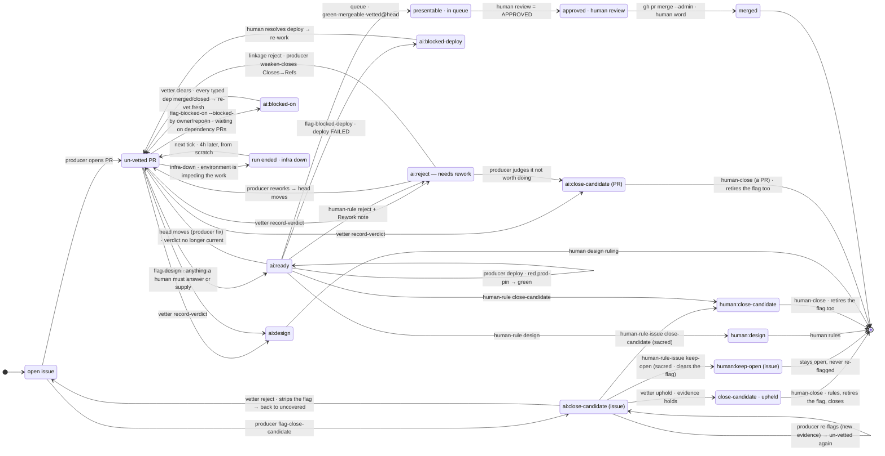

# rainlanguage org issue→PR pipeline

Local, autonomous cron jobs that drive issues to merge-ready PRs across the
rainlanguage **and cyclofinance** GitHub orgs. The pipeline is a **finite state
machine**: a PR's state _is_ its GitHub state — `ai:*` / `human:*` labels,
trusted `🤖 ai:vetter` comments, and its native review — and the
`pr-review-report` tool is the **only** transition function between states. A
**producer** cron and a **vetter** cron drive the automated transitions; landing
is interactive (a human merges on their explicit per-PR word). See
[CLAUDE.md](CLAUDE.md) for the framing.

## Pipeline state machine


```mermaid
stateDiagram-v2
    direction LR
    state "open issue" as issue
    state "ai:close-candidate (issue)" as icand
    state "close-candidate · upheld" as iupheld
    state "un-vetted PR" as unvetted
    state "ai:ready" as ready
    state "ai:reject — needs rework" as reject
    state "ai:design" as design
    state "ai:close-candidate (PR)" as close
    state "ai:blocked-deploy" as bdeploy
    state "ai:blocked-on" as bon
    state "run ended · infra down" as infradown
    state "human:design" as hdesign
    state "human:close-candidate" as hclose
    state "human:keep-open (issue)" as ikeep
    state "presentable · in queue" as queue
    state "approved · human review" as approved
    state "merged" as merged

    [*] --> issue
    issue --> unvetted : producer opens PR

    %% issue close-candidate lifecycle — the vetter's SECOND subject. A flag is a CLAIM, and it is
    %% vetted before a human is asked to act on it (a bad flag asks a human to destroy work).
    issue --> icand : producer flag-close-candidate
    icand --> iupheld : vetter uphold · evidence holds
    icand --> issue : vetter reject · strips the flag → back to uncovered
    icand --> icand : producer re-flags (new evidence) → un-vetted again
    iupheld --> [*] : human-close · rules, retires the flag, closes
    icand --> hclose : human-rule-issue close-candidate (sacred)
    icand --> ikeep : human-rule-issue keep-open (sacred · clears the flag)
    ikeep --> [*] : stays open, never re-flagged

    %% vet lifecycle — the vetter is the sole verdict transition fn
    unvetted --> ready : vetter record-verdict
    unvetted --> reject : vetter record-verdict
    unvetted --> design : vetter record-verdict
    unvetted --> close : vetter record-verdict
    ready --> unvetted : head moves (producer fix) · verdict no longer current

    %% ready → the human merge queue
    ready --> queue : queue · green·mergeable·vetted@head
    queue --> approved : human review = APPROVED
    approved --> merged : gh pr merge --admin · human word

    %% the reject state routes back to the producer, then back to un-vetted. ONE state, whoever
    %% ruled (#133) and whatever the ground: a code rework, a linkage repair (#135 retired
    %% ai:relink — a linkage error is a reject whose note names the reference), or a close.
    reject --> unvetted : producer reworks → head moves
    reject --> close : producer judges it not worth doing
    reject --> unvetted : linkage reject · producer weaken-closes Closes→Refs

    %% producer deploy + blocked hand-offs. blocked-deploy waits on a human; blocked-on sits with
    %% the VETTER (#161): the flag carries typed --blocked-by refs (refused without one) and the
    %% vetter's state-load clears it the run after every dep merges/closes → fresh re-vet.
    ready --> ready : producer deploy · red prod-pin → green
    ready --> bdeploy : flag-blocked-deploy · deploy FAILED
    unvetted --> bon : flag-blocked-on --blocked-by owner/repo#n · waiting on dependency PRs
    unvetted --> design : flag-design · anything a human must answer or supply
    bdeploy --> unvetted : human resolves deploy → re-work
    bon --> unvetted : vetter clears · every typed dep merged/closed → re-vet fresh

    %% infra down is NOT a PR state — the RUN ends and no PR is touched (#108)
    unvetted --> infradown : infra-down · environment is impeding the work
    infradown --> unvetted : next tick · 4h later, from scratch

    %% human decisions are sacred — the vetter never re-verdicts these
    %% a human REJECT is not one of them: it writes the same ai:reject the vetter writes, and the
    %% sha-pinned 👤 human comment is what records that a human ruled (#133).
    ready --> reject : human-rule reject + Rework note
    ready --> hdesign : human-rule design
    ready --> hclose : human-rule close-candidate
    hdesign --> [*] : human rules
    hclose --> [*] : human-close · retires the flag too

    design --> [*] : human design ruling
    close --> [*] : human-close (a PR) · retires the flag too
    merged --> [*]
```

Every transition above is a `pr-review-report` subcommand. A raw `gh` / `git`
state change from a prompt is a _loose_ transition — unenforced and untested —
so the prompts route **all** GitHub I/O through the tool. That is what makes
this an actual finite state machine rather than a picture of one.

### The human's transitions

Every actor's hand-off is a labelled transition — including the human's. That
was not true until #86: `human:reject`, `human:design`, `human:close-candidate`
and `human:keep-open` appeared in the binary only as strings it **read and
refused on**, so the one actor whose decisions everything else treats as sacred
was also the only one improvising raw `gh issue edit --add-label`.

| Transition                                             | The move it makes                                                                                     |
| ------------------------------------------------------ | ----------------------------------------------------------------------------------------------------- |
| `human-rule <owner/repo> <pr> <ruling> "<note>"`       | PR ruling — `reject` / `design` / `close-candidate`, pinned to the **head sha**                       |
| `human-rule-issue <owner/repo> <issue> <ruling> "<…>"` | issue ruling — those three plus `keep-open`, pinned to the **live flag** or to the **issue as filed** |
| `human-close <owner/repo> <n> "<note>"`                | the **terminal** edge, on either subject: rule, retire the pending flag, close — one transition       |
| `record-close-candidate-verdict <owner/repo> <issue>`  | the vetter's flag verdict, now reachable from a terminal too (the refusal above names it)             |

The vocabularies are not a second list: they **are** `HUMAN_DECISION_LABELS`
(PRs) and `HUMAN_RULING_LABELS` (issues), the same constants every AI transition
already refuses to override. A state added there gains its transition rather
than needing one, so the transition surface and the lane classifier cannot name
different states.

**A ruling is not a label; it is a label plus what it was ruling on.** The
comment a ruling posts pins to whatever the AI's ruling on the _same subject_
pins to, so the two records go stale together:

- a PR → its head sha: `👤 human` / `Ruled <sha>: reject — <note>`, the twin of
  `Reviewed <sha>: …`. A rework moves the head and the ruling visibly stops
  describing the code that is there.
- an issue carrying a **live** producer flag → the flag's timestamp:
  `Ruled close-candidate @<at>: keep-open — <note>`, the twin of
  `Reviewed close-candidate @<at>: …`. A re-flag invalidates it exactly as it
  invalidates the vetter's verdict.
- an issue with no live flag → the issue as filed: `Ruled issue @<createdAt>:`.
  Deliberately not a moving anchor — with no producer claim there is nothing
  that _can_ go stale — and saying `issue @…` rather than `close-candidate @…`
  is precisely the namespace distinction that was lost.

The guards are the same shape as the vetter's, and each exists for a failure
that has already happened:

- **the vocabulary**, from the constants above (a ruling outside them writes a
  label `classify_lane` buckets nowhere — a leak);
- **a note is required** (an unexplained ruling is indistinguishable from a
  mis-click, which is the whole complaint);
- **an anchor must exist** — no head sha, no ruling (`Ruled : reject` is the
  bound-to-nothing label this replaces);
- **a terminal subject is moot**, not refused: a merged PR or a closed issue has
  no state left to move out of, so nothing is written and the exit is 0;
- **re-ruling supersedes** rather than refuses. The human owns this namespace
  and may correct a mis-click, so the old `human:*` is removed and the new one
  added — since #133 the **only** sanctioned removal of a `human:*` label, and
  sanctioned because the actor removing it wrote it;
- **a ruling that would strand a live flag is refused** (exit 4). This is the
  one from #86. On `rainlanguage/rain.erc4626.words#93` a hand-applied
  `human:reject` sat on an issue whose producer close-candidate flag had not
  been judged — and because **every** AI transition refuses once a human has
  ruled, `record_close_candidate_verdict` could never judge it again. The flag
  was stranded and undoing it took more raw `gh`. So on an issue carrying a live
  flag only the two rulings that **answer** the flag are legal, and the refusal
  names all three ways out, each a single command.

That last point is the rule the whole surface is built to respect: the human is
the top of the hierarchy, and **a tool that makes the sacred decision harder
than raw `gh` will simply be bypassed**. Every refusal here either has no legal
write to make or names the one-command move that is legal.

A ruling whose target is a sacred `human:*` label moves exactly **one** label,
and strips an `ai:*` only where it contradicts outright: `keep-open` clears
`ai:close-candidate` ("keep this open" against "close this"). Everything else is
merely stale, not contradictory, and erasing the `ai:*` label would erase the
very claim the ruling was ruling on.

A `reject` ruling is different, and #133 is why: its target **is** a pipeline
state (`ai:reject`), so it obeys the same one-state rule the vetter's write
obeys and strips every other `ai:*`. That is not the human reaching into the
machine's namespace — it is the reject state no longer being in anyone's. A
`human:reject` PR used to carry its stale `ai:ready` for ever, because only
`reworked-reject` was allowed to touch it.

The writes happen in a fail-safe **order**, which is the reverse of the AI
verdict write's and is asserted as a property rather than left to statement
order: the comment lands before anything sacred is written (a sacred label with
no recorded reason is the failure being fixed), and the new ruling is added
before the old one is removed (the reverse has a window in which the subject
carries no human decision at all and every AI actor is free to move it).

#### The terminal edge — `human-close`

`iupheld --> [*]` and `hclose --> [*]` are edges of the diagram above, and until
#94 they had no transition function, so the only way to take them was raw
`gh issue close` — which knows nothing about the machine. The cost was measured:
when #94 was filed, **74** terminal subjects across the org (55 issues, 19 PRs)
were CLOSED and still carrying `ai:close-candidate`, a state no modeled
transition produces. In the same sitting the one ruling that did go through a
tool — a flag `reject` on `rain.dia#42` — came out clean. That asymmetry is the
argument: the transition with a tool was consistent, the one without it was
wrong every time.

`human-close <owner/repo> <n> "<note>"` is that edge as **one** transition: the
`👤 human` comment, `human:close-candidate`, the retirement of the pending flag,
then the close.

- **It is one transition, not a command that chains two.** A slash command that
  called `human-rule-issue` and then `gh issue close` would put the ORDER and
  the flag clear in a prompt — unenforced, untested, free to drift. Here the
  order is a tested property, and the close is **last** because a closed subject
  reads as moot to every ruling plan: closing first would make the labels
  permanently unreachable and a retry would report "nothing to do" over a
  half-written transition.
- **It retires `ai:close-candidate` and no other `ai:*` label.** That one label
  means "a human still has to ACT on this subject" — on an issue the producer's
  pending claim, on a PR the vetter's pending `close` verdict — and closing IS
  that act. Every other `ai:*` label is a judgement about the code and survives,
  exactly as the rulings leave it.
- **The ruling alone still leaves the flag standing.** While the subject is open
  the flag is the live pending claim and `closeCandidateUpheld` still counts it;
  only the terminal act retires it. The two are deliberately different, and that
  difference is the edge.
- **It resolves PR-or-issue by lookup**, from the subject's own `url`, so one
  `owner/repo#n` reference cannot act on the wrong one of the two populations
  that share the label name.
- **On an already-closed subject it clears a stale flag and writes no ruling.**
  The state had no exit and now has one — the machine has no dead ends — but the
  human's close is already on the record as GitHub's own close event, and a
  `👤 human` reason written today would date the decision to today. Manufactured
  provenance is worse than none.

#### One label, two populations

`ai:close-candidate` names two separately-sized sets: `closeCandidateIssues`
counts **issues** (a producer CLAIM awaiting judgement) and
`lanes.vetter-verdicts.ai:close-candidate` counts **PRs** (the vetter's own
`close` verdict). Every human transition therefore takes a full `owner/repo#n`,
and where it can act on either subject it READS which one it has rather than
trusting which command was typed. Where it cannot, it refuses by naming what was
actually referenced and handing over the command that fits — in **both**
directions, because a refusal a caller cannot act on sends them straight back to
raw `gh`:

- `record-close-candidate-verdict` pointed at a PR used to answer "no trusted
  producer close-candidate flag — nothing to judge", which reads as _this PR has
  no human path at all_ and was recorded as exactly that misreading. It now says
  the subject is a pull request, why a flag verdict cannot apply to one, and
  names the three moves that do.
- `human-rule` pointed at an issue used to answer "`gh pr view` failed — not
  writing on incomplete data", which reads as an API outage. It now names the
  subject and prints the `human-rule-issue` line, carrying the same ruling
  through.

### The human's slash commands

The transitions above are the layer a tool call reaches. The layer a **human**
types is a Claude Code plugin, published from this repo's own marketplace:

```
/plugin marketplace add rainlanguage/issue-pr-cron
/plugin install human-fsm@issue-pr-cron
```

| Command                                      | The transition it invokes                                                       |
| -------------------------------------------- | ------------------------------------------------------------------------------- |
| `/close-candidate <owner/repo#n> uphold "…"` | `human-close` — rule, retire the flag, close. Issue **or** PR, by lookup        |
| `/close-candidate <owner/repo#n> reject "…"` | `record-close-candidate-verdict … reject` — drop the flag, back to the producer |
| `/reject <owner/repo#n> "…"`                 | `human-rule` — `ai:reject` (PR) / `human-rule-issue` — `human:reject` (issue)   |
| `/design <owner/repo#n> "…"`                 | `human-rule` / `human-rule-issue` — `human:design`                              |
| `/keep-open <owner/repo#n> "…"`              | `human-rule-issue … keep-open` — the sacred "never re-flag this"                |

Ruling on one close-candidate previously took four steps: a hand-written
JSON-RPC frame, `pr-review-report mcp` fed from a file, a Python filter to read
`isError` back out, then `gh issue comment` and `gh issue close`. It was done
seventeen times in one sitting. These collapse that to one invocation.

**Nothing in the plugin writes GitHub state.** Every guard — the ruling
vocabulary, the mandatory note, the provenance anchor, the stranded-flag
refusal, the subject-type check, terminal-is-moot, idempotence,
re-ruling-supersedes — is in the binary, where it is unit- and
mutation-validated. A command that re-derived a transition, or reached for raw
`gh` to do what a subcommand already does, would be the loose transition this
whole line of work exists to remove; the shipped commands are asserted against
that, by a test that reads their fenced blocks and requires every runnable line
to be a `pr-review-report` transition.

**A command's grant is all shell, or MCP plus a named read surface — never a
mixture with shell.** What that buys is a command with **no shell fallback** —
it cannot reach for `gh` and cannot assemble a field by hand — so a command may
grant a whole SET of MCP tools, and `/nr` grants four: the queue row, the PR the
row's verdict is a claim about, the checkout of its source, and the release of
that checkout. The rule used to demand exactly one MCP tool as a stand-in for
the same guarantee, and the stand-in is what broke: it made "check the verdict
against the diff" unrepresentable rather than making the shell unreachable
(#132). Every name in the set is still resolved against what the manifest's
server actually serves, because the loader drops a name it cannot resolve
instead of refusing the command.

Beside the typed grants, exactly two of the harness's own tools are admitted, by
name: `Skill` and `Read` (#150). They are what lets `/nr` invoke the `audit`
skill over the PR's source instead of recalling its rules — neither is a shell,
neither writes, and everything else, `Bash` and `Task` first of all, is still
refused beside an MCP grant. `Grep` and `Glob` are deliberately not admitted:
measured on Claude Code 2.1.220 they are not tools in this harness at all, so a
grant naming one would be a permitted tool that does not exist. And the
`allowed-tools` line is a declaration rather than a sandbox — a command granting
only `Read` still ran a `Bash` call with no permission denial — so what the
contract enforces is that the declaration and the command's own prose agree, and
that no shell line is fenced anywhere in the body.

**Why a plugin rather than files with an install step.** The org already
distributes Claude Code assets this way — `claude-audit-skills`,
`adversarial-mutation-test` and `rain-org-health` each publish a
`.claude-plugin/marketplace.json`, and two of them are installed on the pipeline
box. `rain-org-health` is the shape followed here: a repo that is primarily
something else and publishes a plugin from a **subdirectory**
(`"source": "./plugins/human-fsm"`), so this repo does not have to pretend to be
a skills repo. And a slash command is the right form rather than a skill: these
are human-typed, deterministic, argument-taking transitions — "I have decided,
execute this" — not something a model should match by description and invoke on
its own.

**The version is stored twice, so agreement is a gate.** A plugin's version
lives in the marketplace listing installers read AND in the plugin manifest it
points at, and `/plugin` detects an update by comparing version strings — so a
listing naming the old version silently serves stale content.
`pr-review-report plugin-version-lockstep` asserts they agree for every plugin
the marketplace lists (and that each entry resolves to a manifest of the same
name), and `.github/workflows/version-hygiene.yaml` runs it plus the
change-must-bump check. It is a subcommand rather than a CI shell script for the
reason `require-qa-block` is: everything it does is parsing.

### The vetter's transitions as an MCP surface

For the producer, routing through the tool is enforced by the **prompt**, and a
Bash deny-list is prefix-matched and bypassable. For the vetter that gap is
closed: `pr-review-report mcp` serves its transitions over MCP (stdio), and that
server is the vetter's **only** tool surface.

| Tool                             | The move it makes                                                                                                                                                                              |
| -------------------------------- | ---------------------------------------------------------------------------------------------------------------------------------------------------------------------------------------------- |
| `unvetted`                       | state-load: ONE PAGE of the open PRs to vet, vet-first, each with head/labels/review/sacred/vetted/ci/mergeable, plus the whole-queue `counts`, `more`, and the `openThreads` withhold list    |
| `pr_context`                     | read one PR: body, files, diff, every linked issue, and the trusted `🤖 ai:*` comments — one call                                                                                              |
| `pr_checkout`                    | local read-only clone of the PR head, so the `audit` skill has source — returns the `dir` AND the `head` sha it produced, or errors having left nothing behind                                 |
| `record_verdict`                 | the PR write: `ai:<verdict>` label + `🤖 ai:vetter` comment bound to the head sha, stamped with the vet protocol, carrying the cost — refused unless `covered` accounts for every changed file |
| `clone_release`                  | dispose of a checkout it is finished with (guarded — see below)                                                                                                                                |
| `unvetted_close_candidates`      | state-load: ONE PAGE of the producer close-candidate flags to judge, each with its `flagAt` + stated evidence                                                                                  |
| `close_candidate_context`        | read one flag: the issue's title/body/`createdAt`/labels, the full flag body, any prior verdicts, and `citationEvidence` — the machine's read of the cited change's own diff                   |
| `record_close_candidate_verdict` | the issue write: `uphold` (flag stands, queued for the human) or `reject` (strips `ai:close-candidate`)                                                                                        |

There is a **third profile**, and it is the answer to "CLI subcommand or MCP
tool?" for the human: `pr-review-report mcp --profile human` (wired by
`human-mcp.json`) serves `next_ready`, `pr_context`, `pr_checkout`,
`clone_release`, `next_close_candidate`, `close_candidate_context`,
`human_rule`, `human_rule_issue` and `human_close` — find the subject, read it,
audit its source, rule on it, close it. The human has **two** inboxes, so it has
two "which is next" tools: `next_ready` for PRs and `next_close_candidate` for
close-candidate flags (#173). `human_close` is a tool rather than something the
caller composes for the reason above: the alternative is a transition half in a
tool and half in a prompt, and that half was wrong on all 74
closed-and-still-flagged subjects. The subcommands above are for the human at a
terminal; the profile is for **an agent acting on the human's behalf**, which is
the case that actually went wrong in #86. A prompt rule cannot take a bypassable
Bash away, and a `gh issue edit` that no tool offers is exactly what gets
improvised; a profile makes the non-FSM operation _unavailable_. The vetter's
inbox tools are deliberately absent — the human's inbox is `human-queue`, which
renders whole org-wide sets and does not fit one tool result — and so is
`record_close_candidate_verdict`, which is the vetter's authority and the very
move `human_rule_issue` refuses on the human's behalf.

`pr_checkout` and `clone_release` are on it for `/nr`'s sake (#150). The human
gate forms its own view rather than relaying the vetter's, and the mechanical
half of a view like that is the `audit` skill — which reads SOURCE, so a diff is
not a substrate it can run on: every dimension needing a file the diff never
touches (the callees, the siblings sharing an invariant, the premise the PR body
asserts about current behaviour) would go unexercised, and silently.
`rain.deploy#21` is the measured case — "one canonical CREATE2 derivation, 22
hardcoded copies" is a count over the tree, not over the added lines. The
release is not optional garnish beside it: a checkout left behind waits for a
sweep, and this server runs with no `WORK_DIR`, so its clones land in the
temp-dir fallback the producer's `clone_gc` may never look in. A human-gate leak
has no collector behind it.

**The lens's SCOPE is an argument, because prose does not survive the invocation
(#154).** `nr.md` described the scope correctly and at length — the diff plus
the callees, callers, siblings sharing the changed invariant and every
current-behaviour claim, with _"would understanding it change the ruling on THIS
diff?"_ as the inclusion test — and none of it reached the run. `Skill audit`
loads a document whose own first rule is _"whole-repo snapshot, never a diff"_,
and once it is loaded `nr.md` is not in the room: on `rain.deploy#21` the lens
ran whole-repo, twelve findings, five bearing on the PR and seven in code the
diff never touches, with the scope hand-typed as free text nothing could
validate. So `/nr` DECLARES the scope — the literal `pr:<number>` — beside the
`dir` and the changed-file list. The spelling is the skill's own and not this
repo's: its whole vocabulary is three literals, `whole-repo` / `pr:<number>` /
`paths:<globs>`, the same strings its run stamp records verbatim, and a key
wrapped round one of them would be a fourth spelling. The value is built from
typed results only: the number out of the row's own `pr` field, the file list
out of `pr_context`. And the ruling `/nr` presents NAMES the scope it was formed
at, so a PR-scoped review is distinguishable from a whole-repo sweep without
counting how many findings missed the diff. `whole-repo` stays reachable as a
separate deliberate invocation on a repo somebody named — never as the default
that happens when nothing is passed, which is precisely how the defect read as
working. The step-5 prose is kept as the REASON the PR scope admits the
surrounding files it does, rather than as the only thing carrying it.

#### `next_ready` — the merge decision as one typed result

Ruling on an `ai:ready` PR used to take six `gh` reads assembled by hand, in an
order the reader had to remember, and being wrong about any one of them changes
the decision. `next_ready` returns them together: the vetter's own sha-bound
verdict **note** (the reasoning, not the label), `headRefOid` and `baseRefName`,
the CI rollup with failing checks **named**, whether CodeRabbit actually
reviewed, the unresolved-thread count **qualified by that**, and any
deploy-before-merge gate.

**Which** PR is not a second question. `--queue` already ranks the presentable
set cheapest-first; `next_ready` answers a prefix of that same ranked list, from
the same enumeration and the same per-PR snapshot, so the head of the queue and
the PR the tool names cannot be different PRs. A PR whose head moved after its
verdict is not "next" at all — the queue's vetted-at-head gate withholds it, and
`counts.unvetted` says so, because returning a verdict that no longer describes
the code is worse than returning nothing.

Three fields are worth their own note:

- **CodeRabbit coverage is a typed verdict, not a check state.** Only a commit
  status whose _description_ is exactly `Review completed` is coverage.
  `Review rate limited` and `Review queued` are `success` states carrying a
  green check with nothing behind them, and while the org's plan quota is
  exhausted that is most PRs. Matching is exact on the coverage side and lenient
  on the others, so a description CodeRabbit invents tomorrow is under-claimed
  rather than over-claimed. The raw state and description are returned beside
  the verdict, so the misleading green stays visible next to the truth about it.
  The description comes from `GET /commits/{sha}/status` because
  `statusCheckRollup` does not carry the field the whole distinction turns on.
- **`reviewThreads.meaning` qualifies the count.** Zero unresolved threads under
  a rate-limited review means no thread was _opened_, which is what an absent
  review looks like — `vacuous-no-review-behind-it`, not `clean`.
- **The deploy gate is read from the body and the trusted comments, never the
  title.** Of the six open PRs carrying `REQUIRES redeploy at land` on
  2026-07-29, all six had it in the body and one also had it in the title, so
  title-matching would have found one of six. It is the same predicate the
  producer's own deploy routing reads, shared rather than re-derived, so "the
  producer must deploy this" and "the human must not plain-merge this" cannot be
  answered differently — and a retitle cannot move the gate.

It cannot be refused for size. Every variable-length field is capped, so a full
page's worst case is arithmetic the compiler checks
(`NEXT_READY_MAX_ROWS * NR_ROW_CEILING + NR_ENVELOPE_BYTES <= 36,000`) and a
test builds that worst case out of the characters JSON escapes worst — `"`, and
the control characters that would otherwise cost six bytes each. `limit` is a
real narrowing argument anyway — rows are independent, so lowering it strictly
removes bytes — which is what keeps it clear of #117, where a refusal names an
argument the tool does not accept. It caps at 3 rather than 25 because every
human ruling changes this queue, so a long page is stale past its head, and
because a page long enough to matter would have to clip the reasoning the tool
exists to carry.

#### `next_close_candidate` — the flag decision, and why its order is different

The flag lane's human half started with a manual search: the human could read a
flag it already knew the number of and rule on it, but nothing answered **which
flag is next**. So the queue where being wrong is least recoverable — a flag
asks a human to destroy work — was the one worked by hand, while the PR queue
had a one-call entry point. `next_close_candidate` is that call: the issue's
title/state/labels/`createdAt`, the producer's **stated reason** (the claim
being checked, never a fact), the vetter's verdict **pinned to the flag it
judged**, and whether an open PR claims to close the issue.

**Coverage is reported; what it COSTS is a pairing.** Rule 7a bars an issue
"**merely** COVERED BY AN OPEN PR" and calls an open PR "never sufficient
**evidence**" — one clause about having nothing else, one about what may be
cited FOR a close. Read as a veto instead, it lets an unverified claim override
a verified one: `rain.dia#6` was fixed on main by a merged PR and stayed blocked
from 2026-07-28 behind `rain.dia#60`, a redundant PR that was itself queued for
closure. Nothing in the pipeline could exit that — two queues each holding half
the picture, neither reading the other. So `openPr.blocksClose` pairs the
coverage read with `flag.grounds`: a flag citing **no landing** (`invalid` /
`duplicate` / `wont-fix`, or an `already-fixed-on-main` claim naming nothing
datable) is the "merely" case and the open PR may be the only thing that would
ever resolve the issue, so it blocks — and an unreadable coverage query blocks
with it. A flag citing a **landing** does not block: a redundant PR in flight
does not un-land what landed, and disposing of it is a decision in the PR lane.

Mergeability is deliberately **not** the discriminator. `rain.dia#60` happened
to be `CONFLICTING`, but any PR can assert `Closes #N` and the assertion is not
evidence; `rain.dia#63` blocks a sibling flag today and is perfectly mergeable.
And `grounds` says what the reason CITES — read off `already_fixed_anchor`, the
same parse `flag-close-candidate` gates the write on, so the two cannot disagree
about it. It is not a claim that the citation holds: whether the merged PR is
really this issue's fix is `/ncc` step 5's check, and `pr_context` still carries
no merged/state field for the human to confirm it with.

**And a citation that cannot be what it claims is now on the record.** `grounds`
says what a reason CITES; it never said the cited change bears on the claim, and
that gap is `rain.dia#22`: the flag said merged PR #48 "landed
`testRoundTripEmpty` (line 27) and `testRoundTrip31Bytes` (line 32)" when #48 is
an import-path standardisation whose touch on that file is `+2/-2` — PR #33
added those tests. The vetter upheld it by restating the citation, which on the
record is indistinguishable from checking it. So `flag-close-candidate`,
`close_candidate_context` and `record_close_candidate_verdict` all carry a
**citation evidence** line, read from the cited change's own diff: how many
files it touches, its `+a/-d` on every path the reason names, and which symbols
the reason names its changed lines do not contain.

**One reading of it DOES gate, and only one.** A reason that names paths or
symbols and cites a change containing NOT ONE of them — no named path in its
file list, no named symbol in its changed lines — is refused at write time
(`flag-close-candidate`, exit 5). That closes an EVASION of a guard that already
existed: `already_fixed_recency_gate` refuses a bare `file:line` outright,
because "this code is on main today" is not "a change landed that fixed this" —
and appending the sha the tree was READ at converts that same claim into a
commit anchor that always post-dates the issue, so the date check passes
vacuously. Every commit-anchored flag on record is that shape.
`raindex#588`/`#574`/`#573`/ `#570` all cite `bb83031`, which is "Merge pull
request #2810 … fix/build-script-name" and touches `foundry.toml`,
`script/Build.sol` and three siblings — not one of the Svelte components those
four reasons are about; `raindex#928` cites `7ba0fa8` in the words "tauri-app/
existed **at** 7ba0fa8", naming the state BEFORE the deletion it credits.
Replayed over every flag in the live and closed queues, the gate refuses 4 of
those 5 and **nothing else** — `#928` names no path or symbol at all, and an
empty check is not a failed one.

**Every WEAKER reading still gates nothing, and that is a measurement rather
than a preference.** Over every `ai:close-candidate` flag in the live and closed
queues carrying a fetchable anchor (21 of them, 2026-08-04), no threshold on any
of these signals separates the sound citations from the one unsound one.
Requiring a named symbol in the cited diff's changed lines would have passed
`rain.dia#22` — its reason names `LibDia.t.sol`, and the import rewrite does
touch `LibDia` — while refusing eleven sound flags, because an
`already-fixed-on-main` reason argues about CURRENT MAIN as well as about the
landing, and four of the seven live ones are fixed by DELETION, whose evidence
is on the removed side. `rain.dia#22` was CLOSED on the merits with the
correction recorded, since rejecting it would have cost a producer cycle to
reach the same answer; a check that converted that into rework would be the
wrong fix for it. So a partial miss is reported and never refused, and
`rain.dia#22` itself passes the gate — the PR it cites does touch the file it
names, which is all "connected" asks. The gate catches a citation about
DIFFERENT CODE; whether a citation about the RIGHT code is the right change
stays the human's call at `/ncc` step 5.

Nothing here touches `already_fixed_anchor` or `flag_grounds`. The parse that
answers "what does this reason CITE" is unchanged, so `blocksClose` on the live
queue is unchanged too — replaying all 11 open flags through the gate before and
after moves not one of them.

The one hole this opens is closed where it is opened: a reason whose anchor is
**one of the covering PRs** is citing the thing in flight as the reason to
ignore it, so it reads as `cites-no-landing` and blocks. That is rule 7a
literally — an open PR is never sufficient evidence — rather than an exception
to the pairing.

**The ranking is not the PR queue's.** Cheapest-first is right there because
merges are the scarce resource and a cheap merge is throughput. Here the scarce
resource is the human's judgement, and neither half transfers: a flag's whole
content is one line whose length says nothing about how hard the claim is to
falsify ("already fixed on main" is twenty-two characters and needs a diff read
against the path the issue named), so a cost sort would be sorting by a number
that does not measure the work. What the queue must protect against instead is
**starvation**, because a flag is not inert while it waits —
`is_producer_backlog` excludes an `ai:close-candidate` issue from the producer's
backlog, so a flagged issue is neither being fixed nor closed. The flag parks
it. So the order is **oldest flag first**, which bounds that limbo; and it is
right on accuracy too, since an "already fixed" claim is about a main branch
that keeps moving and the oldest flag's reason describes the least of what is
there now. Newest-first — the other candidate — optimises the cost of each check
by never reaching the flags that have decayed most.

**What it withholds is as load-bearing as what it returns.** A flag the vetter
has not judged is `counts.unvetted`, not a row: a flag the vetter would REJECT
never reaches a human at all, because the reject strips the label, so presenting
one early spends judgement on the vetter's turn. And `strandedFlags` names two
states no AI transition will ever clear — a label with no producer comment
behind it (the vetter skips it for ever as `skip-no-flag`) and a `reject` whose
label removal did not land. Both sat invisible until this tool counted them.

The cap is 3 for `next_ready`'s reason and the argument is stronger: there, a
human who reads a row and does not merge leaves the PR in the queue, whereas
**every** ruling here retires its flag — uphold-and-close, keep-open and
reject-the-flag all remove the row — so a page is stale past its head by
construction. The same per-field caps make a full page's worst case arithmetic
the compiler checks, this time including both withheld lists at their caps.

The last three vetter tools are its **second subject**. A PR asks a human to
merge code; a close-candidate flag asks a human to **destroy work**, so the flag
is judged before it reaches the triage queue. The shape is identical to the PR
side — state-load, read one, record one verdict — including the
vetted-at-the-thing-judged rule: a PR is un-vetted again when its head moves, a
flag when the producer posts a new one.

`review-run.sh` always launches the model with `--mcp-config review-mcp.json`,
`--strict-mcp-config` and `--settings review-settings.json`, so the vetter's
entire tool surface is
`mcp__fsm__{unvetted,pr_context,pr_checkout,record_verdict,clone_release,unvetted_close_candidates,close_candidate_context,record_close_candidate_verdict}`
plus `Read`/`Grep`/`Glob`/`Skill`/`ToolSearch` — **no Bash**, so there is no raw
`gh` or `git` to reach for. There is no second vetter configuration and no flag
that selects one. The guards (verdict vocabulary, a mandatory 0-1000 cost, a
well-formed `owner/repo#n`, the human-sacred refusal) are enforced in the server
and unit-tested rather than restated in the prompt.

Those thirteen schemas are **presented, not deferred**: `review-run.sh` exports
`ENABLE_TOOL_SEARCH=false`, so the surface rides in the preamble instead of
costing the vetter a first-turn `ToolSearch` to rediscover a fixed allowlist by
name. `ToolSearch` nonetheless stays in the allow-list as the fail-safe — if a
harness defers anyway, a vetter that cannot call it sees its own tools as
nonexistent and records nothing at all (#63). The producer keeps deferral: it
has Bash and a far larger surface, where the round trip pays for itself.

### Vetting is a pure function, and `vetted_at_head` is its cache key

A verdict is the value of one function — **the PR at its current head** — and
nothing else. A prior verdict is not an input to it: the same PR at the same
head earns the same verdict however many times it is asked, so there is no
"re-vet", no delta pass, and no state called _judged before_. A PR is **vetted**
or **un-vetted**, and the only reason the pipeline stores a verdict at all is to
skip recomputing an answer that would come out identical.

That makes `vetted_at_head` a **cache key**, and a cache key over the input
alone is sound only while the function is fixed. So a `🤖 ai:vetter` comment
carries both facts, and counts as current only when both hold:

- `Reviewed <sha>:` pins the **input** — the head the verdict was computed at. A
  push moves it.
- `vet-protocol <n>` pins the **function** — the version of what vetting means,
  `VET_PROTOCOL` in `pr-review-report`. Bumping the constant retires every
  verdict written under the old rules **at once**, wherever they are: no head
  has to move, no branch is touched, no comment is rewritten, and the next
  scheduled vetter run recomputes them. Bump it when the audit lens, a mandatory
  gate or the verdict vocabulary changes — not for a reworded prompt.
  `vet-protocol 2` is scope coverage (#131): a verdict now carries a claim,
  checked in the binary, that every file the PR changes was in view when it was
  formed. That is a mandatory gate by the definition above, so a protocol-1
  verdict is not a value of the current function and is recomputed.
  `vet-protocol 3` is the audit lens (#151): a verdict is refused unless the run
  holds SOURCE at the PR's head and an `audit`-skill invocation scoped to that
  PR, and the record carries the binary's own account of both. The bump is what
  makes the fix retroactive — the 34 verdicts the 2026-07-29T17:17:35Z run
  recorded with the lens never run all stop being current at once.
  `vet-protocol 4` is the audit lens's **scope** (#155): the ledger row now
  carries the scope the invocation declared, and a verdict is refused unless
  that scope is this PR's. `whole-repo` and a path list are both real
  invocations that read the **wrong code**, so every protocol-3 verdict was
  formed under a scope-blind ledger and is not a value of the current function.

An **unstamped** comment is `VetProtocol::Unknown` and is never current. It was
written under rules that cannot be identified, and unidentified is not "fine" —
the same posture as `Merge::Unknown` and `CodeRabbitCoverage::Unreadable`. Every
verdict predating the stamp is in exactly that position, which is what makes the
stamp's introduction its own first invalidation.

The author filter sits **upstream** of all of this: a stamped, head-matching
verdict from any account other than the trusted one is not a verdict at all
(`trusted_comments`). And the write-side dedup carries the protocol too — a
recomputed verdict at an unchanged head must still be POSTED, or the PR would
keep the superseded stamp, stay un-vetted, and be re-derived by every run while
nothing was ever written.

### The changed-file list is read once, and it says whether it is whole

`gh pr view --json files` returns at most **100** entries. `changedFiles`
reports the real total, and it is the **only** thing in the document that says
the array is a page. Measured on `rainlanguage/raindex#2796`: `changedFiles` 143
against an array of 100 — no error, no flag, nothing in the payload. Every
consumer read the bare array and could not tell, and they all failed **open**:
the missing files read as _absent_ rather than as _unknown_, so a gate skipped
them and called the PR clean, a manifest presented 100 files as the whole PR,
and a path match concluded a requirement did not apply.

Measured across the pipeline orgs (`rainlanguage`, `cyclofinance`, `S01-Issuer`;
133 non-archived repos, 6,166 PRs): **80 PRs are over the cap**, 1.3%, spread
over 16 repos including `raindex`, `cyclo.site` and `st0x.deploy`. A thin tail
that keeps recurring rather than a one-off — and it lands on the widest PRs,
where an unaccounted file is hardest to notice by reading.

So there is ONE reader. `ChangedFileSet` has two states, `Complete` and
`Partial`, and there is no bare `Vec` a caller can mistake for the whole set:
the type is the mechanism, and it makes the truncated case unignorable at the
call site. `changed_files_from_view` is the pure read of a `gh pr view`
document; `pr_changed_files` resolves a `Partial` whose total is known by
re-fetching the paginating REST endpoint. **Either field absent leaves the set
`Partial`** — the same posture as `Merge::Unknown` and
`CodeRabbitCoverage::Unreadable`, because a field requested on the call that
produced the document is _unknown_ when absent, never _nothing_.

Pagination is attempted **only when the total is known**, and that restraint is
#129. `gh_json` collapses every failure into `None`, so a re-fetch that failed
on a rate limit cannot be told from one that returned nothing; the only defence
available is cross-checking the result against a count fetched independently.
With no count there is nothing to check against, so the reader stays `Partial`
rather than claiming a completeness it cannot verify.

Each consumer then decides what `Partial` means for **it**. Forcing one answer
on all of them is how a gate that should refuse ends up merely warning, or a
read that should warn ends up refusing:

- **The verdict's scope-coverage gate REFUSES**, on every verdict
  (`RecordGate::FilesUnknown`). A claim checked against a list that may be
  missing 43 files is not checked, and an unchecked claim is not a verdict — the
  same ruling `NoDiff` already makes. Refusing every verdict rather than only
  `ready` is right because this is never a property of the PR that a different
  verdict would route around: it is a read that failed, and the fix is to read
  again.
- **`pr_context` DEGRADES loudly**: the manifest it can build, plus
  `filesTruncated`, `filesTotal` and `filesTruncatedReason`. A reader handed 100
  of 143 files can still form a partial judgement; what it must never do is
  mistake a page for a complete small PR. `filesTotal` is `null` when even the
  count is unknown — a `0` there would read as a PR that changes nothing.
- **`worklist`'s screenshot gate answers `UiTouch::Unknown`** — _may_ touch UI,
  so the requirement applies. A match inside the page still proves `Yes`
  (finding a UI file needs no other file in view); no match proves nothing. `No`
  is only ever returned off a `Complete` list. That closes a second way past the
  3c gate without waiving anything (cf. #140), and the waiver still works.
- **The verdict's mechanical-convention gate (#141) REFUSES a `ready`**, quoting
  the reader's own `why`. It reads Solidity by path out of the `pr_checkout`
  tree, so a page is the worst possible input: the `.sol` file past the cap is
  exactly the one the convention is about, and reading the page would report the
  PR clean. It never reaches that state in practice — the coverage gate's
  `FilesUnknown` refusal sits above it in `record_gate` — and it fails closed on
  its own account anyway, because a gate that is safe only while a guard above
  it holds is a gate one reordering away from failing open.

`worklist` resolves the list at its one impure point — `fetch_pr_detail`, the
same place `unresolvedThreads` is injected — and writes `files` and
`changedFiles` back **together**, so `worklist_row` stays a pure function of a
document that is internally consistent. A full array beside a stale count would
still read as `Partial`; a corrected count beside a capped array is the
fail-open itself. When resolution fails the fields are left exactly as fetched,
the pure read reports `Partial`, and the safe branch fires.

**`gh pr diff` does not have this problem, measured.** It carries every file up
to **300**, and past that it returns HTTP 406 (`PullRequest.diff too_large`)
with a non-zero exit — so `gh_text` returns `None` and the existing refusals
fire. Verified on `raindex#2796` (143 files) and `#2586` (223): every
`diff --git` header present, 143 and 223 respectively. `#2526` (935 files)
returns the 406. The diff was already fail-closed, so paginating `files` has
closed the fail-open rather than moved it. 13 of the 80 over-cap PRs are also
over 300, and on those `pr_context` and `record_verdict` refuse outright rather
than truncate.

### Every tool result is bounded, and going over is the tool's error

A state-load is a **page**, not a dump. `unvetted` and
`unvetted_close_candidates` return at most `limit` rows (default 10, max 25)
with the whole-queue `counts` alongside and `more` naming what the page left
behind; the vetter re-calls for the next page, and because each `record_verdict`
removes its subject from the queue, paging converges without an offset argument.
The page size is what makes the bound structural — the payload no longer grows
with the number of open PRs.

Every result is then checked against **one byte budget, the same for every
tool** (36,000 bytes), and a result over budget is returned as a **tool error
naming the argument to narrow** — never truncated, never spilled. On 2026-07-27
`unvetted {"include_skipped": true}` returned 63,742 characters on one line, the
harness refused it, and the vetter improvised a fallback that silently dropped
the whole open-threads accounting; the run log looked normal. A partial
state-load cannot say what it is missing, so the tool refuses to produce one.

**A refusal is only a redirect while a narrowing move exists** (#117). The
argument each refusal names is declared on the tool's own table entry, beside
the schema that has to advertise it, and a tool that declares none is told so —
`narrowing_argument` used to be a match over the call whose catch-all was
`Some("limit")`, which asserted a `limit` for seventeen variants of which two
had one. `clone_list` was the one that bit: an empty input schema, a refusal
saying "lower `limit`", and a producer with no second call to make, which
improvised `ls -d …/*/ | wc -l` and reported **289 clones / 214G** where a state
load belonged — every field the tool exists to carry (`branch`, `unpushed`,
`uncommitted`, `ageDays`, `releasable`) gone, and nothing in the run saying so.
The advice a caller cannot follow provokes the improvisation the refusal exists
to prevent, so the prohibition on improvising is now in **both** branches, and
`each_refusal_names_an_argument_that_actually_narrows_it` walks the advertised
tool table rather than three tools named by hand.

**Which is why an unbounded read is a bug in the read, not a case for the
guard.** A tool whose result grows with the box or the queue fits itself to the
budget the way `pr_context` does. `clone_list` and `clone_gc` state the whole
population as **counts that are never truncated** and offer their per-clone rows
to the budget in the order a caller acts on them — unreadable state first, then
unpushed commits, then dirty trees, then releasable — with `listed`/`omitted`
saying exactly how many rows the budget took. So the sample is the thing that
shrinks and the accounting is not, which is the difference between a truncation
that says what it is missing and a partial state-load that cannot. On the box
#117 was found on, `clone_list` went from 38,492 bytes **refused** to 25,358
bytes carrying all 139 held clones out of 242.

**The budget must be lower than what the harness accepts, and that is the
mechanism, not a preference.** If the harness is the thing that speaks, what
comes back is untyped and arrives with `is_error` **unset** — so every rule
downstream about "a tool error is an instruction" stops applying at the moment
it is needed. `pr_context` used to be budgeted at `max_diff_bytes + 32,000`, up
to **332,000 bytes**, roughly six times what the harness accepts; its guard
could not fire, and the harness's message arrived instead. The value is now
measured rather than derived from halving a payload that had already been
refused — see [the ceiling, measured](#the-ceiling-measured).

Two consequences follow from one budget for every tool. `max_diff_bytes` can no
longer be raised past it, so a `pr_context` cannot buy itself more room than any
other tool gets. And **narrowing converges**: while the budget scaled with
`max_diff_bytes` and the diff was truncated to `max_diff_bytes`, lowering the
argument lowered allowance and payload equally, so "re-call NARROWER" was a loop
with no exit. Against a fixed allowance a smaller argument is a strictly smaller
result.

`pr_context` does not wait to be refused: it **fits itself** to the budget,
shrinking the diff until the document lands under it, and reports `diffBytes`
(the whole diff), `diffIncluded` (what actually made it in) and `diffTruncated`
so the gap between what exists and what was handed over is visible rather than
inferred. The shrink terminates — each round removes at least the overflow from
the cap, and one raw byte of diff is at least one byte of document — and the one
case no argument can fix, metadata alone over the budget, is a typed error that
says exactly that.

#### The ceiling, measured

Against Claude Code 2.1.220, by calling `pr_context` through the real harness at
increasing `max_diff_bytes` and reading the `tool_result` the model actually
received. There are **two** independent gates and **both** arrive with
`is_error` unset:

| gate  | what the model gets                                             | boundary                                                      |
| ----- | --------------------------------------------------------------- | ------------------------------------------------------------- |
| byte  | `<persisted-output> Output too large (NN KB)` + a 2 KB preview  | delivered at 50,011 bytes, replaced at 50,176                 |
| token | `Error: result (N characters …) exceeds maximum allowed tokens` | the gate the live traces hit, at 63,742 and 56,789 characters |

The byte gate is **not** governed by `MAX_MCP_OUTPUT_TOKENS` — forcing that to
200,000 still replaced a 50,486-byte result — and it is the more dangerous of
the two, because the 2 KB preview it substitutes looks like the head of a real
answer. The token gate is: forcing the variable to 100 replaced a 4.5 KB result.
Isolating it at `MAX_MCP_OUTPUT_TOKENS=10000` puts its boundary between 27,152
and 30,163 bytes, so this JSON measures **2.7–3.0 chars/token**; nothing on the
box sets that variable, and 56,789 characters tripped it live, which puts the
default near 19–21k tokens. Both gates therefore land around 50 kB for this
content.

36,000 sits ~28% under both. The margin is not timidity: the token gate scales
with the **content**, and a diff of generated hex — which this org has, in every
`src/generated/*.pointers.sol` — tokenises far worse than prose. At 36,000 bytes
even a payload tokenising at 1.5 chars/token stays inside a 19k-token cap.

The `openThreads` list is unconditional for the same reason: the PRs withheld
for unresolved threads (and their `unresolvedThreads` counts) are the only
skipped rows carrying information the vetter can act on, and making that
accounting depend on an optional argument is exactly how it went missing.

### The audit lens's working tree: the PR head, or nothing

`pr_checkout` shallow-clones the repo and fetches **`refs/pull/<n>/head`** into
`refs/remotes/origin/pr/<n>`, then checks that out as `pr-<n>`. Three properties
follow, and each fixes a distinct failure:

- **It works on a shallow clone.** `gh pr checkout` does not: a `--depth 1`
  clone's fetch refspec is
  `+refs/heads/<default>:refs/remotes/origin/<default>`, so a same-repo PR's
  head arrives as a bare fetched ref and `git checkout --track` refuses it —
  _"cannot set up tracking information; starting point 'origin/<head>' is not a
  branch"_ — for **every** same-repo PR, i.e. every PR that needed the audit
  lens (#81).
- **It stays shallow.** The obvious repair — widen the refspec and keep
  `gh pr checkout` — makes the follow-up fetch deepen the clone to nearly full
  history. Measured on raindex: **156 MiB** of pack against **3.9 MiB** for the
  pull-ref fetch, with `--depth 1 --no-single-branch` at 78 MiB and a full clone
  at 180 MiB. Disk-full silently killed both crons for ~17h (#56), so the fix
  that costs nothing over the shallow clone already intended is the only one
  that is not a trade.
- **The head is on a remote-tracking ref**, which is what makes the commit count
  as pushed. `gh pr checkout` puts a **fork** PR's head on a plain local branch,
  so `rev-list HEAD --not --remotes` reports the whole branch as unpushed and
  both `clone_release` and the sweep refuse the clone forever.

**Its postcondition is binary: the PR head at `dir`, or no `dir` at all.** The
old code returned an error while leaving the directory behind, because
`gh repo clone` had succeeded and only the checkout failed — so a directory
named after the PR sat at exactly the path the audit lens looks for, holding the
**default branch**. On 2026-07-27 the vetter met that failure, went looking for
a tree, found the leftover `vet-rain.factory-dep` from an unrelated run, and
began enumerating its Solidity sources as `rain.factory#47`'s. The chain is
broken in four places: the checkout works; a failed one deletes what it made;
the failure is an `isError` that names the wrong answer a filesystem search
returns and forbids it; and the sweep reclaims the leftovers a search would
otherwise find. The success value carries the `dir` **and** the `head` sha, so
locating (or recognising) the tool's own output is not a step that exists.

**What the vetter therefore does not verify.** With no Bash it cannot build, and
cannot execute anything in the clone `pr_checkout` gives it — it reads source,
it does not run it. Two checks live elsewhere as a result, and the vetter prompt
does not ask for either:

- **A clean working tree after a build.** Keeping a work clone clean by
  construction is the **producer's** obligation (`campaign-prompt.txt` step 6b:
  `git status --porcelain` must be empty before the work counts as submitted,
  and build/tooling dirt is gitignored as part of the PR). For rainix Solidity
  repos the committed-artifact half is additionally enforced on every push by
  the shared `rainix-copy-artifacts` workflow, which regenerates, builds, and
  fails on `git diff --exit-code`.
- **Re-running a PR's tests.** The QA gate checks that the QA-GUIDE.md section-8
  evidence block **exists** and that its claims are consistent with the diff it
  reads. It does not re-run the named tests against base; CI runs them, and a
  red CI is the producer's to green, never a vetter `reject` ground.

### The audit lens is a PRECONDITION of a verdict, and the binary checks it

`review-prompt.txt` has told the vetter to **invoke the `audit` skill** per PR
for months, and nothing could see whether it did. Measured from the vetter's own
trace, `review-runs/20260729T171735Z.jsonl`:

```
record_verdict : 35
pr_context     : 35
pr_checkout    :  3
Skill          :  1
```

**34 of 35 verdicts were recorded with the lens never run, and 32 with no source
tree at all.** The single invocation was scoped to
`cyclofinance/cyclo.site#386`. Two of the 34 are `ready` verdicts on Solidity
the skill flags verbatim (`rainlanguage/rain.deploy#20`'s floated concrete test
mock, `#21`'s 22 hardcoded copies of a value it also derives). It was otherwise
the best run to date — zero errors, correct paging, a `design` verdict raised —
which is the point: nothing about a lensless verdict looked wrong.

So `record_verdict` refuses a verdict on a PR this run holds no lens for, on
**three facts it establishes for itself**:

- **SOURCE** — the `pr_checkout` tree for this PR, holding this PR's head.
  `pr_checkout` is a tool this same binary implements, `checkout_dir` derives
  the path from `(work_dir, slug, num)` with no search, and the vetter has no
  `Bash`, `Write` or `Edit` to make a tree of its own with.
- **INVOCATION** — an `audit`-skill `Skill` call scoped to this PR, as recorded
  in the run's **lens ledger**. A `Skill` tool_use is written into the
  stream-json stream by `claude` itself, before the tool runs, and `run-timings`
  — already standing in the runner's live pipe — appends one row per invocation
  the instant the harness announces it. The row is therefore on disk before the
  MCP server can be asked about the PR.
- **SCOPE** (#155) — the scope that invocation **declared**, read off the same
  announced event by the same filter and written onto the same row. See
  [the scope gate](#the-scope-the-lens-ran-at-is-on-the-row-too) below.

The ledger is a per-run file (`review-runs/<TS>.lens`), written by
`run-timings --lens` and read back through **`RUN_LENS_LEDGER`**, because the
MCP server's argv is fixed by `review-mcp.json` and cannot carry a per-run path
— the same writer-flag/reader-env split `RUN_INFRA_FILE` uses. It is
deliberately not named `.jsonl`: the trace rotation globs `*.jsonl` and would
count it as a second run.

Five things this is careful about:

- **It reads the LIVE stream, not the tee'd trace file.** `tee` block-buffers
  its file outputs (only its stdout is `_IONBF`), so the file can lag the stream
  by up to a block — and a `Skill` call in the same assistant message as the
  verdict after it would be invisible to a reader of the file at exactly the
  moment it mattered. Downstream of `tee`'s unbuffered stdout there is no such
  window.
- **One invocation names ONE PR.** `review-prompt.txt` says _scoped to this PR_,
  singular. A call whose `args` list several is credited to **none** of them —
  otherwise one invocation naming the whole page would buy a verdict for every
  PR on it. Naming none is likewise uncreditable: which PR was examined is the
  ledger's whole content.
- **It refuses EVERY verdict, not only `ready`**, and that is where its shape
  differs from the mechanical-convention gate
  ([#141](https://github.com/rainlanguage/issue-pr-cron/issues/141)). A
  convention violation is a property of the PR that `reject` is the correct
  routing **for**, so gating `reject` on it would leave the PR unroutable. A
  missing lens is not a property of the PR at all — it is work not done, and the
  repair (`pr_checkout`, then invoke the skill) is available whatever the
  verdict was going to be. 7 of the 35 were not `ready`, and all 7 were
  lensless.
- **Its place in `record_gate` is under the reads-that-failed and over the
  coverage refusal.** Under, because the human ruling, the missing sha, the
  unresolved file list and the missing diff each say there is no verdict to
  write at all, and being sent to check out a PR a human has already decided is
  work about to be discarded. Over, because a coverage claim is a claim formed
  **under a lens**: _"your anchors do not account for the diff"_ is the wrong
  instruction for a vetter that has not opened the source, and the anchor ranges
  that refusal prints are readable straight out of the checkout it is being sent
  to make.
- **The exit code is its own.** 5, beside 4 for scope coverage: four says the
  claim about the diff is wrong, five says the code was not read. A caller
  branching on the code must not have to match prose to tell them apart.

**The record says which.** The `🤖 ai:vetter` comment now carries a `lens` line,
written by the binary from what it verified and sitting above the model-authored
`Reviewed` line with the protocol stamp:

```
🤖 ai:vetter
vet-protocol 4
lens source@6a370a5d… + audit skill invoked at pr:386
Reviewed 6a370a5d…: ready — closes #386
cost 412 — concurrency guard in a store poll loop
```

That is a different object from the evidence-of-reading preamble #131 and #140
removed. A preamble is the **model's** account of its own diligence; this is the
**binary's** account of facts it checked. It is also why an **absent** stamp is
meaningful: a verdict with no `lens` line is one written before the lens was
checkable, which is exactly the 34, and no longer indistinguishable from a vet
that read the source. `lens source@<sha>, invocation UNOBSERVED (…)` is the
third state — a run that names no ledger records its verdict and says so,
because absent evidence must never read as evidence.

**Diff-only verdicts are not legal.** For a one-line front-end change a diff may
look proportionate, but `review-prompt.txt` requires the callees, the callers,
the sibling implementations sharing the invariant, and every claim the linked
issue makes about how the code **currently** behaves — none of which is
decidable from a diff, and the last of which is how a faithfully-implemented
false premise gets caught. The cost of the alternative is one depth-1 clone that
`pr_checkout` reuses and `clone_release` disposes; the cost of a model-written
_"diff-only was proportionate here"_ waiver is a waiver written 34 times.

**What this does NOT close, stated plainly.** It says nothing about what the
skill **concluded** —
[#146](https://github.com/rainlanguage/issue-pr-cron/pull/146) is right that
correctness, security and design are not decidable from source text, and those
dimensions remain entirely the vetter's. The two gates are complementary and
neither subsumes the other: this one asks whether the lens was pointed at the
PR, that one asks whether a `ready` contradicts a rule the lens states.

**And what it rests on.** Every one of these facts is unforgeable only while the
model cannot write to the filesystem. That is currently true of the vetter in
the strongest available sense — not a deny rule but an absent tool: the `tools`
array in every run's own `system`/`init` event is
`[Glob, Grep, Read, Skill, mcp__fsm__*]`, with no `Bash`, `Write` or `Edit` in
it, so a redirection into the ledger is not a thing the session can express.
That is also why the ledger is written by `run-timings` — a **different
process**, in the runner's pipe, outside the model's session — rather than by
anything the model calls.
[#152](https://github.com/rainlanguage/issue-pr-cron/pull/152) is the reason to
say this out loud rather than leave it implied: a _declared_ tool surface is not
a sandbox, and a command declaring only `Read` was observed running `Bash`. If
the vetter is ever granted a write tool, the invocation and scope halves degrade
to the source half and the ledger becomes advisory — so that grant is the moment
to revisit this, and the `vetter has no write grant` CI job is what fails first.

### The scope the lens ran at is on the row too

A lens pointed at the wrong **scope** is not a weaker review, it is a review of
**different code** — and both wrong scopes are real invocations, so both satisfy
the check above:

- **Diff-only** structurally cannot see ramifications. `raindex#2778`'s claim
  that a `signer<256>` silently resolves to row 0 was falsified only by reading
  the callee, which reverts.
- **Whole-repo on a PR** returns findings mostly about code the PR never
  touches. Measured on `rainlanguage/rain.deploy#21`: twelve findings, five
  bearing on the PR, seven pre-existing — and the merge-relevant one (a new
  public API shipped without a `[package] version` bump, against an
  already-published version, in a repo that autopublishes on push to `main`) was
  one line in a list of twelve.

So the ledger row carries the **scope the invocation declared**, and
`record_verdict` refuses a verdict whose lens ran at the wrong one
(`RecordGate::WrongLensScope`, **exit 6**). The vocabulary is the audit skill's
own
([`claude-audit-skills#66`](https://github.com/rainlanguage/claude-audit-skills/issues/66)),
three values and no fourth: `whole-repo`, `pr:<number>`,
`paths:<comma-separated globs>`. For a PR verdict exactly one is legal —
`pr:<this PR's number>`:

- `whole-repo` reviewed the repository.
- `paths:<globs>` reads the files the list names and nothing that decides
  whether they are right. On a PR the only file list to hand is the diff's, so
  this is the diff-only lens under another name — and even where the globs reach
  wider they are a list the caller assembled, not the ramification set the
  _"would understanding it change the ruling on THIS diff?"_ test derives.
- `pr:<other>` declares it reviewed a different PR than the one it was credited
  to.

Four things this is careful about:

- **The runner writes the row, from the invocation.** The scope is read off the
  same announced `Skill` event `run-timings` already stands in the pipe for, and
  it is **never** parsed out of verdict text. A model-written scope claim is a
  claim about itself, which is the reasoning that made
  [#146](https://github.com/rainlanguage/issue-pr-cron/pull/146) choose the
  linter shape over a findings record and #151 choose the stream-json
  observable.
- **Absent is not the same as wrong**, and neither is the same as
  **unobserved**. A row with no `scope` key is an invocation that declared
  nothing (the key is omitted, never `null`); a row with a scope this PR does
  not own is an invocation that declared the wrong thing; a run with no ledger
  at all observed nothing. Three states, three refusal messages, because a
  refusal that told a vetter it declared `whole-repo` when it declared nothing
  would be a refusal about a call it never made. An **undeclared** scope is
  still refused: the skill's standing rule is a whole-repo snapshot, so
  declaring nothing _is_ declaring whole-repo.
- **Its place in `record_gate` is immediately under the lens gate.** Under,
  because _"at what scope"_ is not a question about a PR whose source was never
  checked out or whose skill was never invoked. Over the convention and coverage
  refusals, for #151's own reason one level in: there is no point reporting a
  pragma or an anchor range to a vetter whose lens read the wrong code.
- **The exit code is its own.** 6, beside 5: five says the code was not read,
  six says the **wrong** code was read. One is repaired by a checkout and an
  invocation, the other by re-invoking a skill that already ran, at `pr:<n>`.

A scope naming **more than one** value declares none — `args` is prose, and
`"scope pr:21, not whole-repo"` states two values a reader would have to rank,
so the same ruling applies as for an invocation naming two PRs.
`review-prompt.txt` says to write `pr:<number>` and not to write the other two
even to say they are not being used.

### The mechanical half of the audit lens is the binary's, not the model's

`review-prompt.txt` tells the vetter to **invoke the actual `audit` skill** and
map its findings to a verdict. Nothing checked that it did, or what came back —
so a `ready` could contradict its own lens and read exactly like one that ran
clean. `rainlanguage/rain.deploy#20` is the instance: it **added**
`test/src/lib/MockAddressRevertingFactory.sol` carrying
`pragma solidity ^0.8.25;` — a concrete contract floated with `^`, which the
skill flags verbatim — and the recorded verdict was `ready`. The file was new in
the diff, so scope was not the problem, and unlike
[#131](https://github.com/rainlanguage/issue-pr-cron/issues/131)'s file
accounting the fix is not "prove the file was in view": it **was** in view. A
prose rule applied by a model is what failed.

So the rules that need no model do not go through one. **`record_verdict`
classifies every changed `.sol` file at the PR's head and refuses a `ready` that
breaks one** (exit 4). The first rule is the rainlanguage pragma convention: `^`
(floating) for **library and abstract** files — downstream soldeer consumers
compile them, and a hard pin breaks them on a different `0.8.x` — and `=` (exact
pin) for **concrete** contracts, **including concrete test mocks**.

The classifier is file-level, because `pragma` is:

| The file declares                                           | Kind              | Pragma |
| ----------------------------------------------------------- | ----------------- | ------ |
| a `contract` that is not `abstract` (test mocks, `*.t.sol`) | `Concrete`        | `=`    |
| only `library` / `abstract contract` / `interface`          | `Shared`          | `^`    |
| nothing at top level (`*.pointers.sol`, free functions)     | `Declarationless` | —      |

Four things that decision is careful about:

- **Concrete dominates a mixed file.** One deployable artifact in the file makes
  the whole file's pragma a thing that is pinned.
- **Comments and string literals are erased first**, length- and
  line-preserving. Every `.sol` in the org opens with NatSpec that talks about
  contracts and libraries in prose, and a scanner that reads it classifies
  documentation. Word boundaries matter for the same reason: rain.deploy's own
  test file has a `contractPath` token.
- **A bare `pragma solidity 0.8.25;` is an exact pin** (solc reads it as `=`),
  while a range (`>=0.8.0 <0.9.0`, `~0.8.25`) is **not flagged in either
  direction** — the convention is written over `^` and `=` only. A
  declarationless file is likewise not flagged: the rule is stated over
  "library/abstract" and "concrete", and this under-flags rather than inventing
  an expectation that would refuse verdicts on a rule nobody wrote down.
- **The finding names the file kind and its deciding declaration**, because an
  "inconsistent pragma" finding is answered **per file kind** and never by
  mass-pinning a repo to one pragma.

Four things it deliberately does **not** do:

- **Only `ready` is gated.** `reject`, `design` and `close` pass untouched —
  gating them would leave a convention-breaking PR with no verdict it could be
  given at all, which is a deadlock, not a fix. It is one arm of `record_gate`,
  the single ordered decision #145 built, so its place in the order is a
  property a test drives rather than a sequence in a side-effecting body: the
  human ruling, the missing sha, the unresolved file list and the missing diff
  all outrank it, and it sits immediately ABOVE the coverage refusal so that a
  `ready` failing **both** gates is told both in one refusal instead of learning
  the second a cron tick later.
- **It fails closed.** The source is the `pr_checkout` tree, cross-checked
  against the PR's head sha, so a tree holding another commit yields "no source"
  rather than confident findings about code the PR never touched. No source
  **refuses** the `ready`: a `ready` on a Solidity PR nobody checked out is the
  verdict this gate exists to stop. The one ergonomic consequence is an ordering
  — **record the verdict before `clone_release`** — and the refusal says so.
- **It never reads a PAGE as the change set**, and it owns no reader of its own
  to get that wrong with. The gate takes a
  [`ChangedFileSet`](#the-changed-file-list-is-read-once-and-it-says-whether-it-is-whole),
  so a bare `Vec` it could mistake for the whole list is not a thing it can be
  handed: a `Complete` set is scanned, a `Partial` one is "no source" and
  REFUSES. This gate is where the 100-entry cap was first found — as a mutation
  survivor, not by review — and
  [#147](https://github.com/rainlanguage/issue-pr-cron/issues/147) then made one
  reader of it for all four consumers. A private copy here would have
  reintroduced exactly the divergence that issue exists to remove.
- **It closes the mechanical class only.** Correctness, security and design are
  not decidable from source text and remain entirely the vetter's; nothing here
  checks them. `i`/`s` storage-class naming and bare `src/`/`test/` imports are
  the next two rules that _are_ mechanical, and both reduce to the same shape:
  classify, then compare.

`pr-review-report sol-conventions <path>…` runs the same rules over a tree on
disk — the producer's copy of the check (it has a shell; the vetter does not),
and how the rules are validated against real repos. On rain.deploy at `c0d48cf8`
it flags four of the five first-party `.sol` files and leaves
`src/lib/LibRainDeploy.sol` (a library, correctly `^`) alone. Across
rain.math.float, rain.erc4626.words and rain.factory it reads 170 files and
raises four findings, every one of them real: three concrete test mocks floated
with `^`, and one `abstract contract` pinned with `=`.

### Work-clone lifecycle as an MCP surface (always on)

`pr-review-report mcp --profile producer` serves the **producer's** clone
lifecycle — `clone_create`, `clone_release`, `clone_list`, `clone_gc` — plus the
two output edges, **`push`** (see
[pushing a rework is a transition](#pushing-a-rework-is-a-transition-push)) and
**`open_pr`** (see
[opening a PR is a transition](#opening-a-pr-is-a-transition-open_pr)), and the
two **body repairs**, `repair_qa_block` and `weaken_closes` (see
[the linkage repair](#the-linkage-repair-weaken-closes)). Unlike the vetter's
surface this one is **additive** — the producer keeps its Bash, and is wired
unconditionally (`--mcp-config campaign-mcp.json`, no `--strict-mcp-config`),
because what it gains is an operation it could not previously perform at all:

`campaign-settings.json` denies `Bash(rm -rf /:*)`. Deny rules are
**prefix-matched**, so that also denied `rm -rf /home/gildlab/code/<clone>` —
every work-clone path — while `campaign-prompt.txt` mandated exactly that
deletion the moment a PR was pushed. The two contradicted each other for months;
the clone directory grew to **195 GB** and disk-full is the documented cause of
the producer's silent-death failure mode (#56).

The fix is not a wider deny rule (that fixes the instance and keeps the shape).
It is that **the model no longer supplies a path to delete** — it names a clone,
and the name is resolved in Rust before any syscall:

- exactly one path component directly under a configured root (`WORK_DIR`, plus
  `INSTALL_DIR`, where the vetter's `vet-*` clones were stranded); roots come
  from the environment, never from a tool argument;
- no `..` anywhere, no absolute path outside the root (including the
  sibling-prefix trick that fooled the deny rule), never the root itself or an
  ancestor, never a `.`-prefixed entry, never a symlink;
- the target must contain `.git` — **only a git work clone is ever deletable**,
  so no malformed argument can reach ordinary data.

Release refuses **unconditionally** on commits that exist only in the clone (or
an unknown push state); uncommitted changes refuse too, overridable with
`discard_uncommitted` once the caller has confirmed the dirt is build output.
`clone_gc` remains the unattended backstop with the old, deliberately
conservative rule — it deletes only what it can prove is finished.

**Audit-lens checkouts are the one exception, and they had to be.** A `vet-*`
clone is the PR the vetter is **judging**, so its PR is always OPEN, and "open
PR → active work" made every leaked checkout immortal: 83 of them, 349 MB, under
a sweep that had been running nightly the whole time (#81). They are now
disposable on **age alone** — one day, ~12× the vetter's own 2h `REVIEW_MAXTIME`
ceiling, independent of `--max-age-days`. The dirt/unpushed guards still run
first, and "idle" is read as the newer of the clone directory's mtime and
`.git/HEAD`'s — a checkout rewrites files below the top level, so the
directory's own mtime does not move, and a clone the vetter checked out minutes
ago would otherwise read as days idle and be deleted underneath a run still
using it. So "never delete something that holds work" is unchanged; what changed
is that a read-only copy of a commit already on GitHub stopped being treated as
work. This sweep is the **only** thing that reclaims a leaked checkout, and it
has to be: a run that dies is exactly the run that leaks, so a `clone_release`
on the way out can never be the mechanism.

The machine has **no dead-ends**: every state has an exit back into the
lifecycle or to a terminal (`merged` / a human ruling). The vet lifecycle is
`un-vetted → vetting → a verdict`, and a PR falls back to **`un-vetted`** — the
same state, not a second one — the moment its verdict stops being current at its
head, so a reworked PR is always judged against its current code. A **reject is
TRANSIENT**, not terminal, and since #133 there is exactly one of them:
`ai:reject`, whoever ruled. Both labels always demanded the same move from the
same actor — the producer reads the note and reworks — so they were one state
split by an attribute, and filing that attribute as a state is what put 36 items
of producer work in a lane named `human-decisions`.

The attribute did not go away; it moved to where provenance already lives. A
human ruling posts a `👤 human` comment **pinned to the head sha**, and that
comment is the authority: `trusted_comments` authenticates it by AUTHOR, and the
marker match is `starts_with`, so the vetter — whose every comment begins
`🤖 ai:vetter` — cannot produce one however hostile the note it controls. While
that ruling names the current head the PR is sacred to every AI actor.

That also **replaces** `reworked-reject`, which is gone. A rework pushes a
commit, the head moves, the ruling stops describing the code that is there, and
the PR is un-vetted by the ordinary cache key — the same one that returns any
pushed-past `ai:ready` PR to vetting. Nothing has to be called, and no AI actor
ever removes a human's record. The old guard compared the head commit's date
against the label event's, which proved only that _some_ commit was newer; what
actually protects the human's objection is that the re-vet is stateless and the
vetter is handed the ruling itself in `pr_context.humanComments`.

`human-queue --json` emits the **full** inventory — every modeled state's PRs,
grouped into four lanes so the dashboard can show where PRs pile up:

- **vet-lifecycle** — `un-vetted`: every open PR the vetter owes a verdict,
  whether it has never been judged or its `ai:ready` verdict stopped being
  current at its head. Vetting is a pure function of the PR at its head, so
  "judged before" is not a state — there is one un-vetted state, handled one
  way. Plus `ai:blocked-on` (#161): the vetter's lane because the vetter is its
  next mover — the state-load clears the flag the run after every typed dep
  merges/closes and the PR re-enters vetting fresh ("clear when deps merge" is
  vetter action, not human polling).
- **vetter-verdicts** — `ai:ready`, `ai:reject`, `ai:design`,
  `ai:close-candidate`, plus the RETIRED `ai:relink` for as long as any PR still
  carries it (#135).
- **producer-blocked** — `ai:blocked-deploy`, plus the RETIRED
  `ai:blocked-infra` for as long as any PR still carries it (#108).
- **human-decisions** — `human:design`, `human:close-candidate`, plus the
  RETIRED `human:reject` for as long as any PR still carries it (#133). That
  last count is the migration's progress meter: `migrate-reject` moves those PRs
  to `ai:reject` and it only ever shrinks.

Each PR is bucketed **once**, by FSM precedence (a human decision dominates a
stale `ai:*` label). The legacy `states` / `leaks` / `counts` keys are preserved
unchanged; `lanes` and the additive `counts` keys (`reject`, `relink` (retired,
counting down to zero), `closeCandidatePrs`, `humanReject`, `humanDesign`,
`humanCloseCandidate`, `unvetted`) are the full-machine view the dashboard
renders.

The ISSUE close-candidate lifecycle carries two further additive counts, which
split the existing `closeCandidateIssues` (unchanged: every issue carrying the
label) by vet state:

- **`closeCandidateUnvetted`** — flagged, no `human:*` ruling, and no vetter
  verdict against the CURRENT flag. This is the vetter's inbox, and it is the
  same set `unvetted-close-candidates` returns, so the dashboard and the vetter
  cannot disagree about its size.
- **`closeCandidateUpheld`** — the vetter judged the evidence sound, so the flag
  genuinely awaits human triage.

A **rejected** flag needs no count: the vetter strips `ai:close-candidate`, so
the issue leaves this set entirely and reappears under `uncoveredIssues` — the
producer's queue — which is exactly the behaviour a rejection should have.

Both are emitted exactly as `closeCandidateIssues` and `uncoveredIssues` are:
the key appears **twice** — at the top level as the ITEM ARRAY and under
`counts` as its length. The dashboard's state boxes are click-through, so a
count without its array renders a number that then lists nothing. Arrays and
counts are derived from a single document, so `counts.X == X.len()` holds by
construction. These are ISSUE states, so — like `closeCandidateIssues` — they
are **not** in `lanes`, which groups PRs.

### Opening a PR is a transition: `open_pr`

Opening the PR — the one move that **is** a new PR's output — was a
`gh pr create` inside Bash, which leaves a shell string in the trace and nothing
a reader can join on. On the reference producer run that is **1,986 Bash calls
against 35 MCP calls**, so the question "which dispatched task produced which
PR" had no answer in the record the pipeline keeps. The cost side already had
one (`token-report` splits a run by `parent_tool_use_id`); the output side did
not, which made _what did it cost to land this_ unanswerable.

`open_pr` is that edge as a tool:

```json
{
  "repo": "rainlanguage/rain.solmem",
  "head": "2026-08-02-issue-63",
  "title": "Guard the empty inner position",
  "body_file": "/scratch/pr-63.md",
  "closes": 63
}
```

and its **result** carries the PR number and url, so one typed line of the trace
holds the whole `{agent, repo, issue, PR}` tuple. That tuple is what
[`work-tokens`](#tokens-to-land-work-work-tokens) joins on.

Four properties are deliberate:

- **The QA gate runs BEFORE anything is created**, using
  [`carries_qa_block`](#the-retrofit-repair-qa-block) — THE predicate, now with
  three callers (the PR-open hook, the retrofit, and this). A body this tool
  accepts is a body `require-qa-block` accepts by construction rather than by
  two implementations agreeing, and a refusal (exit 3) provably created nothing,
  so it costs one edit inside the run.
- **`body_file` is a FILE, and absolute.** The bytes stay on disk for the trace,
  and the MCP server's working directory is the cron's, not the caller's clone —
  so a relative path names a file neither side can identify, and is refused.
- **`closes` is a number, not prose.** The tool writes the canonical `Closes #N`
  line only when [`closing_keywords`](#the-linkage-repair-weaken-closes) says
  the body does not already close that issue, and the result reports every issue
  the posted body closes. Stating a linkage at PR-open is what the producer
  always did in prose; `weaken-closes`'s direction lock is untouched (it guards
  a PR a human may already have read, where adding a `Closes` would
  retroactively mark work covered).
- **The PR number is read out of gh's OWN url**, and a url that cannot be read
  is its own refusal (exit 6) saying the PR **was** created — retrying it would
  open a second one.

The `require-qa-block` PreToolUse hook stays exactly as it is. It binds every
session on the box, including the interactive ones with no MCP surface at all,
which are the population it was filed about; it is simply redundant on the cron
producer's path now.

### There is no screenshot gate at PR-open, and that is a ruling (#142)

The QA block is gated at `gh pr create`. The screenshot is **not**, and asking
for the same shape there is the obvious next move — a gate at open is worth more
than a reject after the fact, because the reject costs a round trip through the
queue. The ruling is that the enforcement point **stays where it is**: the
vetter's SCREENSHOT GATE rejects a UI PR with no visual evidence, and the
producer's step 3c backfills its own open UI PRs on the next pass, so the round
trip runs inside the pipeline rather than through a human.

What settles it is that the two gates are not the same shape. `require-qa-block`
reads a `## QA` heading and four evidence lines — a STRUCTURE, present or
absent, and `carries_qa_block` decides it exactly. The screenshot rule's subject
is _does a user see this change_, and nothing on a `gh pr create` command line
answers that. Measured over the **681 PRs the producer has opened since the
cron's first commit** (`rainlanguage`, `cyclofinance`, `S01-Issuer`), with the
shots on raindex's `pr-screenshots` branch as ground truth for _the producer
judged this one visual and rendered it_ — **35** such PRs:

| classifier                                                     | fires on | catches (of 35) | fires with no markup/style/template line changed |
| -------------------------------------------------------------- | -------- | --------------- | ------------------------------------------------ |
| `packages/webapp` \| `packages/ui-components` \| `site/*.html` | 78       | 24              | —                                                |
| any `.svelte` / `.css` / `.html`                               | 116      | 31              | **32 of 116**                                    |
| both, plus the whole `site/` tree                              | 123      | 35              | —                                                |

The narrow rule misses **all nine** shot-carrying `cyclo.site` PRs, which is the
repo both of #140's incidents happened in — `cyclo.site` keeps its components in
`src/lib/components/`. Widening to extensions flips the failure over: **32 of
the 116** it fires on change no markup, style or template line at all — and **5
of that same 32** carry a screenshot the producer judged necessary anyway,
because a string a `<script>` block assigns can be the text a user reads
(`cyclo.site#432` renders generic error copy in place of a raw one). The rule
that catches all 35 fires on 123 PRs and cannot say which of them a user sees.
So every available classifier is wrong in one direction or both, and a refusal
at open would land that error on the PR — whose only escape is the
`screenshot pending (manual)` marker, i.e. it would manufacture pressure to
write the bogus waiver #140 exists to remove.

The same imprecision is **cheap** one step later. `is_ui_path` is read to ROUTE
a PR to `screenshot-3c`, where step 3c's own next sentence is the narrowing —
read the diff, skip a change with no visible effect. A false positive there
costs one diff read, which is the price `UiTouch::Unknown` is already set at;
the same false positive at open costs the PR. That asymmetry is why the
classifier is deliberately wide and the gate deliberately absent.

Three things the measurement found broken are fixed rather than ruled on,
because the ruling above depends on all of them working:

- **`is_ui_path` names all three families** (the frontend packages, the whole
  `site/` tree, and the `.svelte`/`.css`/`.html` extensions). The claim that
  step 3c catches its own open UI PRs was false for `cyclo.site`: neither the
  tool nor the step could see a single one of them.
- **A shot is recognised by its branch URL, not by a filename.** Step 5 names a
  raindex shot `shots/<pr>.png` and every other repo's `shots/<repo>-<pr>.png`,
  and the branch also holds per-view suffixes and shots naming no PR at all, so
  matching `shots/<number>.png` recognised raindex's spelling and nothing else.
  On 2026-08-04 `rain-org-health#155` and `#156` each carried
  `shots/rain-org-health-<n>.png` and `worklist` reported both as having no
  screenshot — re-routing them to `screenshot-3c` every run, which is also what
  held them out of `green-ready`. `screenshot_settled` matches the subject the
  vetter's SCREENSHOT GATE names — a `pr-screenshots/…png` in a trusted comment
  — so the two ends of the convention are answering one question instead of one
  of them matching a filename the other never mentions.

The other half of #142 — moving the evidence channel so the artifact is keyed to
branch + head sha and the shot rides in the BODY at open — is what a gate would
require and is not done, because the gate is not being built. Reopen it with the
gate, not before.

### Pushing a rework is a transition: `push`

`open_pr` records a PR that did not exist before. The RUN BUDGET counts three
other kinds of work — "a rework you push", "a conflict you resolve", "a deploy
you dispatch" — and the first two have **one outcome between them**: the head of
an existing PR moves. That went out as a bare `git push` inside Bash, so on the
first capped producer run (`20260804T114433Z`) **all three** of the run's items
were reworks, none of them left a typed record, and `work-tokens` reported
nothing at all for a run that spent $62.90 doing three things.

```json
{ "clone": "cyclo.site-pr369", "branch": "2026-05-04-lock-price-gate-slippage" }
```

`branch` is the **remote** branch and defaults to the clone's checked-out one;
it exists because the corpus really does push a local branch to a differently
named remote one (`push origin pr168-work:2026-07-31-issue-162-…`).

The result is the record:

```json
{
  "repo": "cyclofinance/cyclo.site",
  "branch": "2026-05-04-lock-price-gate-slippage",
  "head": "9c1f…",
  "moved": true,
  "pr": 369
}
```

Four properties are deliberate:

- **The join is CAUSAL, not nominal.** A PR is named only when the remote ref
  actually **moved** and an open PR on that branch has `headRefOid` **equal to
  the commit this call pushed**. Resolving a branch name through GitHub's head
  index is exactly the join
  [`work-tokens` rejected `clone_create` for](#tokens-to-land-work-work-tokens):
  `gh pr list --head main` answers with a real PR the caller never touched. Here
  the sha is the evidence, so the record says _the head this transition created
  is that PR's head_. Nothing moved, no PR at that head, or **two** PRs at that
  head (one branch, two bases — a real shape), and the result carries
  `"pr": null` plus the reason. An unattributable push is a defensible nothing;
  a plausible-looking wrong PR is not.
- **It cannot spell a force-push.** The argv is
  `push origin HEAD:refs/heads/<branch>` — no flags at all — and the `branch`
  argument is refused if it starts with `+` or contains `:`. So "the producer
  never force-pushes" stops being a prompt rule this path could violate.
- **The command string is not a substitute**, and that is measured rather than
  asserted. Across the seven producer traces **76** command strings contain a
  `git … push`; they are not one shape (`git -C <dir> push`,
  `push origin <branch>`, `push -u origin <branch>`,
  `push origin HEAD:<branch>`, `push origin <local>:<remote>`), several are
  chained behind `;` into unrelated commands, and two are not pushes at all — a
  `for c in "git push" …` loop counting occurrences in a prompt file, and a
  `grep -c -- "git push" <file>`. A parser over that invents work items, which
  is what a label regex was rejected for.
- **A push that moved nothing records nothing.** Being up to date is not this
  transition's work item, whatever the PR's head says: the head it would name
  was put there by something else, and crediting it here is how a read-only call
  comes to own a real PR.

The screenshot push (`shots/<repo>-<n>.png` onto the `pr-screenshots` branch) is
deliberately **not** routed through this tool: it happens in a scratch clone
rather than a work clone, and it moves no PR head, so it records nothing either
way.

### The subject-reference shape

Every reference to a GitHub subject in `human-queue --json` — a lane item, a
`states` member, `closeCandidateIssues`, `closeCandidateUnvetted`,
`closeCandidateUpheld`, `uncoveredIssues`, `leaks` — is **one** shape:

```json
{
  "repo": "owner/repo",
  "number": 512,
  "url": "https://github.com/owner/repo/issues/512",
  "title": "…"
}
```

`leaks` adds `reason`; nothing subtracts. The `url` is the one **GitHub
reported**, never rebuilt from `repo` + `number` — `{repo, number}` alone does
not say whether a number is an issue or a PR, and these arrays split both ways
(`states` and `leaks` are PRs, the rest issues). Which way is a fact about each
key's source query, not something the payload states, so a consumer rebuilding
the link would be hard-coding a per-key rule it cannot verify. It costs nothing
to carry: every one of those arrays is built from a `gh search` /
`gh issue view` payload that already returns the url, so no extra call is made
for it. The human-readable `human-queue` prints the same carried url, for the
same reason — it used to rebuild `…/pull/<n>`, and printed that for
close-candidate **issues**.

That is enforced by a single type (`SubjectRef`) with a single serialiser, not
by several structs agreeing: adding or removing a field is a compile error at
every construction site and every reader. The arrays drifted apart once already
(#114 — lane items carried `url`, the top-level arrays did not), and nothing
failed; a consumer just could not render a link.

The producer never narrates a hand-off in prose. Anything it cannot land is a
labeled transition into exactly one modeled state: `design`, `close-candidate`,
`blocked-deploy`, or `blocked-on`. The first three plus `ready` (the merge
queue) are the **human-gated states** — the daily review queue, a plain label
search, no prose scraping. `blocked-on` is **not** human-gated (#161): its next
mover is the vetter, whose state-load clears it automatically — see below.
`design` is the **total-function fallback**: a situation the producer cannot
classify is by definition one a human has to look at, and `design` already means
exactly that.

### `ai:blocked-on` sits with the vetter (#161)

Human ruling (verbatim): _"things that are blocked on other things due to a
dependency should sit with the vetter, not with a human, it should be possible
to automate the judgement about whether a dependency has been cleared."_ And:
_"merging a dependency isn't a separate responsibility, it's just something that
happens through normal merging of ready items, it is the ai's responsibility to
present things that are truly ready."_

Four mechanisms carry that:

- **Typed dependency.**
  `flag-blocked-on <owner/repo> <n> "<reason>"
  --blocked-by <owner/repo#n>`
  (repeatable). Each ref is parsed by the one `owner/repo#number` parser and
  stored as a machine-readable `blocked-by owner/repo#n` line in the flag
  comment, **alongside** the prose reason (the prose keeps the WHY). A new flag
  without at least one typed ref is **refused** — fail closed on the exact input
  that makes the state automatable. Clearance is never judged from prose.
- **Automated clearance, in the vetter's state-load.** Every `unvetted` call
  resolves each typed ref of every open `ai:blocked-on` PR. All deps MERGED or
  CLOSED ⇒ the label is cleared and a `🤖 ai:vetter` `Blocked-on cleared:`
  comment records which dep cleared in which state. That comment is deliberately
  **not** a verdict (no `Reviewed <sha>:`, no protocol stamp), so as the newest
  vetter comment it makes `vetted_at_head` false even at an unmoved head — the
  PR re-enters vetting **fresh**, because the dependency landing may have
  changed what correct means; clearance is never a rubber stamp back to
  `ai:ready`. Any dep still OPEN ⇒ untouched, withheld from the vet queue
  (`blockedOn` in the state-load names the open deps).
- **Manual review is loud, never silent.** A flag with **no typed refs** (the
  legacy prose-only flags), a malformed `blocked-by` line, or a ref that no
  longer resolves is `blockedOnManualReview` in every state-load: named ref,
  named reason, never auto-cleared, never auto-vetted, never silently stuck.
- **Ownership on the dash.** `ai:blocked-on` emits under the **vet-lifecycle**
  lane (the vetter's action is "clear when deps merge"), not producer-blocked
  and not the human's queue. Seventeen human inbox slots of "has #9 merged yet?"
  were pure polling the machine now does.

The **legacy prose-only flags** are migrated by an eyes-on pass — a human (or an
interactive session) re-flags each with typed refs derived by reading the PR,
never by regexing the prose. Until then they sit visibly in
`blockedOnManualReview`.

### Infrastructure down ends the run (#108)

`ai:blocked-infra` used to be the fourth blocked state and the total-function
fallback. It is **retired**. The prompt made the label a cross-run marker —
_"skip a PR already in that state"_ — so a PR that met a ten-minute outage was
parked until a human removed the label by hand. Thirteen ordinary PRs sat there
(a `pi` constant word, a staleness-overflow fix, a README setup fix); none of
them were infra problems. **Infrastructure being down is a property of the
moment, not of a PR.**

The response is one exit, and nothing else:

| Piece                                                              | What it does                                                                                                                                                                                                                                |
| ------------------------------------------------------------------ | ------------------------------------------------------------------------------------------------------------------------------------------------------------------------------------------------------------------------------------------- |
| `infra-down "<what is unavailable>" [--root-cause <owner/repo#n>]` | The model's mid-run exit. Records the finding once, exits **12**, touches no PR — no label, no comment, no GitHub call at all.                                                                                                              |
| `run-infra [<record>]`                                             | The runner's read-back. Exit **12** when the run recorded an outage, which is how `campaign-run.sh` ends a run on something discovered **mid-flight** — every other exit in that script (82, 90, 96, and the preflight abort) is pre-model. |
| `run-metrics --infra <record>`                                     | Folds `infraDown` / `infraReason` / `infraRootCause` onto the `runs.jsonl` line, beside #91's `unreadableFiles` / `commandsNotFound` / `missingTools`, and makes the run's `outcome` **`infra-down`** rather than `ok`.                     |
| `retire-blocked-infra [--dry-run]`                                 | One-shot: strips the retired label from every open PR still carrying it.                                                                                                                                                                    |

**There is deliberately no detector.** No threshold, no failure-signature
classifier, no "is this a real outage or just a flake". The model declares what
it saw and the run ends. That follows from the cost asymmetry: a **false exit**
costs one skipped run and the cron runs again in four hours, while a **false
negative** costs a whole run producing PRs nothing can verify — which is exactly
what `20260728T111645Z` did, with labelling churn on seven PRs as the visible
half. Every line of detection logic is machinery that can be wrong in the
expensive direction to avoid an outcome that costs nothing, so there is none.
Exiting on a flake is fine.

This is #91's rule one step later. `preflight` ends the run **before a token is
spent** when a harness tool is missing, because _"no verdict at all beats a
verdict from a lens that was blind without saying so"_. Here: no PRs at all
beats PRs against a fleet whose CI cannot pass.

The record is the entire output, and that is the argument for the swap: **errors
accumulate, labels do not.** One exit is noise; `outcome == "infra-down"` across
twenty runs is a signal a human can act on, and nobody has to audit labels to
find it —

```
jq -r 'select(.infraDown) | "\(.runId)  \(.infraRootCause)  \(.infraReason)"' metrics/runs.jsonl
```

Two things are unchanged. A red that **one PR can green** is still that PR's
work (the 3b rules are untouched). And anything genuinely permanent that needs a
**person** — a secret that exists nowhere, a harness that cannot render a stack
— is a question for the human, so it goes to `flag-design`, not to an exit that
would end every run forever.

The three crons are **staggered by 2 h** so work flows downstream within each
4-hour cycle (all times UTC):

```
   :00  ✅ MERGE     lands the PRs you approved last cycle
   :01  🤖 PRODUCER  greens its own red PRs FIRST, then opens new fix PRs
   :03  🔍 VETTER    AI-reviews the fresh PRs → records verdicts
        👤  ……  you approve anytime  ·  pr-review-report.sh --ready
   :04  ✅ MERGE     (next cycle) lands what you just approved … ⟳

   6 cycles/day. A PR opened at :01 is vetted by :03; once you approve,
   the next :00/:04/:08… merge run lands it — hours end-to-end, hands-off.
```

- **Producer** (`campaign-run.sh`, every 4h at :00 of 1,5,9,13,17,21 UTC) —
  opens drives its OWN red PRs green FIRST (existing in-flight work, non-force
  commits), THEN opens one fix PR per tractable, uncovered issue (audit-backlog
  first). Org-mutating actions: `open_pr` (a tool, not `gh pr create`),
  `gh pr comment` (screenshots), and `push` (a tool, not `git push`) to its own
  PR branches. Never merges/closes/deploys/force-pushes. Skips issues with a
  `reject` verdict (parked for a human, so a rejected fix isn't re-attempted
  into dead PRs).
- **Vetter** (`review-run.sh`, every 4h at :00 of 3,7,11,15,19,23 UTC) —
  AI-reviews open PRs and records a verdict as an `ai:*` label plus a sha-bound
  comment. Approval is the human's gate.
- **You approve** — review with `pr-review-report.sh`; approval is a GitHub
  `APPROVED` review, and only approved PRs are mergeable.
- **Merge cron** — RETIRED. Landing is interactive-only: the human merges, or
  the interactive assistant merges on an explicit per-PR go-ahead. Noted here
  only so a reader of older docs is not left looking for it.

## Scope — read this first

**The org-mutating actions this routine takes are `open_pr` (the producer MCP
tool that opens a PR, replacing `gh pr create`), `gh pr comment` (UI
screenshots), and `push` (the producer MCP tool that fast-forwards a work
clone's branch, replacing `git push`) of fix commits to its OWN open red PR
branches (to drive them green).** It **never** merges, deploys, force-pushes, or
closes/edits/comments-on issues. If it believes an issue should be closed
(already fixed, invalid, duplicate) it records a _close-candidate_ — it never
acts on it. This is enforced two ways: the permission deny-list in
`campaign-settings.json` and the rules in `campaign-prompt.txt` (step 7 / 7a).

That flag is then **vetted before a human sees it**. The producer is the party
with an incentive to believe its own evidence, so the vetter judges the claim
the same way it judges a PR: `uphold` leaves the flag queued for the human, and
`reject` strips `ai:close-candidate` and returns the issue to the producer's
uncovered queue. Only the human ever CLOSES an issue — but the queue they triage
has had its wrong flags filtered out first. Hand-triage of ~29 flags found
roughly one in three unsupported (#72), in three classes the vetter now checks
explicitly: evidence that predates the issue, evidence that is unreachable code,
and evidence that answers a narrower question than the issue asked.

## Files (tracked here)

| File                     | Purpose                                                                                                                                                                                                                                                                                                 |
| ------------------------ | ------------------------------------------------------------------------------------------------------------------------------------------------------------------------------------------------------------------------------------------------------------------------------------------------------- |
| `campaign-run.sh`        | Durable runner (built as the `campaign-run` flake package): `flock` single-run lock, `DISABLED` kill-switch, `timeout`, invokes `claude --print` with the prompt + settings, logs to `campaign.log` (+ per-run JSONL traces in `runs/`). Nix builds its PATH; it sets none itself.                      |
| `campaign-prompt.txt`    | The campaign instructions fed to the model.                                                                                                                                                                                                                                                             |
| `campaign-settings.json` | Tool allow/deny list passed via `--settings` (the permission guardrails).                                                                                                                                                                                                                               |
| `review-run.sh`          | Vetting runner (same hardened pattern as `campaign-run.sh`): vets open PRs on the MCP surface, logs to `review.log`. Its one GitHub write is `record_verdict`. Kill-switch `review-DISABLED`.                                                                                                           |
| `review-prompt.txt`      | The AI-vetting instructions fed to the model: the judgement gates only — every `gh` recipe is a tool schema instead.                                                                                                                                                                                    |
| `review-settings.json`   | Tool allow/deny for the vetter: the five `mcp__fsm__*` tools + `Read`/`Glob`/`Grep`/`Skill`/`ToolSearch`, **Bash denied outright**.                                                                                                                                                                     |
| `review-mcp.json`        | The vetter's MCP config: one stdio server, `pr-review-report mcp`, named `fsm` (so its tools are `mcp__fsm__*`).                                                                                                                                                                                        |
| `campaign-mcp.json`      | MCP config for the producer's clone-lifecycle surface: one stdio server, `pr-review-report mcp --profile producer`, named `fsm`. Additive — the producer keeps its Bash.                                                                                                                                |
| `cron.env.example`       | Template for deployment-specific values (PR assignee, work dir, models, run caps). Copy to `cron.env` (gitignored) and edit.                                                                                                                                                                            |
| `pr-review-report.sh`    | Thin wrapper (flake package `pr-review-report-sh`) over the binary. Reports every open PR by its pipeline stage (approved / AI-vetted / needs-producer-fix (red) / conflicting / reject / close / unreviewed / pending / draft), reading `ai:*`/`human:*` labels + GitHub approvals, as clickable URLs. |
| `hooks/`                 | The two bash PreToolUse guards that close deny-list bypasses. See [PreToolUse guards](#pretooluse-guards--what-a-prompt-cannot-hold).                                                                                                                                                                   |
| `.claude-plugin/`        | The marketplace listing this repo publishes. Its version must match the plugin manifest's — `pr-review-report plugin-version-lockstep` is the gate.                                                                                                                                                     |
| `plugins/human-fsm/`     | The human's slash commands as a Claude Code plugin. Prompts only: every guard is in the binary. See [The human's slash commands](#the-humans-slash-commands).                                                                                                                                           |

## PreToolUse guards — what a prompt cannot hold

A prompt is advice and a permission deny-list is prefix-matched, so some
invariants can only be held by a PreToolUse hook, which sees the actual tool
call. Three are wired that way. **Only two of them are scripts:**

| Guard                               | Holds                                                                                                                                                                                                                                                                                                                                                   |
| ----------------------------------- | ------------------------------------------------------------------------------------------------------------------------------------------------------------------------------------------------------------------------------------------------------------------------------------------------------------------------------------------------------- |
| `pr-review-report require-qa-block` | QA-GUIDE.md section 8 — a `gh pr create` whose body has no `## QA` section, or names fewer than all four evidence lines, is refused with what's missing. Redundant on the cron producer's path since `open_pr` (which applies the same predicate before creating anything); still the only thing holding the rule for a session opened outside the cron |
| `hooks/block-nix-wrap-gh.sh`        | `nix shell/run nixpkgs#gh` re-wrapping, which makes a command start with `nix` and so slips the `Bash(gh …)` deny-list                                                                                                                                                                                                                                  |
| `hooks/block-cron-git-bypass.sh`    | `git -C <dir> reset --hard` / `git -C <dir> push --force`, the spellings that evade guards anchored on a bare `git reset` / `git push`                                                                                                                                                                                                                  |

The QA gate is a **subcommand**, per CLAUDE.md's north star: everything it does
is parsing — a shell word-splitter, a heading scanner, a distinct-line
assignment — which is the work this binary exists to own. Being in the binary
also means it ships in the flake closure and its tests run inside the nix build;
a script under `hooks/` cannot, because the derivation's fileset is the
manifests plus the crate, so a repo-root script is absent there and every test
driving one skipped. The other two are still bash and still untested —
[#10](https://github.com/rainlanguage/issue-pr-cron/issues/10) tracks giving
them the same treatment.

### Why the producer has no interpreter

Measured over 18 producer traces
([#171](https://github.com/rainlanguage/issue-pr-cron/issues/171)): **358
permission denials in 6,350 tool calls**, against 533 error results — two of
every three errors a run reads back is the permission layer refusing a command
**shape**, not a tool doing something wrong. A denied call costs a round trip
and then sits in context to be re-read for the rest of the run.

The tempting fix is to permit `bash` / `sh` / `python3`, so a multi-step
sequence can go in a script file. **It is the one change that must not be
made**, and the reason is measured rather than argued — run against this harness
with `Bash(bash:*)` allowed and `Bash(touch:*)` denied, `bash -c 'touch …'`
creates the file, `sh <script>` runs whatever the file says, and
`bash -c 'cd <dir> && git …'` walks straight past the cd-before-git refusal. A
rule matches a command **string**, and an interpreter is a command whose string
says nothing about what it will do: `gh pr merge`, `gh issue close`,
`git push --force` and a `gh pr create` that never meets `require-qa-block` all
come back within reach — by ACCIDENT, not by intent, because a provisioning
script is precisely what a model reaches for when a sequence gets long. It also
buys nothing for the denials actually being paid: a `for` loop is refused for
its shape with `bash` permitted exactly as without it.

The deny-list is not airtight as it stands — `node -e`, `npm run`, `npx`,
`nix run` and `cargo run` are all allow-listed and all execute arbitrary code.
That is the point rather than a counter-argument: what the list buys is that the
common ACCIDENT is impossible, and each of those needs a deliberate wrapper the
model has no habitual reason to write. The one escape hatch it DID reach for out
of habit had to be closed by hand — that is what `hooks/block-nix-wrap-gh.sh`
is.

So the denials are answered where they are actually decidable, in the prompt.
The permission check is **not** a first-token match: it parses the command,
resolves `env` / `timeout` / `xargs` down to what they would really run, and
refuses what it cannot statically verify. That makes every refusal
deterministic, and therefore teachable:

| Class                                    | Denials | Answer                                                                         |
| ---------------------------------------- | ------: | ------------------------------------------------------------------------------ |
| `cd <dir> && git …`                      |     110 | `git -C <dir> …` (a `cd` before `gh`, or before anything else, is fine)        |
| loops, `$(…)`, `<(…)`, `( … )`           |     ~94 | separate tool calls; one `jq`/`grep` pipeline instead of ten iterations        |
| bare `VAR=value <cmd>` prefix            |     ~40 | `env VAR=value <cmd>` (`env -C <dir>` is refused too — `env` carries no dir)   |
| `cp` with any flag                       |     ~21 | regenerate artifacts in the clone that needs them; plain `cp <src> <dst>` only |
| `bash` / `sh` / `python3` script or `-c` |      18 | there is no interpreter, by the section above                                  |

`Monitor` needs no allow-list entry: its `command` is checked against the same
Bash rules (a denial reads "Permission to use Bash with command …"), so a denied
`Monitor` is always a command to rewrite. A loop INSIDE it is accepted, which
makes `until <check>; do sleep …; done` the sanctioned wait even though the
identical loop is refused as a Bash call.

#### "The following parts require approval" is not an allow-list failure

The refusal that reads as one:

```
This Bash command contains multiple operations. The following parts require approval:
  pr-review-report worklist --json, head -5 /tmp/claude-1000/wl.err
```

Both named commands are allow-listed, nothing in the call is denied, and nothing
is unlisted — which is how
[#180](https://github.com/rainlanguage/issue-pr-cron/issues/180) came to be
filed as a permission bug. It is not one. **Compounding is not refused**, and no
part that should match its allow rule fails to: across the 21 producer traces
4,232 accepted Bash calls include 2,460 carrying a pipe, 1,825 a `;`, 626 an
`&&` and 481 a redirection. A chain is refused when ONE PART is refused — and
the message prints that part **with its redirection stripped**, so the byte that
actually disqualified it (`2>/tmp/claude-1000/wl.err`, hanging off the first
command) is the one thing the reader never sees.

Probed against the live harness — claude 2.1.221, `campaign-settings.json`,
`--permission-mode default`, both `--add-dir` roots and the `Edit(//…/**)`
rules, i.e. `campaign-run.sh`'s own invocation — over 91 Bash calls in 14
sessions. `<in>` is a path under `WORK_DIR`, `<out>` is `/tmp/…` or
`/nix/store/…`:

| Command                                                          | Result                                                                          |
| ---------------------------------------------------------------- | ------------------------------------------------------------------------------- |
| `echo a; echo b` / `echo a && echo b` / `echo a \| wc -c`        | allowed — chaining is not the trigger                                           |
| `cmd > <in> 2> <in>; echo "exit=$?"; wc -c <in>; head -5 <in>`   | **allowed** — the reported command, with `/tmp` swapped for the scratch dir     |
| `cmd > <in> 2> <out>; echo "exit=$?"; wc -c <in>; head -5 <out>` | refused: "parts require approval: `cmd`, `head -5 <out>`" — the `2> <out>` gone |
| `cmd 2> <out>` alone                                             | refused, and here the message DOES name it: "Output redirection to … blocked"   |
| `head -2 <out>` alone, and `head -2 <out>; echo b`               | refused, message names the path and the allowed root                            |
| `head -2 <out> \| wc -l`, `ls -d <out> \| head -2`               | refused as "multiple operations" — a pipe re-reports the same path block        |
| Read **tool** on `/tmp/claude-1000/…`                            | **allowed** — the tool is not path-scoped the way Bash's readers are            |
| `cd <dir> && cmd >> <in>` (and `&& echo b`)                      | allowed                                                                         |
| `cd <dir> && cmd >> <in> 2>&1`                                   | refused — a second redirection                                                  |
| `cd <dir> && cmd > <in>; echo b`                                 | refused — a `;`                                                                 |
| `echo a >> <in>; cd <dir> && echo b`                             | refused — the `cd` may sit anywhere                                             |
| `cd <dir> && ls \| head -2; echo b`                              | allowed — a `cd` with no redirection anywhere is fine                           |
| `mkdir -p <in> <in> && FOO=bar echo x`                           | refused: the bare assignment prefix (#174's rule, message accurate)             |
| `pkill -f x 2>/dev/null; sleep 1; echo x`                        | refused: `pkill` is off-list (message accurate)                                 |

So the rule, in the order it is worth knowing:

1. A part is refused for its own disqualifier; the rest of the chain is
   irrelevant. **Reissuing the offending command bare — what the producer does
   today — fixes nothing that swapping the path would not have fixed, and costs
   the round trip twice.**
2. `/tmp/…` is outside both `--add-dir` roots, so a redirect into it is a
   refused WRITE and a `head`/`cat`/`tail`/`ls` of it is a refused READ. The
   `…/tasks/<id>.output` file the harness names when it backgrounds a command is
   in exactly that position: readable with the **Read tool**, refused to `head`.
3. A `cd` anywhere in a command that also REDIRECTS is refused on the `cd`
   ("cannot automatically determine the final working directory"), whatever the
   paths — absolute targets included. The tolerated form is narrow (an `&&`-only
   chain with a single redirection), which is why the prompt says keep `cd` out
   of every call that writes rather than teaching the boundary.
4. The same disqualifier surfaces under three different messages depending on
   the shape it sits in, and only the least useful one — the "multiple
   operations" summary — is the one a compound normally gets.

**Measured population: 15 occurrences in 4 of 21 runs** — not the 12 #180
reports, and the shortfall is the message again: the refusal is worded "The
following **part requires** approval" for one offending part and "The following
**parts require** approval" for several, so a scan for the singular misses
three, two of them in the run #180 leads with and one of them its own headline
example. Eleven of the fifteen predate #174 and are its classes, correctly named
by their own messages: 4 `bash`/`sh` scripts, 3 `python3` heredocs or `-c`, 2
`pkill` (off-list), 1 bare `FONTCONFIG_FILE=` prefix, 1 `for` loop. The four in
`20260804T114433Z`, the only run whose prompt carried #174's rules, are this
class: an out-of-scope `2>/tmp` plus its `head` (the run's opening state load),
two `cd <clone> && … >> <log>` provisioning calls, and an
`ls /nix/store/*dejavu*` inside a pipeline.

[#182](https://github.com/rainlanguage/issue-pr-cron/issues/182) removes the
first one's OCCASION and not its cause: the opening state load is now one typed
`state-load` result with no redirect at all, so the run no longer opens with
that command — but `worklist --json > {{SCRATCH_DIR}}/worklist.json` survives as
the documented fallback, and what was refused was the
`2>/tmp/claude-1000/wl.err` the model added of its own accord, which nothing in
#182 touches. Three of the four remain reachable as written.

### The retrofit: `repair-qa-block`

The QA gate is on **open**, so it stopped the population of block-less PRs
growing and did nothing for the ones already there. That half was a deadlock
with a number on it: the vetter rejects a PR whose body lacks the block, the
producer's only way to write a body was `gh pr edit` — denied by
`campaign-settings.json` — and, measured by running the gate itself over the
whole fleet, **122 of 160 open PRs carried a body it would refuse** (114 with no
`## QA` heading at all, 8 with an incomplete one), over diffs the vetter's own
notes certified sound. The reject named a defect the rework loop had no move for
([#51](https://github.com/rainlanguage/issue-pr-cron/issues/51)).

```
pr-review-report repair-qa-block <owner/repo> <n> --block-file <path> [--replace] [--dry-run]
```

Three things make it a narrow transition rather than a re-opened `gh pr edit`:

- **It appends; it does not rewrite.** The edit is a **span** of the current
  body plus the text replacing it. An append is an _empty_ span at the end, so
  the old body is a byte-exact prefix of the new one; a `--replace` is the
  `## QA` section's own span, so the prose above and the sections below come
  back identical. Nothing else in the body is expressible.
- **It validates what it writes with the gate's own predicate.**
  `carries_qa_block` has exactly two callers: the PR-open gate, and this. It is
  applied to the block handed in _and_ to the body that would be written — the
  second is not ceremony, because a block appended to a body with no trailing
  newline is a heading that does not start a line, which the gate cannot see.
- **A present-but-different block is refused** (exit 4), not overwritten. That
  is the _other_ reject — "the block's claims don't hold" — and silently
  rewriting the claim would sanction fixing the prose instead of the code.
  `--replace` is the deliberate opt-in for a body whose evidence has actually
  been re-produced. Re-running the identical call is a no-op, so a retry is
  never a conflict.

The block comes from a **file**, not flags: that is where the producer already
writes its evidence (`{{SCRATCH_DIR}}/qa-block-<n>.md`) and the shape the
PR-open gate already forces, so one artefact satisfies both and the exact bytes
stay in the run trace. It needs **no deny-list change** —
`Bash(pr-review-report:*)` is already allowed, and `Bash(gh pr edit:*)` stays
denied; the binary shells out to `gh` itself, exactly as every label transition
already does.

One thing it deliberately does **not** do: a body edit moves no commit, so the
PR is still `vetted-at-head` and the vetter will skip it. The subcommand prints
a NOTE saying so, and the producer re-arms the vet the way it re-arms CI — an
`--allow-empty` push.

### The linkage repair: `weaken-closes`

`ai:relink` was the same deadlock, one level up: a whole VERDICT telling the
producer to change a body `Closes #N` to `Refs #N`, on a producer whose every
body write was denied (`Bash(gh pr edit:*)`) or absent. Its population was one
PR, sitting. [#135](https://github.com/rainlanguage/issue-pr-cron/issues/135)
retires the verdict — a linkage error is a `reject` whose note names the
reference, because it always named the same owner and the same move — and
[#136](https://github.com/rainlanguage/issue-pr-cron/issues/136) is the
transition it never had.

```
pr-review-report weaken-closes <owner/repo> <n> <issue> [--dry-run]
```

- **Direction-locked.** It may rewrite `Closes` to `Refs` and never the reverse.
  `Closes` is what GitHub resolves into `closingIssuesReferences`, and that is
  what `uncovered-issues` computes the producer's backlog from — so a producer
  able to ADD one could mark an issue covered without fixing it, on its own
  inbox. Weakening can only ever GROW that inbox. Held three ways: the only text
  an edit carries is the `Refs` constant, the spans come from the same scanner
  `commit-closes` uses, and the planner re-runs `closing_keywords` over the
  result and refuses any plan whose closing set gained a number.
- **Surgical**, the same way the QA retrofit is: the plan is a list of spans of
  the current body, each one a keyword token, applied through the same
  `BodyEdit::apply` — which copies everything outside its span through verbatim
  and has no other way to produce a result.
- **Idempotent**, and a no-op is not an error. A body that already says
  `Refs #N` is done; a body that never mentions `#N` is a call that named the
  wrong issue, and that one **refuses** (exit 4) rather than weakening the
  nearest reference that looked close enough.
- **The `## QA` block is not touched.** Its span is excluded from the plan and
  the result is checked with `require-qa-block`'s own predicate. A closing
  reference that exists ONLY inside the evidence block is refused (exit 6):
  section 8's category line legitimately writes about `Closes` and `Refs`, and
  editing evidence to change a linkage is the laundering `--replace` already
  exists to prevent. When one survives an otherwise-successful repair, the tool
  says so rather than reporting a success the PR's linkage contradicts.

Both body repairs are on the **producer MCP profile** as well as being
subcommands. That is deliberate symmetry: the producer's ability to write a PR
body is something `tools/list` states, rather than something a prefix-matched
`Bash(pr-review-report:*)` allow rule happens to permit — and the subcommand
form stays because a session opened outside the cron has no MCP surface, and
those are exactly the sessions the QA retrofit exists for (#83).

Nothing here is **installed by the flake as a hook**: wire each into the box's
user `settings.json` as a PreToolUse `Bash` hook. The two scripts carry their
own `DEPLOY:` note; the subcommand is invoked directly, with no wrapper script
around it:

Claude Code's `settings.json` is strict JSON — **no comments**, so the block
below is copy-pasteable as-is:

```json
{
  "hooks": {
    "PreToolUse": [
      {
        "matcher": "Bash",
        "hooks": [
          { "type": "command", "command": "pr-review-report require-qa-block" },
          {
            "type": "command",
            "command": "<install-dir>/hooks/block-nix-wrap-gh.sh"
          },
          {
            "type": "command",
            "command": "<install-dir>/hooks/block-cron-git-bypass.sh"
          }
        ]
      }
    ]
  }
}
```

The first entry is the flake-built binary invoked directly, with no bash wrapper
around it. `nix profile install <install-dir>#pr-review-report` puts it on PATH;
otherwise substitute the absolute path from
`nix build --no-link --print-out-paths <install-dir>#pr-review-report`.

Each reads the hook payload on stdin and exits `0` to allow or `2` to block,
with the refusal on stderr — the stream Claude Code feeds back to the model, so
a refusal is a **failed tool call carrying the fix**, not advice printed beside
a PR that opened anyway.

The two scripts return early unless `RAINIX_CRON_HOOK=1` (the cron runners
export it), so interactive sessions are untouched. `require-qa-block`
deliberately does not: the producer cron was the population already honouring
section 8 — every PR body in `runs/` carries the block — and the five PRs the
vetter rejected for a missing block (#83) were opened while that cron was
`DISABLED`, by interactive sessions under the same bot account. A guard scoped
to the cron would have covered everything except the thing that failed, and for
the same reason this cannot be an MCP transition: a tool surface binds only a
session launched with it, while a PreToolUse hook binds every session on the
box.

Its behaviour is covered by `pr-review-report-rs/tests/require_qa_block.rs` — a
content invariant on a command line is all parsing, and parsing is not something
a static read of the source can judge.

**None of the three is a security boundary.** They read a command line with a
lexer that resolves quoting and nothing else, so a determined bypass always
exists — a script file the gate cannot read, an expansion it does not perform.
Where the QA gate can see that a word it needs is unevaluable (`gh pr $C`) it
refuses and says why; where it cannot see that at all, the command runs. What
these guards buy is that the common ACCIDENT becomes impossible, not that
evasion does.

## Configuration

Deployment-specific values are **not** committed. Copy `cron.env.example` to
`cron.env` (gitignored) and set at least `PR_ASSIGNEE` (the GitHub handle every
opened PR is assigned to). `WORK_DIR`, `MODEL`, `MAXTIME`, `KEEP_RUNS` have
defaults and may be overridden there. The runner takes its install dir from
`CRON_DIR` (falling back to the working directory) and gets its `PATH` from the
flake closure, so there are no machine paths in the repo; `campaign-prompt.txt`
uses `{{WORK_DIR}}` / `{{SCRATCH_DIR}}` / `{{INSTALL_DIR}}` / `{{ASSIGNEE}}` /
`{{OWNER_FLAGS}}` / `{{ORGS}}` placeholders that the runner substitutes at run
time.

### The producer's scratch dir

Each producer run gets `$WORK_DIR/scratch/<run-id>`, created before the model
starts, handed to the prompt as `{{SCRATCH_DIR}}`, and deleted when the run
ends. It is where every throwaway file goes — cached tool output, a PR body
being drafted — so that no run has to invent a path of its own. Before it
existed they all did, and the results sat in the install dir for six weeks
behind `.gitignore`'s `/*` (#106).

The part that is not guessable: **`--add-dir` does not make a directory writable
by bash output redirection.** A redirection is a `create` operation, and
working-directory membership — all that `--add-dir` and
`permissions.additionalDirectories` confer — authorises `create` only in
`acceptEdits` mode. Under `--permission-mode default` it needs an edit-kind
allow rule, which is why the runner also passes
`--allowedTools "Edit(//$WORK_DIR/**),Edit(//$DIR/**)"`; the `//` prefix is
required, as `Edit(/abs/**)` never matches and fails silently. The refusal a
model gets without that rule names the directory it just tried as allowed, so
the symptom points nowhere near the cause. That is what the
`producer scratch dir is writable` CI job is for: it asserts the rule, the
substitution and the cleanup still line up.

The grant covers **both `--add-dir` roots**, not just the scratch dir (which is
inside `$WORK_DIR` and so already covered). A root given only half the grant
refuses redirects while naming itself allowed, and scratch-only left every work
clone in that state — which is what made a render harness, the org's way of
producing the before/after screenshots the vetter demands, unbuildable by
ordinary means (#118). Granting the install dir too is not a widening of what
the producer can write: `campaign-settings.json` allows `Write` and `Edit` with
no path constraint, and the Bash allow-list carries `cp`, `mv`, `tee` and
friends, so refusing one write form there was never a boundary — it was a
self-contradicting message and a wasted turn. The install dir stays clean
because the prompt says so and because the scratch dir gives throwaway files
somewhere legal to go, which is a guard at the level that governs.

The scratch dir is reclaimed on an EXIT trap, not by a statement at the foot of
the script: a killed run never reaches that line, and one did (#118). INT, TERM
and HUP all run the EXIT trap; only SIGKILL and a reboot escape it, and the
age-bounded sweep on the next run's way in reclaims those.

The vetter needs none of this: `review-settings.json` denies `Bash`, `Write`,
`Edit` and `NotebookEdit` outright, so it has no way to write a file at all —
with no Bash tool a redirection is not even expressible, and an allow rule there
would be inert. Its `--add-dir` flags confer the read membership `Read`/`Glob`/
`Grep` need over the install dir and the checkouts, and nothing more. That
omission is asserted by the `vetter has no write grant` CI job, so granting the
vetter Bash forces the redirect question to be answered rather than inherited.

## Reviewing the output — the merge pipeline

A PR moves through two distinct gates before it merges:

```
🟦 unreviewed  →  🤖 AI-vetted  →  ✅ you approve  →  merge
```

- **AI review** is the automated pass (the review campaign): it records a
  verdict as an `ai:*` label plus a sha-bound comment. An `ai:ready` verdict
  means "passed automated review" — it is **NOT** a human sign-off.
- **Human approval** is _your_ gate: a GitHub `APPROVED` review, or a `human:*`
  label. **Only an approved PR is "ready to merge"**, and the merge is only ever
  performed on your explicit go-ahead.

`./pr-review-report.sh` prints every open PR bucketed by where it sits in that
pipeline, all as clickable URLs: **✅ approved by you** (ready to merge) · **🤖
AI-vetted — awaiting your approval** · **🔴 needs a producer fix** (CI red — the
producer drives it green) · **❌ reject / changes-requested** · **🗑️ close
(dup/superseded)** · **🟦 not yet reviewed** · **⚠️ conflicting** (needs rebase)
· **🟡 pending** · **📝 drafts** · plus the issues the cron flagged
`ai:close-candidate`. `--ready` prints only the approved-by-you set.

### The open-threads gate

A PR does not reach **either** the vetter or the human while it carries
**unresolved review threads** (CodeRabbit's or a human's). Both gates read the
same typed GraphQL state — `reviewThreads { isResolved }`, paginated — and never
the prose of a review body: on 2026-07-27 CodeRabbit reported check `SUCCESS` on
rain-org-health#128 with four threads open, so neither the status check nor an
`Actionable comments posted: N` line is evidence of clean.

- `unvetted` (the vetter's state-load) withholds a thread-dirty PR: it is
  counted as `skipOpenThreads`, listed in `openThreads` with its thread count,
  and never handed over, so no `ai:ready` verdict can be recorded while a thread
  is open. The vetter itself has no `gh` — the exclusion has to happen in the
  tool that builds its list, and the accounting has to come back unconditionally
  or the vetter cannot tell a withheld PR from an absent one.
- `queue` (the human approval queue) withholds it a second time, counted as
  `open-threads`, in case a PR was vetted before a thread was opened.

Both fail **closed**: a thread state that cannot be read is not presented. In
`queue` it is reported as `fetch-error` — a transient API failure is visible
rather than silently read as clean (which would present a dirty PR) or as dirty
(which would blank the queue). Resolving the threads is the **producer's**
step-3e duty, and `worklist` routes the PR there as `nextAction:
coderabbit-3e`.

**A rate limit is not a fetch error, and the queue now says which it had.**
`gh_json` used to collapse every failure into one `None`, so a candidate GitHub
had merely asked us to re-ask for was reported as an unreadable PR and dropped —
and #123/#126 put those fetches on a bounded pool, which makes a secondary limit
_likelier_. The classification is typed and comes only from typed fields: the
HTTP status code, the `Retry-After` / `X-RateLimit-Remaining` headers
(`gh api
--include`), GitHub's documented GraphQL `errors[].type`, and the REST
body's own `status`. **No message is ever matched.** `gh pr view` supplies none
of those — measured: exit 1 and an empty stdout for a missing PR, a missing repo
and a dead network alike — so when it fails the queue RE-ASKS the same question
through `gh
api graphql`, which answers in types.

What each class does: a rate limit is retried with backoff (GitHub's own
`Retry-After` where it gave one, clamped), and a candidate still limited after
the budget is counted as `rate-limited`, never `fetch-error`; a genuinely
missing PR _is_ a `fetch-error`; an auth failure **aborts** the enumeration
rather than printing a falsely-short queue. Where nothing typed is available the
answer is `Unknown` — an honest class, not a guess.

**There is no local review ledger.** Verdict state lives on GitHub as `ai:*` /
`human:*` labels plus sha-bound comments, so it survives a lost box, is visible
without shell access, and cannot drift from what the PR itself shows. To approve
a PR, approve it on GitHub. The report self-provisions `gh`+`jq` via nix and
reads `cron.env` for `ORG` / `ORGS` / `PR_ASSIGNEE`.

## Run metrics — `metrics/runs.jsonl`

One JSON object per line, appended by the runners and consumed by the
[rain-org-health dashboard](https://github.com/rainlanguage/rain-org-health).
Startup is **two** costs, not one, and they regress for unrelated reasons:

| field       | window                                                     | what moves it                                                          |
| ----------- | ---------------------------------------------------------- | ---------------------------------------------------------------------- |
| `bootMs`    | first trace event → the run's first tool call              | LAUNCH: a derivation that stopped being cached, a GC'd store path      |
| `ttlMs`     | first tool call → the first **productive** call            | ORIENTATION: a tool returning too much, a longer prompt, a failed call |
| `startupMs` | first tool **result** → the first productive call's result | frozen — see below                                                     |

"Productive" is the producer's first org mutation and the vetter's first
`record_verdict` (`firstMutationIndex` marks it in both cases).

`startupMs` is **not** `bootMs + ttlMs` and must not be made so. Its anchor is
the first tool RESULT, so it opens one tool-result late and excludes the first
call's own latency — on the vetter's MCP surface that first call is `unvetted`,
which has measured 137 s. That is a real flaw, but it is the meaning every
committed record was written under, and re-anchoring it would put a step in the
dashboard's longest series that no run ever experienced. `bootMs + ttlMs` is the
honest run-start-to-first-productive-act figure; `startupMs` stays where it is.

Each line carries a typed `stage`:

- **`stage` absent** — a record written before the split. It has `startupMs`
  under the meaning above and **no** `bootMs`/`ttlMs`. This absence is how a
  consumer tells old records from new.
- **`boot`** / **`ttl`** — PARTIAL records, appended by `run-timings` from
  inside the runner's live pipe the moment each number becomes knowable. They
  carry only what is known then: no `toolCalls`, `startupPct`, `durationMs`,
  `outcome`, and no `startupMs` (its end anchor has not arrived).
- **`usage`** — LIVE SPEND, also from `run-timings`. Many per run rather than
  one: every 25 main-thread messages, on every rate-limit escalation, and once
  when the stream ends however it ends. See below.
- **`final`** — the complete record, written by `run-metrics` after the run.

So one run produces several lines with the same `runId` — more when model
fallback retried it, since each attempt measures itself. A consumer keeps the
most complete (`final` > `ttl` > `boot`), and the **last** of those, which is
the attempt that actually ran; `usage` records are a monotonic series alongside
those rather than competing versions of them, so the **last** `usage` line is
the current one and `final` supersedes them all. The partials exist because
`run-metrics` only ever runs after the claude process exits: a run that is
killed or times out is exactly the run whose startup timings you want, and it
was precisely the one that left no trace of them at all.

### Skipped ticks — the usage-gate pause row (#160)

A tick the weekly-budget pace gate pauses (usage-gate exit 10) still writes one
`stage: final` row, from the runner's exit-10 path over an empty trace:

```json
"skipped": "usage-gate", "skipReason": "<the gate's own PAUSE line, verbatim>", "outcome": "skipped", "exitCode": 10
```

`exitCode` is the GATE's 10, the same way the preflight-abort row records
preflight's 12 — the runner itself still exits 0 because a pause is not a
failure. Both skip fields are **absent** — not null — on every other row, so a
consumer keys on the field existing at all and pre-#160 records read unchanged.
Before this row existed a paused stretch left nothing in the file, and the
dashboard drew nine consecutive gated ticks as a dead cron. A config REFUSAL
(usage-gate exit 2) is NOT a skip: the tick aborts loudly and writes no row —
broken config must never render as pacing.

### How the file reaches main

The runners append rows and never push. The hourly `refresh-human-queue` cron
stages `metrics/runs.jsonl` beside the snapshot it already commits straight to
main, publishing when EITHER file moved. That cron carries it because it is
data-only and never usage-gated — the one committer still awake during a pause,
which is exactly when skip rows are written and nothing else runs. A skip row is
therefore visible to the dashboard within about an hour of its gated tick.

### Live token spend — and the one number that is not knowable

`run-metrics` reads tokens from the terminal `result` event, so a killed run
reported zeros. `usage` records fix that for the input side, and are honest
about the rest:

| field           | live (`usage`) | final | notes                            |
| --------------- | -------------- | ----- | -------------------------------- |
| `tokensIn`      | exact          | exact |                                  |
| `cacheRead`     | exact          | exact | the term that runs away          |
| `cacheCreation` | exact          | exact |                                  |
| `messages`      | exact          | —     | distinct main-thread messages    |
| `tokensOut`     | **absent**     | exact | not knowable mid-run — see below |
| `costUsd`       | absent         | exact | needs `tokensOut`                |

The trace **cannot be naively summed**, in two independent ways, and both wrong
answers look plausible. On `review-runs/20260728T100257Z.jsonl`:

```
naive sum over every assistant event      cacheRead  9,657,649   output    526
deduped by message id only                cacheRead  8,240,864   output    395
MAIN-THREAD + deduped by message id       cacheRead  6,099,441   output    395
authoritative (the `result` event)        cacheRead  6,099,441   output 41,026
```

1. The SDK emits one `assistant` event **per content block** and repeats the
   same `message.usage` on each — 118 events carrying 37 message ids here, 33
   repeated 2–5×, every repeat byte-identical. Usage is taken once per
   `message.id`.
2. Events with a `parent_tool_use_id` are a **Task subagent's** messages, and
   `result.usage` does not include them (only `modelUsage` does). In
   `runs/20260718T050002Z.jsonl` they are worth 23.1M cache-read tokens — 66% on
   top of that run's own reported total.

With both corrections the live probe reproduces `result.usage` **exactly** on 77
of the 81 archived traces that have a `result`. The 4 that differ are the only
ones with more than one top-level `result` — several claude invocations appended
to one file, where `run-metrics` deliberately reports just the largest. The live
filter cannot hit that case: it sits in one invocation's pipe.

**`tokensOut` is deliberately absent from `usage` records.** `output_tokens` on
an `assistant` event is a snapshot taken at message START, not a streaming delta
— it reads 2–5 on messages that went on to emit ~1,100 tokens, which is why
every repeat of a message id carries the same value. Across the 60 traces with a
terminal total, the deduped sum is 0.2%–20.6% of the truth. The only other
output signal in the stream is `system`/`thinking_tokens`, which is both
explicitly an estimate and thinking-only: 9.7%–76.2% of true output across 53
traces. An exhaustive scan of every numeric token/usage/cost field across all 97
traces found no third source. So there is no live output count rather than a
guessed one.

That still leaves a real gauge: solving each model's per-token rates out of its
own `modelUsage`/`costUSD` (sonnet-4-6 and opus-4-8 both fit to <0.1% error),
the three exact fields account for a **median 72%** of a run's spend, range
55–91% across the 36 model-runs where the rate is solvable. Cache-read alone is
the term that runs away — the $37.02 run in #97 read 26.4M cached tokens.

### Tokens to land work — `work-tokens`

`pr-review-report work-tokens metrics/runs.jsonl [--json]`.

**Cost per RUN rewards doing less** — a run that dispatches nothing is the
cheapest run this pipeline can have, and it produces nothing. **Cost per
dispatched TASK rewards cheap tasks that land nothing**, the same failure one
level down. Only a denominator made of OUTPUT resists both, so the denominator
is **landed work items** and the numerator is **everything the corpus spent** —
churn and orchestration included, because what a landed item cost includes what
it cost not to land the others.

Three buckets, and **only one of them is waste**:

| bucket                     | means                                                                                                         |
| -------------------------- | ------------------------------------------------------------------------------------------------------------- |
| `landed`                   | the work item merged                                                                                          |
| `delivered-awaiting-human` | PR open and [presentable](#reviewing-the-output--the-merge-pipeline) (green, mergeable) — or already approved |
| `churn`                    | reworked, abandoned, or no work item at all                                                                   |

Landing is human-gated **by design**, so a green mergeable PR is not a failure
of the pipeline — it is the pipeline having finished. Reading that backlog as
waste would measure the human's review bandwidth and call it the producer's
efficiency, which is why `delivered-awaiting-human` is its own bucket and the
report says so in both its renderings. `per DELIVERED item` is what the pipeline
controls; `per LANDED item` additionally depends on how fast the human merges.

**The join is typed or it does not exist.** A dispatch label is free text: over
40 real labels a regex invents **eight** work items that do not exist (`batch#1`
out of "cyclo.site conflicts batch 1", `A0#2` out of "rain.solmem A02 sentinel
alignment PR"). A denominator that is partly hallucinated is worse than no
metric, so there is no label parser — an actor's work item is what a **work-item
transition** recorded, and an actor with none is churn.

`clone_create` is typed too and is deliberately **not** a source. Its `branch`
names a CLONE, not a deliverable, and resolving it through GitHub's head index
invents items exactly the way the regex does: on the 2026-07-29T17 run one task
cloned `main` to read it, and `gh pr list -R rainlanguage/raindex --head main`
answers with a real, closed PR that task never touched. Typed data joined on the
wrong key is still a wrong join.

**Four kinds of work, and which of them are typed.** The RUN BUDGET counts "an
issue you PR, a rework you push, a conflict you resolve, a deploy you dispatch".
The kind comes from the TRANSITION, never from the payload:

| kind of work                               | typed by                                           | item `kind` |
| ------------------------------------------ | -------------------------------------------------- | ----------- |
| an issue you PR                            | [`open_pr`](#opening-a-pr-is-a-transition-open_pr) | `opened`    |
| a rework you push / a conflict you resolve | [`push`](#pushing-a-rework-is-a-transition-push)   | `reworked`  |
| a deploy you dispatch                      | **nothing** — see below                            | —           |

The middle two are one row because they are one typed effect: a moved head on an
existing PR, which the transition cannot tell a motive apart within. The deploy
is dispatched by the `deploy` **subcommand**, whose result reaches the trace as
Bash text, so it carries no typed record and its work is invisible here. That is
stated rather than patched: no producer run in the corpus has dispatched one, so
the coverage cost today is zero, and typing it means deciding whether a
long-running dispatch-and-watch belongs on the MCP surface at all.

**One PR is one item** however many transitions touched it: a PR opened and then
pushed to is one unit of work, and the stronger claim (`opened`) is the one
kept. Counting the transitions would make the metric look better the more times
a PR was reworked.

**The main loop is an actor.** Attribution keys on `parent_tool_use_id`, which
is absent for every turn the main loop takes — so inline work used to land
nowhere, and a run that dispatched nothing was dropped from the corpus entirely.
It carries its items now, because inline runs are permanent rather than
transitional: fan-out is the default for INDEPENDENT items, and inline is
correct for the rest. What is **not** available is per-item cost for that work.
A main loop's spend is its orchestration and its inline work in one number and
the trace holds no boundary between them, so those dollars sit in the
`main loop` row, in no bucket, and both renderings say so. Dividing them by the
item count would be printing a number the record does not contain.

The corpus is **small and stated**: a run enters it when it dispatched a task or
recorded an inline work item, AND its trace survives. It is a snapshot, not a
trend. Every run that could not be used is counted with its reason, and typed
coverage is printed as a fraction, so a reader can see how much the number rests
on. A run that dispatched nothing and recorded nothing stays out: charging its
whole spend to churn on the strength of an absence is the same inference this
metric refuses everywhere else.

A PR that cannot be read is `unresolved` and sits in **no** bucket: folding it
into churn would let a transient `gh` failure print a worse waste figure, and
folding it into landed would print a better one.

### Rate-limit windows — `rateLimits`

Every record (`usage` and `final`) carries a `rateLimits` object, keyed by the
window word the API uses, always present and `{}` when the run saw no events:

```json
"rateLimits": {"five_hour": {"status":"rejected","resetsAt":1783879200,"utilization":null,"events":5}}
```

`status` is the **worst** status seen, not the last — a rejection at minute two
must not be erased by an `allowed` at minute twenty, since explaining that
rejection is the entire reason the field exists. `resetsAt` and `utilization`
are the last seen. `utilization` is a **fraction in 0..=1** as the wire spells
it, which is _not_ the unit `usage-gate` works in (a 0..=100 percent).

`usage-gate` paces on `seven_day` only and deliberately does **not** gate on
`five_hour` — the reasoning is on `parse_seven_day` in `src/main.rs`. In short:
linear pacing does not transfer to a window that resets 4.8× a day against a
2-hourly schedule; across 97 traces `five_hour` reached `rejected` in 5 events
in a single run that still completed; a second, faster-cycling pause condition
is the same hazard as the incident that made every failure path in that gate
inert; and the two sources disagree on units in a way that would fail silently.
What the five-hour window was missing was diagnosis, not pacing — which is what
recording it provides.

## Runtime state (NOT tracked — see `.gitignore`)

- `campaign.log` — distilled human-readable log (`tail -f` to watch). A trace is
  ONE stream carrying the main loop and every dispatched sub-agent at once, so
  each line names its owner: `[aN]` is the sub-agent the `▸ Agent  [aN] …` line
  above it dispatched, `[task]` is one of those agents reporting back, and an
  untagged line is the main loop's. Run `20260802T130003Z` interleaves 19 owners
  across 2,676 tool lines, up to 14 of them inside one 20-line window; a run
  that dispatches nothing is untagged throughout.
- `runs/<ts>.jsonl` — full per-run stream-json traces (`KEEP_RUNS` most recent).
- Issue close-candidates are NOT a local file — the cron applies the
  `ai:close-candidate` label and never closes anything itself. The human triage
  view is `gh search issues --label ai:close-candidate`.
- `DISABLED` — presence pauses the cron (kill-switch).
- `campaign.lock` — flock file (prevents overlapping runs).

## Schedule & controls

- **crontab:** the runners are flake packages, so cron invokes them through nix
  rather than by script path. `CRON_DIR` names the install dir (where
  `cron.env`, the prompts, the logs and the ledgers live) — the script can no
  longer derive it from `$0`, which is now a read-only path in the nix store.

  ```cron
  0 1,5,9,13,17,21 * * * PATH=$HOME/.nix-profile/bin:/usr/bin:/bin CRON_DIR=<install-dir> nix run git+file://<install-dir>#campaign-run
  ```

  The `PATH=` prefix exists only so cron can find `nix` itself; everything the
  run then executes comes from the flake closure. Use the `git+file:` form, not
  `path:`: a `path:` ref copies the working directory verbatim into the store on
  every evaluation, and the install dir accumulates gitignored work clones and
  traces (~5GB against ~1MB of tracked files). CI asserts the two refs produce
  identical derivations, so the cheap one is always safe.

  The **disk sweep** gets its own line, at midnight — the one run-free gap,
  since every producer/vetter tick is on an odd hour. It must name **every**
  clone root: clones land in `WORK_DIR`, and `vet-*` checkouts also accumulate
  in the install dir, which a `WORK_DIR`-only sweep never looks at (that
  omission is where 83 leaked checkouts and 349 MB sat, #81).

  ```cron
  0 0 * * * PATH=$HOME/.nix-profile/bin:/usr/bin:/bin nix run git+file://<install-dir>#pr-review-report -- gc <work-dir> <install-dir> >> <install-dir>/gc.log 2>&1
  ```
- **Pause:** `touch DISABLED` · **Resume:** `rm DISABLED`
- **Watch:** `tail -f campaign.log` · **Run now:**
  `CRON_DIR=<install-dir> nix run git+file://<install-dir>#campaign-run`

## Tooling failures are run failures, not verdict caveats

A run whose tools could not do their job is not a successful run. Both runners
resolve every external binary the _harness_ needs at read time
(`pr-review-report preflight`, declared in `HARNESS_TOOLS`) before spending a
token; a miss ends the run with exit 12, writes one `metrics/runs.jsonl` record
with `"outcome": "tooling-failure"`, and never starts the model.

Two fields on that record carry the detail:

- `unreadableFiles` — files a successful `Glob` listed and a later `Read` then
  failed on. The file was there, so the failure is the environment's, not the
  model's choice of argument. This is what makes the outcome `tooling-failure`,
  and it needs no rule about any particular binary: it is a relation between two
  tool results, not a match on an error message, so a future dependency nobody
  has declared fails the same way.
- `commandsNotFound` — Bash commands that exited 127. Reported, never raised to
  a failed outcome: the producer's Bash legitimately _probes_ for tools it does
  not need (`which node npm`), and a red for that would spend the outcome's
  credibility.

Why it is not merely a coverage question: on 2026-07-28 the vetter's `Read` of
`audit/protofire/*.pdf` returned `pdftoppm is not installed`, the run vetted the
PR on what was left, recorded `ready`, and exited 0 — for a PR an earlier run
had `reject`ed at the same head. A missing dependency that produces a confident
answer is indistinguishable, from outside, from a considered judgement (#85).

`HARNESS_TOOLS` is only a declaration; three CI gates make it true of the
closure a model actually runs inside. Each is a subcommand, so it runs locally
against any checkout and is tested like the rest of the tool — `rust.yml`
invokes it and reads the exit code (0 satisfied, 12 the closure is wrong, 2 the
gate could not be evaluated at all).

| Gate                                 | Asserts                                                                                                                                                                                                                           |
| ------------------------------------ | --------------------------------------------------------------------------------------------------------------------------------------------------------------------------------------------------------------------------------- |
| `pr-review-report closure-preflight` | every `HARNESS_TOOLS` entry resolves from **each** model runner's own baked PATH — the same `resolve_in` the runner uses at run time, so declaration and closure cannot drift                                                     |
| `pr-review-report closure-render`    | that closure's `pdftoppm` **renders** a generated one-page PDF with the harness's own argv, under a cleared environment. Presence is not capability: a broken renderer reaches the model as the same `isError` an absent one does |
| `pr-review-report closure-surface`   | the two runners' binary sets differ only where `DECLARED_ASYMMETRY` says (currently `jq`, producer-only), in **both** directions — an undeclared difference and a declaration that is no longer true                              |

The render fixture is generated rather than committed: a built PDF cannot rot
into a stale blob nobody can regenerate, and its xref byte offsets are its own
self-check — a generator that computes one wrong produces a file poppler
rejects, so the gate fails loudly rather than passing a degenerate document.

The surface gate is deliberately the third and not the only one. A symmetry
check cannot see a capability **both** runners lack, which is exactly #85's
shape; the two presence gates are what hold that bug.

### Capabilities: the half of the environment PATH cannot answer

`HARNESS_TOOLS` proves **presence**. `preflight`'s capability flags prove
**function**, which is a different question about the same environment: `gh`
resolves and is unauthenticated, `nix` resolves and cannot realise the shell the
Solidity work builds in. Each is opt-in per runner — `campaign-run.sh` passes
`--gh-auth --sol-shell`, `review-run.sh` passes neither, because the vetter
reads PRs through the MCP surface and builds nothing, and a gate that costs a
runner a nix evaluation for a capability it never uses is the gate that gets
switched off.

They were the producer prompt's step 1 until they moved here. Every producer run
opened with the identical two calls, `gh auth status` and
`nix develop …#sol-shell -c forge --version`, and neither carried decision
content: a model that read "not logged in" could do nothing about it and started
work anyway. **Moving them is a behaviour change, deliberately taken.** A broken
`gh` now ends the run before a token is spent, on the same edge a missing
`pdftoppm` takes — exit 12, one `metrics/runs.jsonl` row naming the unsatisfied
capability in `missingTools`, `"outcome": "tooling-failure"`. That is neither a
success nor a skip: a skip is a tick the pipeline chose not to run
(`usage-gate`), and reading a dead tick as either is #176's complaint one layer
down.

The gh check is also **stricter** than the read it replaces. It asserts the
token's `repo` and `workflow` scopes — the ones the pipeline's labels, comments
and deploy dispatch actually need — matching whole scope entries rather than
substrings, so `public_repo` does not satisfy `repo`. Where `gh` reports no
scopes line at all (token kinds that carry none), the gate passes: absence of
evidence is not evidence, and a false abort here costs a whole tick.

### The producer's state-load is one pre-grouped result

`pr-review-report state-load --json` composes `worklist` and `uncovered-issues`
and returns the groupings the producer traces show runs actually derive:

| Grouping                                        | Runs asking for it |
| ----------------------------------------------- | ------------------ |
| `fleet.byAction` — the `nextAction` histogram   | 7 of 7             |
| `fleet.actionable` — the rows that name work    | 7 of 7             |
| `fleet.approved` — `reviewDecision == APPROVED` | 7 of 7             |
| `backlog.audit` — the audit backlog by severity | 4 of 7             |

Groupings three runs or fewer asked for are deliberately absent — a grouping one
run improvised is not a requirement, and a result that answers everything is a
result nobody can read.

Pre-grouped rather than queryable, because the counts settle it: a query
interface puts the round trip back for a caller that wants one grouping, and
three of the four are wanted by every run. The payload argument runs the other
way too — `green-ready`, `wait` and `parked-skip` rows are **counted, not
listed**, because no step acts on one, and they were 70–95% of the ~123 KB raw
fleet across the measured runs.

Two of these are not merely round trips. `reviewDecision` was already in
`WORKLIST_DETAIL_FIELDS` and thrown away, so every run re-asked GitHub for it
with a separate `gh search prs --review approved` — a search that returned
**empty in all seven runs measured**. And the shell re-derivation is not
reliable: four runs spent 2–4 `jq` calls each fighting `uncovered-issues`'s
label shape (`startswith() requires string inputs`), and one of them accepted
`audit-backlog total: 0` for a backlog that actually held 46 issues. A grouping
computed in the tool is a grouping that cannot be silently wrong.

### Covered is not fixed — `already-fixed`

`uncovered-issues` splits covered from uncovered using **open** PRs' closing
references. That is the right denominator for "is anyone already working on
this" and the wrong one for "is this still broken": an issue whose fix has
landed on `main` with no open PR pointing at it is `uncovered` by that
definition, so it enters the candidate set and gets worked.
`rainlanguage/rain.dia#60` is the shape — a producer PR opened 2026-07-18
re-implementing an arity guard merged PR `#33` had landed on 2026-07-17, 25
hours earlier.

`pr-review-report already-fixed <owner/repo#n>...` is the missing question, and
it is deliberately **not** part of `uncovered-issues`. It answers, per subject:
has a MERGED PR referencing this issue landed since the issue was filed? Exit 4
= yes, 1 = it could not tell, 0 = clear. Exit 4 is a reason to **read** that
merged PR, never a finding that the issue is fixed — establishing that is
`flag-close-candidate`'s job, and the recency rule both ends apply is the same
`landed_after_filed`, so a run cannot disagree with itself about what
"post-dates" means.

Per-subject is a **cost** decision, measured: the uncovered set is 617 issues
and the read is one GraphQL round trip each (~0.65 s over a 40-issue sample, so
~6.7 minutes of network per run), against a producer budget of 3 work items.
Folding it into the backlog buys ~614 answers per run that nothing reads.

It reads `timelineItems(CROSS_REFERENCED_EVENT)` and **not**
`closedByPullRequestsReferences(includeClosedPrs: true)`, which is the field
that looks like the answer. Measured against the three cases it exists for, that
field returns only the producer's own open PR for all three and none of the
merged fixes — a PR appears there only when it declared a closing keyword, and
`rain.dia#33`, `rain.dia#48` and `st0x.deploy#252` each declared none for the
issue they fixed. A merged fix that never wrote `Closes` is exactly the fix
`uncovered-issues` is blind to, so reading a field that requires one reproduces
the blind spot. In a 40-issue sample of the live uncovered set, 5 issues (12.5%)
carry such a merged reference — a look-first rate, not a skip rate, which is why
the tool reports evidence rather than a verdict.

A **PR** reference is resolved to the issues it closes and each is checked, so
the same predicate detects the superseded-PR condition step 3 already has a
route for ("log the narrower one as a PR close-candidate noting which PR
supersedes it") and nothing detected. The PR being checked is excluded from its
own result.

Every uncertainty reports `unreadable` rather than a shorter list — a failed
query, a missing filing date, a truncated timeline page, a malformed node, or a
merge date that cannot be ordered against the filing. A shorter list is
indistinguishable from a complete one once it is just an array, and the
direction that matters is the one that opens a duplicate PR.

## What a run does

1. `campaign-run.sh` asserts the environment before the model starts
   (`preflight --gh-auth --sol-shell`); unsatisfied ends the run.
2. Load the whole opening state in one call (`state-load --json`).
3. Cheaply dedup against open PRs (single `jq` pass; byte-grepping the PR JSON
   is forbidden).
4. For each tractable, genuinely-uncovered issue: clone, branch, implement a
   minimal fix with mutation-validated tests, build + test, `push` the branch
   (the tool, not `git push`), open ONE PR per issue (the `open_pr` tool: it
   assigns `$PR_ASSIGNEE` and writes the `Closes #N` linkage from a typed
   `closes` argument). If already fixed on main → no PR, log a close-candidate.
5. UI PRs require a screenshot (headless chromium harness → `pr-screenshots`
   branch).
6. End with a summary: PRs opened, issues skipped, close-candidates logged.
